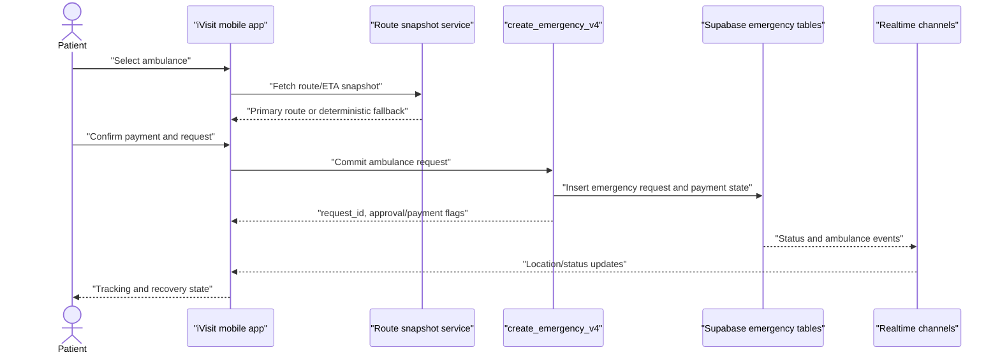
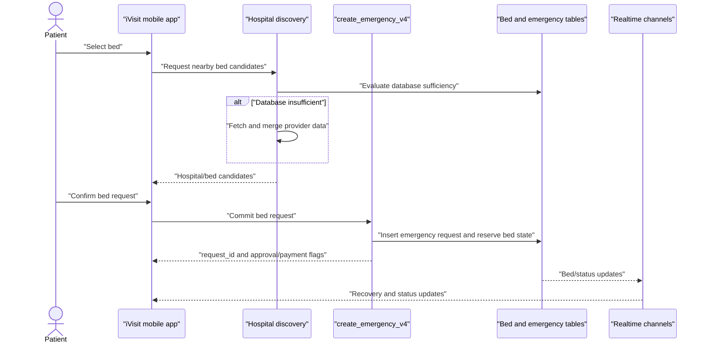
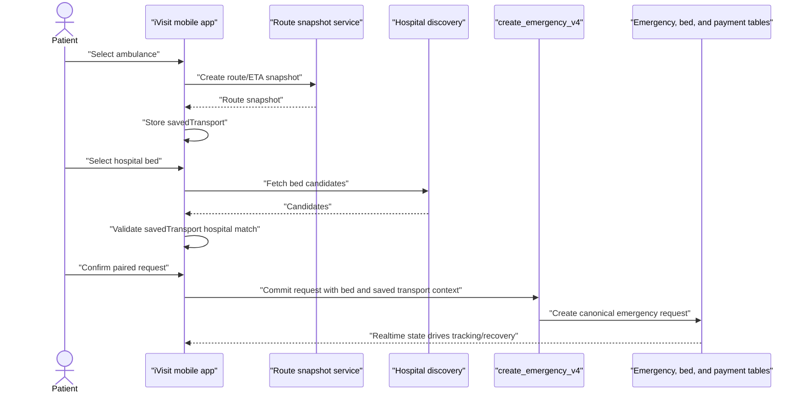
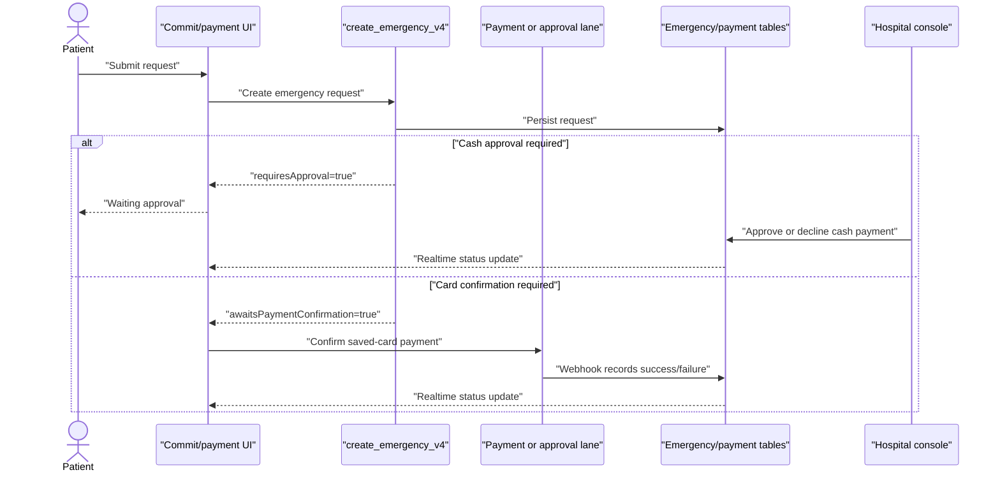
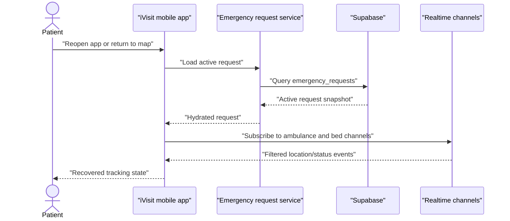

# iVisit Emergency Commit Graph Filing Pack

Working status: counsel-review draft, not legal advice.

Date: 2026-05-24

This pack converts the emergency commit graph dossier into filing-prep evidence. It is intentionally claim-element driven: each proposed technical element is tied to code or SQL, then mapped through trace diagrams, local run evidence, prior-art comparison, draft claim language, pre-disclosure foreign-filing risk, and ecosystem valuation evidence.

## 1. Claim Element Exhibits

### Element A: Patient-Originated Multi-Resource Emergency Intent

Claim concept: the patient flow captures a request for ambulance-only, bed-only, or paired ambulance-plus-bed service, while preserving selected hospital and transport state across the mobile decision path.

Code exhibits:

| Exhibit | Location | Evidence |
| --- | --- | --- |
| A1 | `hooks/map/decision/useMapDecisionHandlers.js:85` | `handleConfirmAmbulanceDecision` begins the ambulance decision lane. |
| A2 | `hooks/map/decision/useMapDecisionHandlers.js:96` | `savedTransport` is captured for later paired use. |
| A3 | `hooks/map/decision/useMapDecisionHandlers.js:176` | `handleConfirmBedDecision` begins the bed decision lane. |
| A4 | `hooks/map/decision/useMapDecisionHandlers.js:184` | bed decision reads `sheetPayload?.savedTransport`. |
| A5 | `hooks/map/decision/useMapDecisionHandlers.js:189` | paired bed decision forwards `savedTransport` with the combined payload. |
| A6 | `hooks/map/exploreFlow/useMapSheetNavigation.js:172` | hospital source payload carries `savedTransport`. |
| A7 | `hooks/map/exploreFlow/useMapSheetNavigation.js:193` | `handleSelectHospital` receives hospital selection. |
| A8 | `hooks/map/exploreFlow/useMapSheetNavigation.js:207` | mismatch protection sends the user back to ambulance decision when saved transport belongs to a different hospital. |

### Element B: Route/ETA Snapshot With Deterministic Fallback

Claim concept: the client builds a stable origin/destination route key, reuses fresh route snapshots, fetches primary routing when possible, and produces a bounded fallback ETA/polyline when the primary route cannot be obtained.

Code exhibits:

| Exhibit | Location | Evidence |
| --- | --- | --- |
| B1 | `services/routeService.js:25` | `buildRouteKey(origin, destination)` canonicalizes origin and destination. |
| B2 | `services/routeService.js:49` | `isRouteResultFresh` guards route reuse by age. |
| B3 | `services/routeService.js:96` | `buildFallbackRoute` defines fallback distance, duration, and geometry. |
| B4 | `services/routeService.js:250` | `fetchRouteSnapshot` is the route snapshot entry point. |
| B5 | `services/routeService.js:257` | snapshot fetch computes `routeKey`. |
| B6 | `services/routeService.js:278` | snapshot fetch returns fallback when primary routing fails. |
| B7 | `hooks/emergency/useMapRoute.js:79` | `calculateRoute` starts client route calculation. |
| B8 | `hooks/emergency/useMapRoute.js:104` | cached query route is reused when fresh. |
| B9 | `hooks/emergency/useMapRoute.js:122` | client route calculation delegates to `fetchRouteSnapshot`. |

### Element C: Atomic Commit to Canonical Emergency Request

Claim concept: a selected request is committed through one canonical RPC that creates the emergency request and payment/approval state under server authority.

Code and SQL exhibits:

| Exhibit | Location | Evidence |
| --- | --- | --- |
| C1 | `hooks/emergency/useRequestFlow.js:274` | `canStartRequest` gates whether a new request can begin. |
| C2 | `hooks/emergency/useRequestFlow.js:316` | request initiation is blocked when `canStartRequest` is false. |
| C3 | `services/emergencyRequestsService.js:324` | app calls `supabase.rpc('create_emergency_v4', ...)`. |
| C4 | `services/emergencyRequestsService.js:358` | RPC response exposes `requiresApproval`. |
| C5 | `services/emergencyRequestsService.js:359` | RPC response exposes `awaitsPaymentConfirmation`. |
| C6 | `supabase/migrations/20260219000800_emergency_logic.sql:441` | `public.create_emergency_v4` is defined. |
| C7 | `supabase/migrations/20260219000800_emergency_logic.sql:494` | commit path sets transition metadata source to `create_emergency_v4`. |

### Element D: Active-Lane Exclusion for Scarce Emergency Resources

Claim concept: the system prevents a patient from creating duplicate active ambulance or active bed requests while still allowing distinct service lanes.

SQL and code exhibits:

| Exhibit | Location | Evidence |
| --- | --- | --- |
| D1 | `supabase/migrations/20260219000300_logistics.sql:345` | unique active ambulance request index is created. |
| D2 | `supabase/migrations/20260219000300_logistics.sql:351` | unique active bed request index is created. |
| D3 | `hooks/emergency/useRequestFlow.js:193` | duplicate active bed index error is recognized. |
| D4 | `hooks/emergency/useRequestFlow.js:194` | duplicate active ambulance index error is recognized. |
| D5 | `hooks/emergency/useRequestFlow.js:763` | completion path treats server-side active-request sync as an expected race. |

### Element E: Payment-Gated Emergency State Advancement

Claim concept: request completion is separated from payment authorization/approval, allowing card confirmation and cash approval to drive later status transitions without losing the committed request.

Code and SQL exhibits:

| Exhibit | Location | Evidence |
| --- | --- | --- |
| E1 | `components/map/views/commitPayment/useMapCommitPaymentController.js:601` | `handleSubmit` begins payment/commit flow. |
| E2 | `components/map/views/commitPayment/useMapCommitPaymentController.js:691` | UI calls `handleRequestInitiated`. |
| E3 | `components/map/views/commitPayment/useMapCommitPaymentController.js:718` | UI branches when `requiresApproval` is returned. |
| E4 | `components/map/views/commitPayment/useMapCommitPaymentController.js:728` | transaction moves to `WAITING_APPROVAL`. |
| E5 | `components/map/views/commitPayment/useMapCommitPaymentController.js:846` | UI branches when awaiting payment confirmation. |
| E6 | `components/map/views/commitPayment/useMapCommitPaymentController.js:861` | saved-card confirmation is executed. |
| E7 | `supabase/migrations/20260219000800_emergency_logic.sql:119` | cash approval sets transition source and reason. |
| E8 | `supabase/migrations/20260219000800_emergency_logic.sql:686` | Stripe webhook sets card-confirmed transition source and reason. |
| E9 | `supabase/migrations/20260219000800_emergency_logic.sql:791` | Stripe webhook records card failure transition reason. |

### Element F: Audited Status Transition Graph

Claim concept: request status changes are constrained by a valid transition graph and written through audited server contexts.

SQL exhibits:

| Exhibit | Location | Evidence |
| --- | --- | --- |
| F1 | `supabase/migrations/20260219000800_emergency_logic.sql:2203` | `is_valid_emergency_status_transition` defines the canonical transition guard. |
| F2 | `supabase/migrations/20260219000800_emergency_logic.sql:2239` | trigger validates changed statuses with `is_valid_emergency_status_transition`. |
| F3 | `supabase/migrations/20260219000800_emergency_logic.sql:145` | manual ambulance assignment records transition context. |
| F4 | `supabase/migrations/20260219000800_emergency_logic.sql:200` | auto ambulance assignment records transition context. |
| F5 | `supabase/migrations/20260219000800_emergency_logic.sql:1422` | trip completion records transition context. |
| F6 | `supabase/tests/scripts/validate_emergency_hardening_guards.js:200` | hardening guard checks transition snapshot/metadata persistence. |
| F7 | `supabase/tests/scripts/validate_emergency_hardening_guards.js:205` | hardening guard checks status write-path gating. |

### Element G: Realtime Recovery and State Reconciliation

Claim concept: the app restores an active emergency and applies realtime ambulance/bed events through relevance filters, allowing recovery after reload or network loss.

Code exhibits:

| Exhibit | Location | Evidence |
| --- | --- | --- |
| G1 | `hooks/emergency/useEmergencyRealtime.js:51` | `shouldApplyAmbulanceEvent` filters ambulance events. |
| G2 | `hooks/emergency/useEmergencyRealtime.js:66` | `handleRealtimeStatus` reconciles status events. |
| G3 | `hooks/emergency/useEmergencyRealtime.js:152` | realtime handler applies the ambulance relevance filter. |
| G4 | `hooks/emergency/useEmergencyRealtime.js:192` | app subscribes to ambulance location updates. |
| G5 | `hooks/emergency/useEmergencyRealtime.js:224` | app subscribes to hospital bed updates. |
| G6 | `services/emergencyRequestsService.js:562` | service-level ambulance location subscription exists. |
| G7 | `services/emergencyRequestsService.js:604` | service-level hospital bed subscription exists. |

### Element H: Provider Discovery Sufficiency and External Augmentation

Claim concept: hospital discovery first evaluates database sufficiency, then conditionally augments from external provider data, and merges provider rows into a response.

Code exhibits:

| Exhibit | Location | Evidence |
| --- | --- | --- |
| H1 | `supabase/functions/discovery/discover-hospitals/handler.ts:171` | handler computes `hasEnoughDbResults`. |
| H2 | `supabase/functions/discovery/discover-hospitals/handler.ts:172` | handler calls `evaluateProviderDatabaseSufficiency`. |
| H3 | `supabase/functions/discovery/discover-hospitals/handler.ts:186` | sufficient database results short-circuit external discovery. |
| H4 | `supabase/functions/discovery/discover-hospitals/handler.ts:200` | insufficient database results permit provider discovery. |
| H5 | `supabase/functions/discovery/discover-hospitals/handler.ts:202` | handler fetches external provider data. |
| H6 | `supabase/functions/discovery/discover-hospitals/handler.ts:257` | handler merges provider discovery rows. |
| H7 | `supabase/functions/_shared/domain/providers/rows.ts:217` | provider sufficiency calculation is shared. |
| H8 | `supabase/functions/_shared/domain/providers/discoveryFlow.ts:12` | external provider discovery function is shared. |
| H9 | `supabase/functions/_shared/domain/providers/response.ts:25` | provider row merge function is shared. |

## 2. Sequence Diagrams

### Trace 1: Ambulance-Only



### Trace 2: Bed-Only



### Trace 3: Paired Ambulance Plus Bed



### Trace 4: Payment Approval



### Trace 5: Realtime Recovery



## 3. Empirical Trace Logs From Local Run

Executed locally from `C:\Users\Dyrane\Documents\GitHub\ivisit-app` on 2026-05-24.

### Command: `npm run hardening:emergency`

Result: PASS.

Evidence:

```text
[hardening-guards] Realtime publication coverage: PASS
[hardening-guards] Critical RLS scope: PASS
[hardening-guards] Transition audit write-path: PASS
[hardening-guards] Console RPC lock semantics: PASS
[hardening-guards] RPC execute scope: PASS
[hardening-guards] Mutation role gates: PASS
[hardening-guards] All checks passed.
```

Patent relevance: supports Elements F and G by checking realtime publication coverage, transition audit metadata, RPC scope, and mutation gates.

### Command: `npm run hardening:table-flow-trace`

Result: PASS.

Generated artifacts:

| Artifact | Path |
| --- | --- |
| JSON | `supabase/tests/validation/table_flow_trace_emergency_requests.json` |
| Markdown | `supabase/tests/validation/table_flow_trace_emergency_requests.md` |

Evidence:

```text
[table-flow-trace] table=emergency_requests
[table-flow-trace] columns=43 refs=2453
[table-flow-trace] json=C:\Users\Dyrane\Documents\GitHub\ivisit-app\supabase\tests\validation\table_flow_trace_emergency_requests.json
[table-flow-trace] markdown=C:\Users\Dyrane\Documents\GitHub\ivisit-app\supabase\tests\validation\table_flow_trace_emergency_requests.md
```

Patent relevance: supports the assertion that `emergency_requests` is not an isolated table; it is a heavily referenced state object spanning app, database, and console surfaces.

### Command: `npm run hardening:high-profile-cta-trace`

Result: FAIL with useful trace evidence.

Generated artifacts:

| Artifact | Path |
| --- | --- |
| JSON | `supabase/tests/validation/high_profile_cta_trace_report.json` |
| Markdown | `supabase/tests/validation/high_profile_cta_trace_report.md` |

Evidence:

```text
[high-profile-cta-trace] runtime_guards_passed=5/5 traces_passed=6/9
[high-profile-cta-trace] inventory app_handlers=1573 console_handlers=1187
[high-profile-cta-trace] FAIL: one or more runtime guards or trace cases failed.
```

Passing traces:

| Trace | Status |
| --- | --- |
| app_request_modal_submit | PASS |
| console_cash_approve_decline_actions | PASS |
| console_dispatch_actions | PASS |
| console_retry_payment_action | PASS |
| emergency_visit_sync_hydration | PASS |
| triage_parallel_capture_lane | PASS |

Failing traces and proof interpretation:

| Trace | Status | Reported gap | Filing interpretation |
| --- | --- | --- | --- |
| app_quick_emergency_dispatch | FAIL | missing `screens/EmergencyScreen.jsx` and `handleQuickEmergency` signature | Do not claim quick-emergency CTA implementation until the current screen path is reconciled. |
| app_cash_approval_notification_lane | FAIL | missing literal `'pending_approval'` in `hooks/emergency/useRequestFlow.js` | Cash approval exists elsewhere, but this specific static trace expects a literal in the request flow. |
| rating_and_tip_completion_lane | FAIL | missing `screens/EmergencyScreen.jsx` | Exclude rating/tip from emergency commit graph claims. |

Limitation: this pass did not execute a staging transaction against live payment, hospital, ambulance, or realtime services. These logs are local non-mutating validation traces and should be supplemented by counsel-controlled staging transcripts before filing or investor disclosure.

## 4. Prior-Art Claim Charts

Sources reviewed:

| Source | Category | URL |
| --- | --- | --- |
| US10832579B2, integrated ambulance tracking system | ambulance dispatch/tracking | https://patents.google.com/patent/US10832579B2/en |
| US11250529B2, computer-aided dispatch automatic diversions | ambulance dispatch/CAD | https://patents.google.com/patent/US11250529B2/en |
| US7720695B2, managing patient bed assignments and occupancy | hospital bed management | https://patents.google.com/patent/US7720695B2/en |
| BMC Health Services Research 2024 EMS dispatch recommendation based on bed availability | ambulance dispatch plus bed availability | https://link.springer.com/article/10.1186/s12913-024-12006-8 |
| US12004839B2, computer-assisted patient navigation | healthcare navigation | https://patents.google.com/patent/US12004839B2/en |
| US20120016688A1, patient routing to provider/location | healthcare navigation/provider routing | https://patents.google.com/patent/US20120016688A1/en |
| US11704608B2, session-based transportation dispatch | ride-hailing/transport dispatch | https://patents.google.com/patent/US11704608B2/en |
| AU2021107444A4, medical IoT bed vacancy and rerouting emergency vehicle | closest bed-aware ambulance routing | https://patents.google.com/patent/AU2021107444A4/en |

### Chart 1: Against Ambulance Dispatch and CAD References

| Proposed iVisit element | US10832579B2 / US11250529B2 comparison | Differentiation theory |
| --- | --- | --- |
| Patient-originated ambulance/bed/paired intent | Dispatch references focus on ambulance dispatch, tracking, diversion, or CAD workflows. | iVisit claim should emphasize patient-side selection and commit of multiple scarce healthcare resources, not merely dispatch assignment. |
| Route snapshot with fallback | Ambulance tracking references may use location and route data. | Claim should avoid broad route tracking and focus on bounded fallback route/ETA persistence tied to commit and recovery. |
| Payment-gated advancement | CAD references do not appear centered on patient payment approval as a status gate. | Payment approval can be a differentiating technical state gate if tied to emergency request lifecycle. |
| Active-lane exclusion | Dispatch systems manage resource assignment. | iVisit excludes duplicate patient active lanes while allowing separate ambulance and bed lanes. |
| Realtime recovery | Tracking references likely disclose realtime location. | iVisit should claim filtered recovery from canonical emergency state plus bed/ambulance subscriptions, not realtime tracking alone. |

Risk: ambulance routing, ETA, and realtime tracking are crowded. Claims should not rely on generic ambulance location tracking as the inventive point.

### Chart 2: Against Hospital Bed Management / Marketplace References

| Proposed iVisit element | US7720695B2 comparison | Differentiation theory |
| --- | --- | --- |
| Bed-only request | Bed assignment systems disclose bed inventory and occupancy management. | Claim should not cover bed inventory alone. |
| Paired ambulance-plus-bed commit | Bed systems generally do not preserve a patient-selected transport leg through the bed selection and payment flow. | The saved transport plus hospital-matching guard is a stronger element. |
| Payment approval and status graph | Bed management references do not appear to claim emergency payment-gated mobile commit. | Payment-gated state transition and realtime patient recovery create a narrower technical combination. |
| Provider discovery sufficiency fallback | Bed systems may query internal inventory. | iVisit conditionally augments local data with provider discovery based on sufficiency thresholds. |

Risk: claims around hospital bed availability alone are likely weak.

### Chart 3: Against Ride-Hailing / Transportation Dispatch

| Proposed iVisit element | US11704608B2 comparison | Differentiation theory |
| --- | --- | --- |
| Route/ETA and dispatch | Ride-hailing dispatch has route, ETA, session, and driver selection concepts. | Do not claim generic route/driver matching. Tie routing to clinical destination, bed state, emergency request lifecycle, and recovery. |
| Paired resource commit | Ride-hailing commits a transport resource, not an emergency bed plus transport pair. | iVisit's narrower value is multi-resource healthcare commit with active-lane exclusion and audit. |
| Payment confirmation | Ride-hailing often includes payments. | Payment alone is not novel; payment-gated medical/emergency state transitions may be differentiating only in combination. |

Risk: any claim that reads like "request transport, show ETA, pay, track driver" will be vulnerable.

### Chart 4: Against Healthcare Navigation / Patient Routing

| Proposed iVisit element | US12004839B2 / US20120016688A1 comparison | Differentiation theory |
| --- | --- | --- |
| Provider/hospital recommendations | Navigation references route patients to providers or locations. | Recommendations are weak unless tied to commit of resources and status transitions. |
| Provider discovery sufficiency | Navigation systems may aggregate provider data. | iVisit should claim the sufficiency gate only as part of emergency commit and availability recovery. |
| Emergency request lifecycle | Navigation references may help select care, but not necessarily create an auditable emergency transaction. | iVisit's canonical emergency request plus payment and realtime channels is the stronger implementation-specific angle. |

Risk: broad "find hospital near me" claims are likely anticipated or obvious.

### Chart 5: Closest Bed-Aware Ambulance Routing Art

| Proposed iVisit element | BMC 2024 and AU2021107444A4 comparison | Differentiation theory |
| --- | --- | --- |
| Ambulance dispatch based on bed availability | These are close because they connect bed availability with emergency vehicle routing or EMS dispatch. | Avoid claiming "route ambulance based on bed availability" as the point of novelty. |
| Patient-side paired commit | Public closest art appears more dispatch/operator or IoT centered. | Emphasize patient-controlled mobile commit preserving selected transport through hospital/bed selection. |
| Payment-gated transaction | Closest art does not appear to combine bed-aware ambulance routing with card/cash approval state in a canonical emergency request. | This is a stronger dependent claim area. |
| Deterministic route fallback | Closest art may recommend destinations but does not appear focused on local fallback ETA proof. | Keep fallback as a technical reliability dependent claim. |
| Active-lane uniqueness and audited graph | Closest art does not appear centered on per-patient active-lane exclusion plus audited status transitions. | This can narrow claims to implemented server controls. |

Risk: this is the highest-risk prior-art family. Independent claims should be drafted around the combined emergency commit graph, not bed-aware dispatch in isolation.

## 5. Counsel-Review Claim Draft

These claims are technical drafting material for a patent attorney. They are not attorney-reviewed.

### Independent Claim 1: Method

1. A computer-implemented method for committing an emergency healthcare request, the method comprising:
   receiving, by a mobile application, a patient selection of an emergency service mode comprising at least one of an ambulance transport mode, a hospital bed mode, or a paired ambulance transport and hospital bed mode;
   generating, for a selected transport leg, a route snapshot comprising an estimated travel duration and route geometry, wherein generating the route snapshot comprises retrieving a primary route when available and generating a bounded fallback route when the primary route is unavailable;
   preserving, during a transition from transport selection to hospital selection, a saved transport state associated with a selected hospital;
   validating that the saved transport state corresponds to the selected hospital before committing the paired ambulance transport and hospital bed mode;
   transmitting a commit request to a server-side emergency creation function;
   atomically creating, by the server-side emergency creation function, a canonical emergency request record and a payment or approval state associated with the canonical emergency request record;
   enforcing, before or during creation of the canonical emergency request record, an active-lane exclusion preventing duplicate active emergency requests for a same patient within a same emergency service lane;
   advancing a status of the canonical emergency request record according to a server-side transition graph responsive to payment confirmation, payment approval, dispatch, arrival, completion, cancellation, or discharge events; and
   recovering, by the mobile application, a current emergency state by subscribing to realtime status, ambulance, or bed updates associated with the canonical emergency request record.

### Independent Claim 2: System

2. A system comprising:
   one or more processors; and
   one or more memories storing instructions that, when executed by the one or more processors, cause the system to:
   present a mobile emergency interface configured to select an ambulance request, a hospital bed request, or a paired ambulance and hospital bed request;
   compute or obtain a route snapshot for a transport leg using a primary route service and a deterministic fallback estimator;
   maintain saved transport context across a hospital selection interface;
   call a server-side emergency creation procedure that creates an emergency request and payment state in a single commit path;
   enforce unique active request constraints for ambulance and bed service lanes;
   record transition metadata for emergency request status changes; and
   reconcile mobile state from realtime emergency request, ambulance location, and hospital bed update channels.

### Independent Claim 3: Non-Transitory Computer-Readable Medium

3. A non-transitory computer-readable medium storing instructions that, when executed by one or more processors, cause the one or more processors to perform the method of claim 1.

### Dependent Claim Concepts

4. The method of claim 1, wherein the route snapshot is keyed by rounded origin and destination coordinates and reused only while a freshness interval has not expired.

5. The method of claim 1, wherein the bounded fallback route uses a direct-line distance expanded by a road-factor multiplier, a minimum distance floor, and an emergency-vehicle speed assumption.

6. The method of claim 1, wherein the active-lane exclusion comprises a unique database index for active ambulance requests and a separate unique database index for active bed requests.

7. The method of claim 1, wherein a cash-payment request is created before final payment approval and remains in a waiting-approval state until an authorized console action approves or declines the request.

8. The method of claim 1, wherein a card-payment request is created before final card confirmation and is advanced in response to a payment webhook.

9. The method of claim 1, wherein status changes are rejected when the changes are not valid under the server-side transition graph.

10. The method of claim 1, wherein transition metadata comprises a transition source, transition reason, actor identifier, actor role, or structured transition metadata.

11. The method of claim 1, wherein realtime ambulance events are filtered before application to the mobile state.

12. The method of claim 1, wherein hospital discovery determines whether database results satisfy a sufficiency threshold before requesting external provider data.

13. The method of claim 12, wherein external provider data is merged with database provider rows before presentation to the patient.

14. The method of claim 1, wherein a mismatch between the saved transport state and the selected hospital redirects the patient to reselect transport for the selected hospital.

15. The method of claim 1, wherein a local trace validation matrix verifies runtime guards, console actions, payment recovery, visit synchronization, or triage capture lanes.

Attorney action needed: rewrite these into jurisdiction-appropriate independent/dependent claims, decide whether payment language narrows the claims too much, assess 101/eligibility framing, and add alternative embodiments that are disclosed but not over-limited to current code.

## 6. Foreign-Filing Risk Review Before Public Disclosure

This review uses public official sources and is not a legal opinion.

Official sources:

| Source | URL | Relevance |
| --- | --- | --- |
| USPTO provisional application page | https://www.uspto.gov/patents-getting-started/patent-basics/types-patent-applications/provisional-application-patent | Notes U.S. provisional filings and the U.S. one-year grace-period context. |
| USPTO pursuing international IP protection | https://www.uspto.gov/patents/basics/international-protection/filing-patents-abroad | Notes the U.S. one-year grace period and foreign filing license paths. |
| USPTO MPEP 140 Foreign Filing Licenses | https://www.uspto.gov/web/offices/pac/mpep/s140.html | Details foreign filing license or six-month wait for U.S.-made inventions. |
| WIPO patents FAQ | https://www.wipo.int/en/web/patents/faq_patents | Warns that public disclosure before filing can be prior art in many countries. |
| WIPO PCT page | https://www.wipo.int/en/web/treaties/registration/pct/index | Explains PCT as a route to seek protection in many countries. |
| EPO guide, novelty basic principles | https://www.epo.org/en/legal/guide-epc/2023/ga_c3_3_1.html | Describes absolute novelty and limited non-prejudicial disclosures. |

### Risk Findings

| Risk | Severity | Practical implication |
| --- | --- | --- |
| Public disclosure before first filing | High | Many jurisdictions may treat public disclosure before filing as prior art, even if the U.S. offers a limited inventor grace period. |
| U.S. foreign filing license | High | If the invention was made in the United States, counsel should obtain or confirm a foreign filing license before foreign/PCT filing or wait under applicable rules. |
| Investor/demo disclosure | High | Non-confidential pitch decks, app demos, videos, screenshots, public test builds, marketplace descriptions, and conference talks can disclose claim elements. |
| GitHub/app store exposure | High | Public repositories, public app listings, TestFlight/Play testing materials, release notes, and support docs may become disclosure evidence. |
| Prior-art crowding around dispatch and bed routing | Medium to high | Claims need the implemented combination; generic ambulance routing, bed availability, and provider navigation are crowded. |
| Trade secret vs patent tension | Medium | Route fallback constants, sufficiency thresholds, and transition orchestration may be kept as trade secrets only if not disclosed in enabling detail. |

### Recommended Pre-Disclosure Controls

1. File a provisional application before public disclosure of the emergency commit graph, including route fallback, paired commit, payment-gated status, active-lane constraints, realtime recovery, and provider sufficiency fallback.
2. Have counsel decide whether to file first in the United States and request/receive a foreign filing license, or use another compliant international strategy.
3. Treat this pack as confidential attorney work material until counsel authorizes disclosure.
4. Before any investor, partner, app-store, demo, website, or public repository disclosure, remove enabling details for:
   - fallback ETA constants and formulas,
   - database uniqueness and transition-graph implementation,
   - paired saved-transport state mechanics,
   - payment approval recovery mechanics,
   - provider sufficiency thresholds.
5. Preserve dated evidence of conception and reduction to practice:
   - git commit hashes,
   - local trace logs,
   - schema migration history,
   - screenshots/videos of the five flows,
   - staging transaction IDs,
   - inventorship notes.
6. Have patent counsel run a search focused on bed-aware ambulance dispatch and patient-side paired healthcare resource commit before finalizing independent claim scope.

### Disclosure Boundary

Safer external description before filing:

```text
iVisit coordinates emergency transport and hospital admission workflows in one mobile experience.
```

Avoid before filing:

```text
iVisit preserves a selected ambulance route snapshot through hospital bed selection, validates the transport/hospital pairing, commits both through a single RPC with payment-gated status transitions, and recovers from realtime ambulance and bed channels using fallback route proof.
```

## 7. Ecosystem Expansion: Website, Console, And Data Room

The patent and valuation case should not treat `ivisit-app` as the whole company. The current workspace shows a four-surface ecosystem:

| Surface | Workspace | Strategic role |
| --- | --- | --- |
| Public website | `C:\Users\Dyrane\Documents\GitHub\ivisit` | Public brand, SEO, early-access acquisition, legal/support pages, app handoff, and sponsor-facing market surface. |
| Patient app | `C:\Users\Dyrane\Documents\GitHub\ivisit-app` | Patient-side emergency intent, routing, payment, tracking, and recovery. |
| Operations console | `C:\Users\Dyrane\Documents\GitHub\ivisit-console` | Provider/admin/sponsor operating layer for dispatch, emergency management, analytics, wallets, pricing, insurance, verification, and reporting. |
| Docs/data-room website | `C:\Users\Dyrane\Documents\GitHub\iVisit-docs` | Sponsor/investor/legal enablement layer with NDA-gated documents, admin access, invite flows, and business/IP materials. |

### Public Website Exhibits

| Exhibit | Location | Evidence | Valuation implication |
| --- | --- | --- | --- |
| W1 | `C:\Users\Dyrane\Documents\GitHub\ivisit\README.md:1` | repo identifies itself as the public iVisit marketing site and acquisition layer. | The company has a separable public market surface. |
| W2 | `C:\Users\Dyrane\Documents\GitHub\ivisit\README.md:13` | repo boundaries distinguish `ivisit`, `ivisit-app`, and `ivisit-console`. | The ecosystem split is intentional, not accidental fragmentation. |
| W3 | `C:\Users\Dyrane\Documents\GitHub\ivisit\src\routes\AppRouter.tsx:24` | public routes are wrapped in `MarketingLayout`. | Public pages are organized as a marketing/legal surface. |
| W4 | `C:\Users\Dyrane\Documents\GitHub\ivisit\src\routes\AppRouter.tsx:25` | home route serves `Home`. | Public homepage is the top-of-funnel entry. |
| W5 | `C:\Users\Dyrane\Documents\GitHub\ivisit\src\routes\AppRouter.tsx:27` | `/early-access` route exists. | Website captures waitlist or testing demand. |
| W6 | `C:\Users\Dyrane\Documents\GitHub\ivisit\src\routes\AppRouter.tsx:28` | `/sitemap` route exists. | SEO/discovery tooling is present. |
| W7 | `C:\Users\Dyrane\Documents\GitHub\ivisit\src\routes\AppRouter.tsx:29` | `/privacy` legal route exists. | Public compliance posture is represented. |
| W8 | `C:\Users\Dyrane\Documents\GitHub\ivisit\src\routes\AppRouter.tsx:32` | `/medical-disclaimer` legal route exists. | Emergency-care risk messaging is represented. |
| W9 | `C:\Users\Dyrane\Documents\GitHub\ivisit\src\routes\AppRouter.tsx:38` | authenticated `/emergency` route exists. | Website can hand into emergency web/PWA functionality. |
| W10 | `C:\Users\Dyrane\Documents\GitHub\ivisit\src\routes\AppRouter.tsx:39` | authenticated `/book-bed` route exists. | Website can hand into bed-booking functionality. |
| W11 | `C:\Users\Dyrane\Documents\GitHub\ivisit\src\pages\Home.tsx:10` | homepage title is `iVisit | Emergency Medical Help, Faster`. | Public positioning is clear and searchable. |
| W12 | `C:\Users\Dyrane\Documents\GitHub\ivisit\src\pages\Home.tsx:15` | homepage description covers emergency response, bed availability, and live location. | The public promise matches the product thesis. |
| W13 | `C:\Users\Dyrane\Documents\GitHub\ivisit\src\components\home\Hero.tsx:22` | hero uses `SEOHead`. | SEO is implemented at the component level. |
| W14 | `C:\Users\Dyrane\Documents\GitHub\ivisit\src\components\home\Hero.tsx:24` | SEO description names emergency response, bed availability, and live location. | Search metadata supports category discovery. |
| W15 | `C:\Users\Dyrane\Documents\GitHub\ivisit\src\components\home\EarlyAccessCTA.tsx:81` | early-access CTA embeds `EarlyAccessForm`. | Acquisition is not just informational; it captures demand. |
| W16 | `C:\Users\Dyrane\Documents\GitHub\ivisit\src\components\early-access\EarlyAccessForm.tsx:26` | form calls `submitSubscriber`. | Lead capture is wired to data persistence. |
| W17 | `C:\Users\Dyrane\Documents\GitHub\ivisit\src\lib\api\subscribers.ts:35` | subscriber API inserts into `subscribers`. | Demand signals can be measured. |
| W18 | `C:\Users\Dyrane\Documents\GitHub\ivisit\src\components\home\transparency\InteractiveFlow.tsx:4` | interactive flow imports ambulance, bed, dashboard, and facility replicas. | Public website can show ecosystem behavior without exposing private internals. |
| W19 | `C:\Users\Dyrane\Documents\GitHub\ivisit\doc\SPONSOR_EVALUATION_GUIDE.md:5` | guide defines sponsor/partner/market-value review of the public surface. | Sponsor review has its own public-site evaluation standard. |
| W20 | `C:\Users\Dyrane\Documents\GitHub\ivisit\doc\SEO_IMPLEMENTATION.md:4` | SEO documentation says optimization is implemented for emergency medical services in Nigeria. | Website supports organic acquisition and credibility. |
| W21 | `C:\Users\Dyrane\Documents\GitHub\ivisit\doc\REVISED_ENTERPRISE_VALUATION.md:30` | older public-site valuation doc states `$1.5M - $3M`. | Mark as historical/conservative to avoid conflict with current ecosystem valuation. |

### Console Exhibits

| Exhibit | Location | Evidence | Valuation implication |
| --- | --- | --- | --- |
| X1 | `C:\Users\Dyrane\Documents\GitHub\ivisit-console\frontend\src\App.js:165` | sponsor/viewer/provider/admin dashboard route is protected. | Sponsor visibility is a productized surface, not a manual reporting promise. |
| X2 | `C:\Users\Dyrane\Documents\GitHub\ivisit-console\frontend\src\App.js:166` | live map route is protected for providers. | The platform has an operations view for active coordination. |
| X3 | `C:\Users\Dyrane\Documents\GitHub\ivisit-console\frontend\src\App.js:167` | analytics route is protected. | Reporting can support sponsor updates and provider ROI. |
| X4 | `C:\Users\Dyrane\Documents\GitHub\ivisit-console\frontend\src\App.js:168` | hospital management route exists. | Provider supply can be onboarded and administered. |
| X5 | `C:\Users\Dyrane\Documents\GitHub\ivisit-console\frontend\src\App.js:169` | ambulance management route exists. | Transport supply can be onboarded and administered. |
| X6 | `C:\Users\Dyrane\Documents\GitHub\ivisit-console\frontend\src\App.js:172` | emergency request route exists. | Mobile emergency commits flow into an operator surface. |
| X7 | `C:\Users\Dyrane\Documents\GitHub\ivisit-console\frontend\src\App.js:173` | verification queue route exists. | Provider trust and compliance workflow is represented. |
| X8 | `C:\Users\Dyrane\Documents\GitHub\ivisit-console\frontend\src\App.js:181` | wallet management route exists. | Financial operations are first-class. |
| X9 | `C:\Users\Dyrane\Documents\GitHub\ivisit-console\frontend\src\App.js:182` | pricing management route exists. | Commercial configuration can be managed without app redeploy. |
| X10 | `C:\Users\Dyrane\Documents\GitHub\ivisit-console\frontend\src\config\navigation.js:11` | role hierarchy includes `admin`, `org_admin`, `sponsor`, `provider`, and `viewer`. | The platform can support distinct stakeholders. |
| X11 | `C:\Users\Dyrane\Documents\GitHub\ivisit-console\frontend\src\contexts\AuthContext.jsx:320` | finance/analytics access includes admin, org admin, and sponsor. | Sponsor/investor transparency is wired into permissions. |
| X12 | `C:\Users\Dyrane\Documents\GitHub\ivisit-console\frontend\src\contexts\AuthContext.jsx:321` | sponsor finance access is view-only. | Sponsor rights can be shown without granting operating control. |
| X13 | `C:\Users\Dyrane\Documents\GitHub\ivisit-console\frontend\src\services\emergencyService.js:388` | console dispatch calls `console_dispatch_emergency`. | Provider-side dispatch is tied to canonical RPCs. |
| X14 | `C:\Users\Dyrane\Documents\GitHub\ivisit-console\frontend\src\services\emergencyService.js:412` | console completion calls `console_complete_emergency`. | Lifecycle closure is operator-controlled and auditable. |
| X15 | `C:\Users\Dyrane\Documents\GitHub\ivisit-console\frontend\src\services\emergencyService.js:431` | console cancellation calls `console_cancel_emergency`. | Exception handling is an operating workflow. |
| X16 | `C:\Users\Dyrane\Documents\GitHub\ivisit-console\frontend\src\services\emergencyService.js:455` | console approval calls `approve_cash_payment`. | Cash payment approval is not just mobile UI; it has operator control. |
| X17 | `C:\Users\Dyrane\Documents\GitHub\ivisit-console\frontend\src\services\emergencyService.js:495` | console decline calls `decline_cash_payment`. | Payment recovery and rejection states are represented. |
| X18 | `C:\Users\Dyrane\Documents\GitHub\ivisit-console\frontend\src\contexts\PageDataContext.jsx:661` | console subscribes to `emergency_changes`. | Realtime operations are supported beyond the patient app. |
| X19 | `C:\Users\Dyrane\Documents\GitHub\ivisit-console\frontend\src\contexts\PageDataContext.jsx:739` | console subscribes to `organization_changes`. | Multi-organization operations are modeled. |
| X20 | `C:\Users\Dyrane\Documents\GitHub\ivisit-console\frontend\supabase\docs\API_REFERENCE.md:46` | `console_dispatch_emergency` documented. | Console/backend contract is documented. |
| X21 | `C:\Users\Dyrane\Documents\GitHub\ivisit-console\frontend\supabase\docs\API_REFERENCE.md:53` | `approve_cash_payment` documented. | Cash approval is part of the public internal API surface. |

### Docs/Data-Room Exhibits

| Exhibit | Location | Evidence | Valuation implication |
| --- | --- | --- | --- |
| Y1 | `C:\Users\Dyrane\Documents\GitHub\iVisit-docs\web-ui\app\page.tsx:35` | `VaultPage` implements the investor/sponsor vault. | Sponsor diligence has a product surface. |
| Y2 | `C:\Users\Dyrane\Documents\GitHub\iVisit-docs\web-ui\app\page.tsx:65` | approved users navigate directly to documents. | Access state is operationalized. |
| Y3 | `C:\Users\Dyrane\Documents\GitHub\iVisit-docs\web-ui\app\page.tsx:70` | unapproved users must sign NDA first. | Confidentiality gate exists before document access. |
| Y4 | `C:\Users\Dyrane\Documents\GitHub\iVisit-docs\web-ui\components\NdaSigning.tsx:63` | NDA signing writes to `access_requests`. | Legal/commercial workflow is captured in data. |
| Y5 | `C:\Users\Dyrane\Documents\GitHub\iVisit-docs\web-ui\components\NdaSigning.tsx:68` | NDA signed timestamp is persisted. | Diligence history can be audited. |
| Y6 | `C:\Users\Dyrane\Documents\GitHub\iVisit-docs\web-ui\app\api\access\request\route.ts:72` | access request triggers admin notification. | Sponsor follow-up can be managed systematically. |
| Y7 | `C:\Users\Dyrane\Documents\GitHub\iVisit-docs\web-ui\app\api\invite\route.ts:93` | document invites are persisted. | Controlled investor/sponsor invite flow exists. |
| Y8 | `C:\Users\Dyrane\Documents\GitHub\iVisit-docs\web-ui\app\admin\page.tsx:145` | admins approve or revoke document access. | Data-room governance is implemented. |
| Y9 | `C:\Users\Dyrane\Documents\GitHub\iVisit-docs\docs\business\INTERNAL_VALUATION_NOTE.md:12` | existing business note positions iVisit at about `$9M` pre-seed valuation. | Valuation narrative already exists but needs technical mapping. |
| Y10 | `C:\Users\Dyrane\Documents\GitHub\iVisit-docs\docs\business\CURRENT_FUNDING_PLAN.md:49` | strategic pilot sponsorship range is `$25,000 to $50,000`. | Immediate ask is already framed. |
| Y11 | `C:\Users\Dyrane\Documents\GitHub\iVisit-docs\docs\business\CURRENT_FUNDING_PLAN.md:69` | early investment range is `$100,000 to $150,000`. | Investment ask can map to a valuation cap/discount discussion. |

## 8. Mapped Valuation View

This is a founder/investor positioning model, not an audited valuation, fairness opinion, or securities recommendation.

### Market Multiple Context

Recent public and private market references suggest a disciplined 2025-2026 software/healthtech valuation environment:

| Reference | Useful signal |
| --- | --- |
| SaaS Capital 2025 private SaaS valuation note, https://www.saas-capital.com/blog-posts/private-saas-company-valuations-multiples/ | Public SaaS run-rate revenue multiples began 2025 around `7.0x`, but that benchmark assumes real revenue scale. |
| First Page Sage 2025 SaaS multiples, https://firstpagesage.com/business/saas-valuation-multiples-2023-report/ | Healthcare/MedTech private SaaS EBITDA multiples are materially higher only after meaningful EBITDA exists. |
| Aventis Advisors SaaS valuation multiples, https://aventis-advisors.com/saas-valuation-multiples-how-much-is-my-saas-business-worth/ | Private SaaS transaction data shows median EV/revenue around the mid-single digits across a broad historical sample. |
| HealthTech Exits valuation tracker, https://www.healthtechexits.com/valuations | Healthtech sales multiples vary widely by subsector; telehealth and healthcare operations can trade below data/AI-heavy categories. |
| Founders Advisors Q1 2025 HIT report, https://foundersib.com/core/uploads/2025/04/2025-Q1-HIT-Report-vFinal.pdf | Provider technology and vertical SaaS multiples provide a more relevant frame than consumer-app comparables. |

Because iVisit is pre-revenue/pre-pilot, revenue multiples should be used as future triangulation only. The current valuation should be milestone-weighted, evidence-weighted, and risk-discounted.

### Current Working Valuation Range

Recommended current positioning after including the public website:

| Case | Pre-money or valuation-cap posture | When to use |
| --- | ---: | --- |
| Conservative | `$5M - $7M` | If no pilot partner, no signed sponsor, and patent filing is not yet made. |
| Defensible current target | `$7M - $10M` | If presenting the full ecosystem: public website, patient app, console, data room, IP dossier, and sponsor sprint. |
| Stretch sponsor/investor case | `$10M - $12M` | If paired with signed pilot LOI, sponsor funding, foreign-filing plan, and staging proof logs. |

Working center: keep the existing `~$9M` pre-seed position, but now explain it as an ecosystem value, not an idea value.

The older website repo valuation note at `C:\Users\Dyrane\Documents\GitHub\ivisit\doc\REVISED_ENTERPRISE_VALUATION.md` states `$1.5M - $3M`. Treat that as a historical/conservative public-site valuation before the current ecosystem mapping. It should not be sent beside the new sponsor pack unless updated or clearly marked superseded.

### Value Component Map

| Component | Evidence base | Low | Target | High | Notes |
| --- | --- | ---: | ---: | ---: | --- |
| Emergency commit graph/IP | Patent dossier, route fallback proof, paired commit, active-lane constraints, transition graph | `$1.4M` | `$2.0M` | `$2.6M` | Strongest if provisional filing happens before public disclosure. |
| Patient app and web PWA | Welcome/emergency intake, route snapshots, payment flow, tracking/recovery | `$1.0M` | `$1.4M` | `$1.8M` | Needs staging video proof for sponsor-grade confidence. |
| Public website and acquisition | SEO, early access, legal pages, app handoff, public sponsor review surface | `$0.4M` | `$0.7M` | `$1.0M` | Adds top-of-funnel and legitimacy, but does not replace traction. |
| Operations console | Dispatch, completion, cancellation, cash approval, analytics, wallet, pricing, insurance, RBAC | `$1.1M` | `$1.6M` | `$2.1M` | Converts the product from consumer app to operating platform. |
| Backend/schema/automation depth | Supabase migrations, RPCs, realtime channels, hardening guards, table-flow traces | `$0.9M` | `$1.3M` | `$1.8M` | Value increases with clean live/staging validation. |
| Sponsor/data-room system | NDA gate, invites, admin approval, sponsor documents, valuation/funding materials | `$0.4M` | `$0.7M` | `$1.0M` | Shows fundraising and diligence readiness. |
| Brand and IP foundation | Nigeria trademark process, IP next-step docs, foreign-filing risk controls | `$0.3M` | `$0.6M` | `$0.9M` | Needs entity/IP assignment cleanup. |
| Market option value | Lagos emergency coordination wedge, provider network expansion, sponsor/pilot model | `$0.9M` | `$1.3M` | `$1.8M` | Not yet traction-backed. |
| Founder execution premium | medical/product/software ownership, velocity, integrated ecosystem | `$0.8M` | `$1.2M` | `$1.7M` | Strong at pre-seed, but must convert into pilots. |
| Gross evidence-weighted value |  | `$7.2M` | `$10.8M` | `$14.7M` | Before stage risk discount. |
| Stage/risk discount | no live revenue, no signed hospital integration, regulatory/distribution unknowns | `-25%` | `-12%` | `-10%` | Discount should shrink with pilots. |
| Risk-adjusted valuation posture |  | `$5.4M` | `$9.5M` | `$13.2M` | Supports the existing `~$9M` internal position while preserving upside. |

### Sponsor Ask Mapping

| Sponsor path | Suggested amount | Valuation/rights handling |
| --- | ---: | --- |
| Strategic pilot sponsor | `$25,000 - $50,000` | No equity by default; grant narrow pilot participation, reporting, and preferred commercial access. |
| Early investor sponsor | `$100,000 - $150,000` | Use counsel-approved SAFE or equivalent; discuss a valuation cap in the `$7M - $10M` range only if the sponsor is taking investment risk. |
| Hybrid sponsor | Split commercial and investment documents | Keep commercial rights separate from equity economics; no source-code, IP transfer, veto, or broad exclusivity. |

### What Moves The Valuation Up

| Milestone | Likely valuation effect |
| --- | --- |
| Provisional patent filed before public disclosure | Raises defensibility of IP component. |
| Five staging traces captured with transaction IDs and videos | Raises product/backend readiness component. |
| First signed Lagos pilot or LOI | Moves market option value from theoretical to commercial. |
| Console sponsor read-only demo with live metrics | Raises sponsor/data-room and console value. |
| Payment/cash approval live proof | Raises revenue-readiness confidence. |
| Clean entity and IP assignment | Reduces legal discount. |

### What Holds The Valuation Down

| Risk | Impact |
| --- | --- |
| No revenue | prevents normal revenue-multiple valuation. |
| No signed provider/hospital contract | weakens distribution and supply-side value. |
| Patent not filed before disclosure | can reduce IP optionality. |
| Website/app/console/docs split across repos | must be presented as one controlled ecosystem. |
| Regulatory ambiguity | requires pilot scope and disclaimers. |
| Static trace failures | should be explained as proof gaps until reconciled. |

## 9. Company Value Breakdown For Sponsor Narrative

The clean sponsor story is:

```text
iVisit is an early emergency-care coordination platform, not just an app.
It already has the public website, patient surface, provider/sponsor console, payment/dispatch state layer, and NDA-gated data room.
The current ~$9M valuation position is a risk-adjusted pre-seed value for the integrated ecosystem, pending live pilots and legal/IP cleanup.
```

### Sponsor-Safe Breakdown

| Layer | What sponsor sees | Why it matters |
| --- | --- | --- |
| Public website | SEO, early access, legal pages, app handoff | proves iVisit has a public acquisition and credibility layer. |
| Patient experience | request help, find bed, track response | proves the patient-side product is understandable. |
| Provider console | manage emergencies, hospitals, ambulances, pricing, wallet, insurance, verification | proves the business can operate with providers. |
| Sponsor visibility | role-based console access and reports | proves sponsor money can be monitored without control leakage. |
| Data room | NDA, access requests, invites, business/IP docs | proves diligence workflow and confidentiality discipline. |
| IP dossier | emergency commit graph, fallback proof, claim charts | proves this is not only a services business. |
| Funding plan | `$25K - $50K` sponsor path; `$100K - $150K` investor path | gives sponsors a clean way to engage. |

### Current Recommendation

Keep the valuation conversation anchored at `~$9M`, but do not lead with the number. Lead with the map:

1. Integrated public + patient + provider + sponsor ecosystem exists.
2. Patent/trade-secret strategy is being prepared before disclosure.
3. Console and data-room surfaces make iVisit sponsor-ready.
4. The immediate capital need is small relative to the company-building stage.
5. Valuation moves materially once a Lagos pilot, provisional filing, and staging traces are locked.

## 10. Open Items for Filing-Grade Completion

| Item | Owner | Status |
| --- | --- | --- |
| Attorney review of claims | Patent counsel | Pending |
| Foreign filing strategy and license confirmation | Patent counsel | Pending |
| Staging run of five flows with transaction IDs | Engineering | Pending |
| Screenshots/video captures of five flows | Engineering | Pending |
| Prior-art search beyond initial public references | Patent counsel/search firm | Pending |
| Inventorship interview and assignment review | Company/counsel | Pending |
| Console proof run with sponsor/provider roles | Engineering | Pending |
| Data-room proof run covering NDA, invite, approval, revoke | Engineering | Pending |
| Sponsor valuation pack review | Founder/counsel/advisor | Pending |
