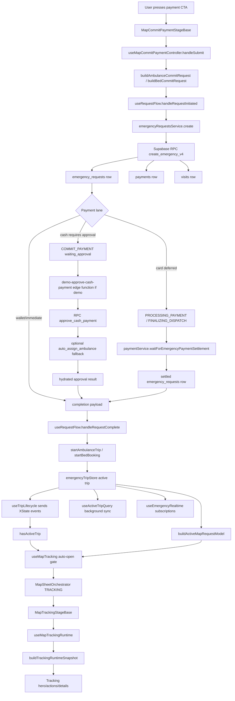
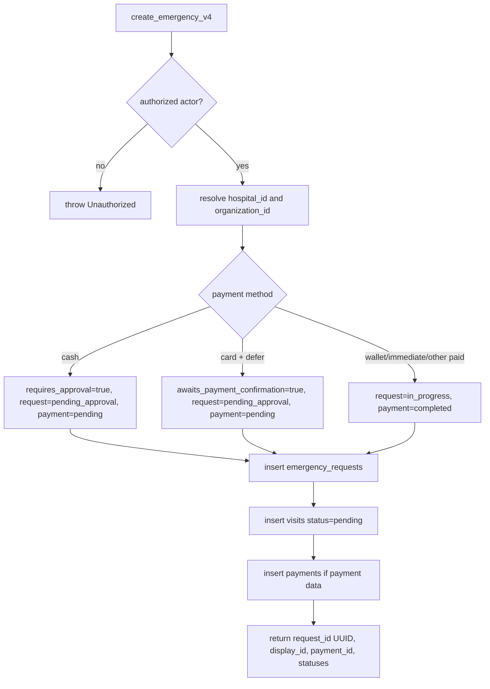
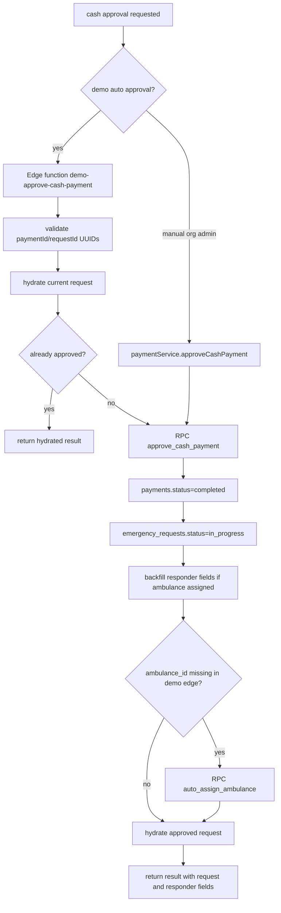
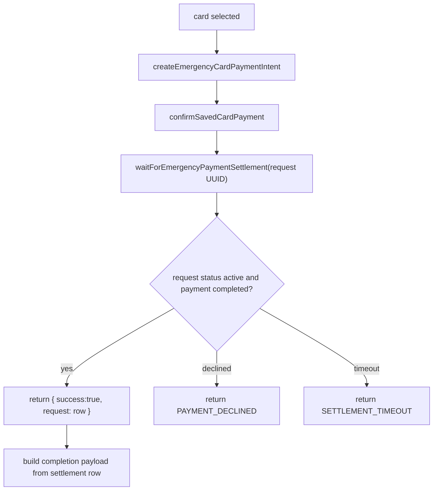
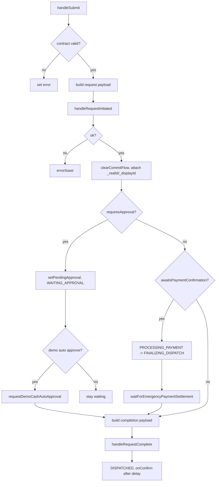
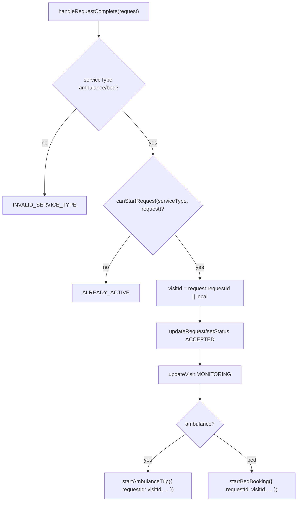
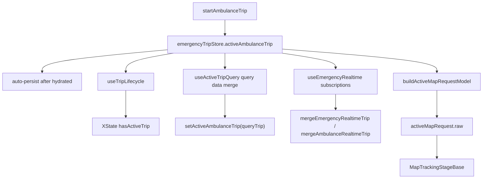
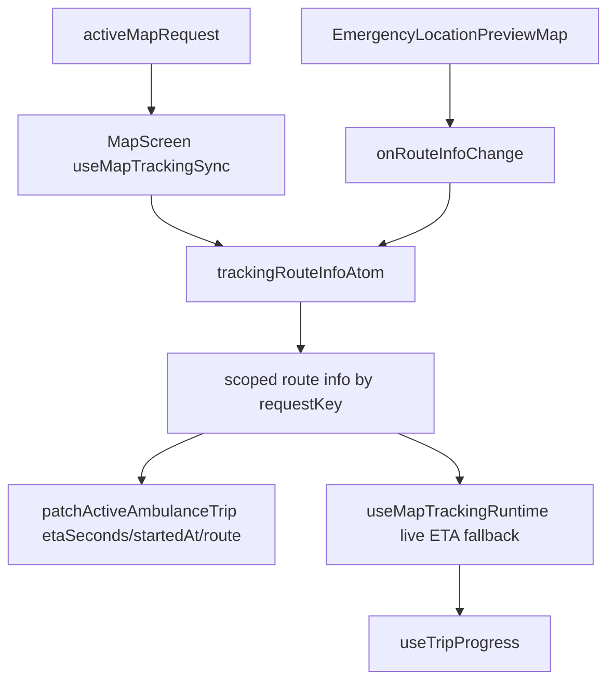
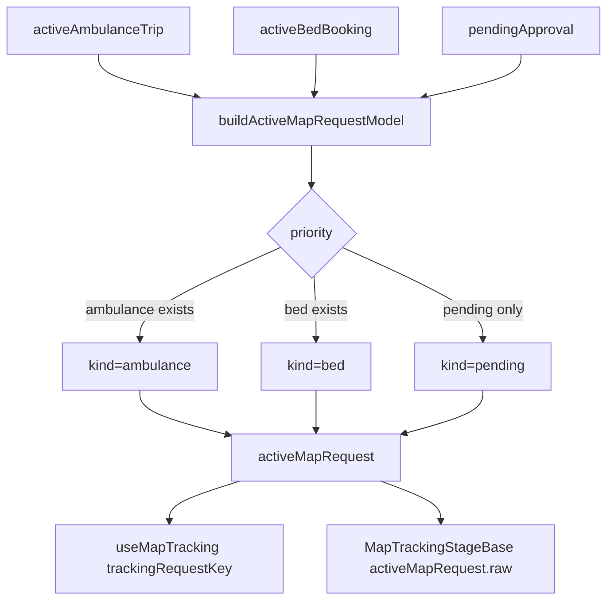
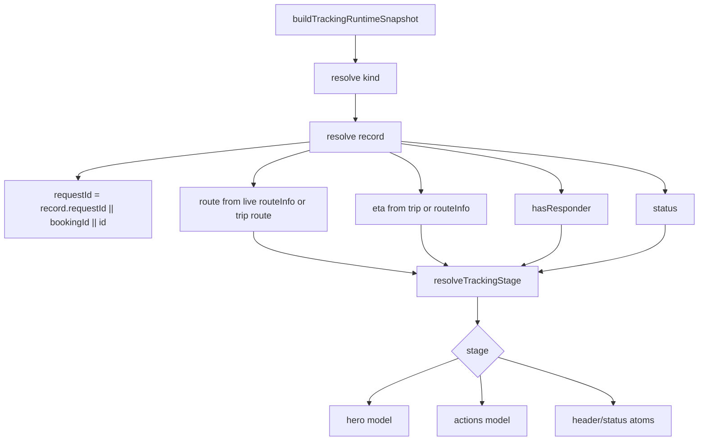

> **Reconciliation 2026-05-24:** See [docs/audit/RECONCILIATION_2026-05-24.md](../RECONCILIATION_2026-05-24.md) for current status of the findings below and any carryforward.

---

# Payment To Tracking Full Flow Map - 2026-05-20

Status: Audit artifact
Scope: `/map` commit payment -> Supabase/RPC/edge -> active trip state -> tracking sheet UI
Purpose: flatten every decision surface so regressions can be caught before patching.

## Core Diagnosis

The reload regression is caused by active request state changing identity shape between the live payment handoff and server/query hydration.

Live payment handoff can create:

```js
{ id: null, requestId: "<emergency_requests.id UUID>" }
```

Server/query hydration later creates:

```js
{ id: "<emergency_requests.id UUID>", requestId: "<display_id>" }
```

Any same-trip guard that only compares `requestId === requestId` or `id === id` can treat those as different trips. That breaks preservation of ETA, route, `startedAt`, responder identity, and visual tracking stage.

## Identity Contract

| Field | Owner | Meaning | UI use | Mutation/subscription use |
| --- | --- | --- | --- | --- |
| `emergency_requests.id` | Supabase | Canonical request UUID | Never primary display | Required canonical key |
| `emergency_requests.display_id` | Supabase trigger | Human display id | Display only | Must resolve to UUID before strict UUID RPCs |
| `requestId` in created request result | Frontend service adapter | Sometimes UUID, sometimes display id depending on layer | Dangerous unless documented at boundary | Dangerous unless normalized |
| `displayId` | Frontend view model | Human display id | Safe for labels | Not safe for UUID RPCs |
| `activeAmbulanceTrip.id` | Zustand runtime | Should be canonical row UUID | Optional display fallback only | Should be preferred for subscriptions/RPC |
| `activeAmbulanceTrip.requestId` | Zustand runtime | Currently inconsistent | Often used for labels and tracking keys | Risky until normalized |

Rule: after request creation, runtime trip state should carry both canonical UUID and display id explicitly. Do not overload `requestId`.

## Files In Scope

### UI Shell

- `screens/MapScreen.jsx`
- `components/map/core/MapSheetOrchestrator.jsx`
- `hooks/map/exploreFlow/useMapExploreFlow.js`
- `hooks/map/exploreFlow/useMapCommitFlow.js`
- `hooks/map/exploreFlow/useMapTracking.js`
- `hooks/map/exploreFlow/mapExploreFlow.transitions.js`
- `components/map/core/mapActiveRequestModel.js`

### Payment Sheet

- `components/map/views/commitPayment/MapCommitPaymentStageBase.jsx`
- `components/map/views/commitPayment/MapCommitPaymentStageParts.jsx`
- `components/map/views/commitPayment/useMapCommitPaymentController.js`
- `components/map/views/commitPayment/mapCommitPayment.helpers.js`
- `components/map/views/commitPayment/mapCommitPayment.transaction.js`
- `components/map/views/commitPayment/mapCommitPayment.presentation.js`

### Emergency/Payment Services

- `hooks/emergency/useRequestFlow.js`
- `hooks/emergency/useEmergencyRequests.js`
- `services/emergencyRequestsService.js`
- `services/paymentService.js`
- `supabase/functions/demo-approve-cash-payment/index.ts`
- `supabase/migrations/20260219000800_emergency_logic.sql`
- `supabase/migrations/20260219010000_core_rpcs.sql`

### Active Trip State

- `stores/emergencyTripStore.js`
- `hooks/emergency/useEmergencyTripState.js`
- `hooks/emergency/useTripLifecycle.js`
- `hooks/emergency/useActiveTripQuery.js`
- `hooks/emergency/useEmergencyRealtime.js`
- `utils/emergencyRealtimeProjection.js`
- `hooks/emergency/useEmergencyActions.js`

### Tracking Sheet

- `hooks/map/tracking/useMapTrackingSync.js`
- `components/map/views/tracking/MapTrackingStageBase.jsx`
- `components/map/views/tracking/useMapTrackingRuntime.js`
- `components/map/views/tracking/useMapTrackingController.js`
- `components/map/views/tracking/mapTracking.snapshot.js`
- `components/map/views/tracking/mapTracking.stage.js`
- `components/map/views/tracking/mapTracking.hero.js`
- `components/map/views/tracking/mapTracking.actions.js`
- `components/map/views/tracking/parts/MapTrackingParts.jsx`

## End-To-End Sequence



## Payment UI Tree

This is a React Native tree, not browser DOM. It is the practical UI tree that can remount, hide, or preserve state.

```text
MapScreen
  MapSheetOrchestrator
    phase === COMMIT_PAYMENT
      MapPhaseTransitionView key="commit_payment-{hospitalId}"
        MapCommitPaymentOrchestrator
          MapCommitPaymentStageBase
            useMapCommitPaymentController
              useRequestFlow
              useEmergencyTripStore selectors
              usePaymentMethodsQuery
              useWalletBalanceQuery
              useBillingQuoteQuery
            MapSheetShell
              topSlot
                MapCommitDetailsTopSlot
              body
                MapStageBodyScroll
                  idle state
                    MapCommitPaymentHeroBlade
                    MapCommitPaymentActionGroupCard
                    MapCommitPaymentSelectorCard
                    MapCommitPaymentBreakdownSkeletonCard
                    MapCommitPaymentBreakdownCard
                    inline error/info message
                  non-idle state
                    MapCommitPaymentStatusCard
                    inline error/info message
              footerSlot
                MapCommitPaymentFooter
```

Payment UI states:

| State | Owner | Meaning | Exit |
| --- | --- | --- | --- |
| `idle` | `paymentSubmissionStateAtom` | User can choose/submit method | submit |
| `waiting_approval` | `paymentSubmissionStateAtom` | Cash approval pending | approval success/failure |
| `processing_payment` | `paymentSubmissionStateAtom` | Card confirmation active | settlement/failure |
| `finalizing_dispatch` | `paymentSubmissionStateAtom` | Card paid, dispatch settling | settlement/failure |
| `dispatched` | `paymentSubmissionStateAtom` | Commit complete | `onConfirm` -> tracking |
| `failed` | `paymentSubmissionStateAtom` | Retryable or blocking failure | user retry/back |
| `payment_declined` | `paymentSubmissionStateAtom` | Payment failed/declined | user chooses another method |

Regression surface: `waiting_approval` and `finalizing_dispatch` are committed states. They must not look idle, allow double submit, or drop the request identifiers needed for tracking.

## Tracking UI Tree

```text
MapScreen
  useMapExploreFlow
    activeMapRequest = buildActiveMapRequestModel(...)
    useMapTracking(...)
  useMapTrackingSync(...)
  EmergencyLocationPreviewMap
    onRouteInfoChange -> trackingRouteInfoAtom
  MapSheetOrchestrator
    phase === TRACKING
      MapPhaseTransitionView key="tracking-{hospitalId}"
        MapTrackingOrchestrator
          MapTrackingStageBase
            activeAmbulanceTrip = activeMapRequest.raw.activeAmbulanceTrip
            activeBedBooking = activeMapRequest.raw.activeBedBooking
            pendingApproval = activeMapRequest.raw.pendingApproval
            useMapTrackingRuntime
              useTripProgress
              useBedBookingProgress
              buildTrackingRuntimeSnapshot
              buildTrackingViewState
            useMapTrackingStatus
            useMapTrackingController
            MapSheetShell
              topSlot
                MapTrackingTopSlot
              body
                MapStageBodyScroll
                  idle
                    empty card
                  active
                    TrackingTeamHeroCard
                    TrackingCtaButton group
                    TrackingRouteCard
                    TrackingDetailsCard
                    TrackingBottomActionButton
```

Tracking stages:

| Stage | Group | Ready? | Decision source |
| --- | --- | --- | --- |
| `idle` | idle | no | no kind/request |
| `pending_approval` | waiting | no | pending status or pending approval |
| `assigning` | waiting | no | active status but no responder/movement |
| `dispatch_confirmed` | active | yes | responder or movement signal |
| `en_route` | active | yes | responder + route/ETA |
| `approaching` | active | yes | progress >= 0.7 with movement |
| `arrived` | active | yes | canonical arrived or visual arrival signal |
| `completed` | terminal | yes | completed |
| `delayed` | exception | no | stale telemetry without movement |
| `lost` | exception | no | lost telemetry without movement |

Regression surface: `isTrackingReady` is a display-stage property, but sheet auto-open is still driven by `requestId + hasActiveTrip`. The UI must show `pending_approval` or `assigning` honestly while tracking-ready data arrives.

## Backend Decision Tree

### `create_emergency_v4`



Return shape:

```js
{
  request_id: UUID,
  display_id: "REQ-...",
  visit_id,
  payment_id,
  requires_approval,
  awaits_payment_confirmation,
  payment_status,
  emergency_status
}
```

Adapter shape in `emergencyRequestsService.create()`:

```js
{
  id: data.request_id,
  requestId: data.display_id,
  paymentId: data.payment_id,
  status: data.emergency_status,
  requiresApproval: data.requires_approval,
  awaitsPaymentConfirmation: data.awaits_payment_confirmation,
  paymentStatus: data.payment_status
}
```

Regression surface: service result uses `id` for UUID and `requestId` for display id, but `handleRequestInitiated()` returns `requestId: realId` to the payment controller.

### Cash Approval



Regression surface: edge returns hydrated `result.request`, but `useMapCommitPaymentController` overwrites `requestId` and `displayId` with initiation values before completion. If the helper does not preserve `result.request.id`, downstream active trip gets no `id`.

### Card Settlement



Card path is currently safer than demo cash for canonical id because it explicitly sets:

```js
requestId: settlementResult.request.id || initiationResult.requestId
displayId: settlementResult.request.display_id || initiationResult.displayId
```

But it still depends on `buildCommitPaymentCompletionPayload()` preserving enough identity for `handleRequestComplete()`.

## Frontend Decision Tree

### `useMapCommitPaymentController.handleSubmit`



Regression surface checklist:

- Does completion payload contain canonical row UUID as `id`?
- Does completion payload contain display id separately?
- Does `handleRequestComplete()` pass both into `startAmbulanceTrip()`?
- Does `onConfirm` fire only after active trip write has occurred?
- Does `finishCommitPayment()` always open tracking, and does auto-open also reconcile if immediate props lag?

### `handleRequestComplete`



Regression surface: `visitId` is whatever completion payload puts in `request.requestId`. In the current cash path this is UUID; no separate `id` is passed to `startAmbulanceTrip()`.

## State Store And Query Flow



### Store invariants

| Invariant | Current owner | Risk |
| --- | --- | --- |
| auto-persist after hydration | `emergencyTripStore.subscribe` | good, do not revert to two-arg subscribe |
| preserve `startedAt` | `preserveTripStartedAt` | fails if same-trip identity misses UUID/display alias |
| atomic pending -> active | `transitionPendingToActive` | good, but only works if identity matches |
| hydration flag | `hydrated` | good, but query is not visibly gated by it |

### Query decisions

`useActiveTripQuery`:

1. polls auth
2. calls `emergencyRequestsService.list()`
3. finds active ambulance using statuses including `pending_approval`
4. finds active bed similarly
5. separately finds pending match
6. reads previous store state via `useEmergencyTripStore.getState()`
7. builds normalized trip snapshots
8. syncs query result back into Zustand

Risk:

- It has the imperative `getState()` fix.
- It does not visibly have the documented `enabled: hydrated` gate.
- Same-trip preservation checks fail when previous `{ id:null, requestId:UUID }` meets query `{ id:UUID, requestId:display_id }`.

### Realtime decisions

`useEmergencyRealtime`:

- main `emergency_requests` channel: user-scoped updates
- per-trip `emergency_requests` channel: request id/display id filtered
- per-trip `ambulances` channel: `current_call=eq.UUID`
- patient location watcher: updates patient location

Risk:

- realtime merges only when `prev` exists
- it is a patch stream, not a creation stream
- subscription key flips when `activeAmbulanceTrip.id` appears later
- event gates compare trip keys to record keys, but cannot repair a bad query overwrite
- lifecycle and telemetry timestamps are separate clocks; they must never share
  one stale-event gate or one generic `updatedAt`

## Map And Route Flow



Route/ETA protections to preserve:

- `durationSec` preservation across request-key reset
- direct `trackingRouteInfoAtom` read in tracking runtime
- patching ETA/route only while tracking map is active
- route info scoped by request key

Risk:

- if request key changes from UUID to display id during hydration, live route info can become unscoped from the active trip until remount/reseed
- this can look like an ETA bug even though the deeper bug is identity drift

## Active Map Request Flow



Priority risk:

- If `useActiveTripQuery` turns a `pending_approval` row into `activeAmbulanceTrip`, `activeMapRequest` prefers it over `pendingApproval`.
- The sheet can look like active tracking while assignment is still pending.
- The snapshot stage model must show `pending_approval` or `assigning`, not imply live telemetry.

## Tracking Snapshot Decision Tree



Stage decision order:

1. idle
2. completed
3. arrived
4. pending approval
5. lost/delayed with no movement
6. bed en route or dispatch confirmed
7. approaching if progress >= 0.7
8. en route if responder + movement
9. dispatch confirmed if responder
10. dispatch confirmed if active + movement
11. assigning if active without movement

Risk:

- if record identity changes, request-scoped atoms and route info may not match snapshot identity
- if pending row is promoted to active ambulance too early, stage can depend on `status` and movement fallback instead of real responder assignment

## UI Action Decision Surfaces

| Surface | Owner | Inputs | Regression risk |
| --- | --- | --- | --- |
| payment footer CTA | `MapCommitPaymentStageBase` | `submissionState`, method readiness, cost loading | double submit, idle-looking committed state |
| payment close button | `MapCommitPaymentStageBase` | `isIdleState`, `isFailureState`, `canDismissStatusState` | closing while approval is committed |
| finish payment | `useMapCommitFlow.finishCommitPayment` | payment `onConfirm` | opens tracking before props/query settle |
| tracking auto-open | `useMapTracking` | `trackingRequestKey`, `hasActiveTrip`, phase | opens before tracking-ready |
| tracking hero | `buildTrackingHeroModel` | `trackingSnapshot`, responder, ETA | implies driver assigned when still assigning |
| tracking mid actions | `useMapTrackingController` | stage, active request, triage, arrival | eligibility/visual phase mismatch |
| confirm arrival | `useMapTrackingStatus` + controller | `canConfirmArrival`, progress, status | CTA can appear before visual arrived state |
| complete request | controller | canonical arrived/confirmed state | must not unlock from visual arrival alone |
| contact dispatch | controller/modal | request UUID | display id passed to UUID-only room creation |

## Confirmed Runtime Fixes - 2026-05-20

The no-reload cash approval path was verified with request `5d33ff42-31e4-4bc3-b5d2-72a438373465` / `REQ-E3BB53`.

Observed before reload:

- `useRequestFlow` created the backend request with canonical UUID.
- `startAmbulanceTrip` received `requestId` as the UUID and `displayId` as `REQ-E3BB53`.
- Tracking opened immediately with an arrival clock, `4 min` ETA, and distance, without Metro/page reload.

Fixes landed in the runtime path:

- completion payloads preserve canonical UUID as active tracking identity and display id separately
- active trip query waits for store hydration and uses alias-aware same-request matching
- realtime projection keeps `requestId` canonical instead of demoting it to `display_id`
- emergency trip store preserves same-trip tracking runtime fields: `startedAt`, `etaSeconds`, `estimatedArrival`, `etaSource`, and route
- route/ETA fallback can render immediately from scoped live route info while the store catches up

Rating modal follow-up:

- The rating flash was caused by two root-level `ServiceRatingModal` instances: one for recovered rating and one for in-flow tracking rating.
- When a recovered rating claim appeared just before the in-flow tracking rating state, React closed the recovered modal and opened the tracking modal, producing a double flash before settling.
- `MapModalOrchestrator` now resolves one effective rating state with tracking priority and renders a single `ServiceRatingModal` instance.

## Known Regression Traps

1. **Identity shape drift**
   - Symptom: reload fixes ETA/status/responder.
   - Cause: live handoff uses UUID in `requestId`; query uses display id in `requestId` and UUID in `id`.

2. **Query starts before store hydration**
   - Symptom: progress/startedAt resets after reload or first query.
   - Cause: missing visible `enabled: hydrated` despite docs saying it was fixed.

3. **Realtime assumed to create state**
   - Symptom: active trip never appears until query/reload.
   - Cause: realtime only merges into existing `prev`.

4. **Pending approval treated as active tracking**
   - Symptom: tracking sheet opens but looks generic/stale.
   - Cause: `pending_approval` participates in active query status and active map request priority.

5. **Route atom request key mismatch**
   - Symptom: ETA shown only after remount or route recalculation.
   - Cause: route info scoped to old request key after identity changes.

6. **Responder identity overwrite**
   - Symptom: driver name disappears or becomes generic.
   - Cause: query merge fails same-trip check, or query payload is partial.

7. **Contact Dispatch UUID mismatch**
   - Symptom: chat connection error from tracking.
   - Cause: display id passed to UUID-only room creation.

8. **Committed payment state looks dismissible**
   - Symptom: user re-clicks or closes while approval/settlement is in flight.
   - Cause: transaction state and UI disabled/dismissible model diverge.

9. **Cross-stream realtime ordering**
   - Symptom: responder marker/telemetry moves, but the top pill or tracking
     stage stays stale until refresh.
   - Cause: `emergency_requests.updated_at` and `ambulances.updated_at` were
     compared through one event gate, allowing a newer GPS row to reject a
     valid lifecycle transition from the other table.

10. **Cross-pickup discovery placeholder**
    - Symptom: transportation displays hospital A, but payment opens hospital B.
    - Cause: the location-keyed emergency query projected the previous pickup's
      hospitals through `placeholderData` while the new pickup query settled.
    - Guard: a pickup-key change must enter structural loading unless that exact
      key already has cache; commit payment must retain the clicked hospital.

11. **Sequential recovered-rating replay**
    - Symptom: Skip succeeds on one rating sheet and another sheet immediately
      appears, although only one modal renderer exists.
    - Cause: the server-owned skip command reached `post_completion`, but the
      recovered handler closed before Visit refetch and the next render used
      stale history.
    - Guard: refetch canonical Visit truth before recovered-modal close and
      invalidate recovered visibility when the matching Visit is no longer
      rating-eligible.

## Flat Verification Matrix

| Case | Payment lane | Expected first tracking state | Must not require reload | Key fields to log |
| --- | --- | --- | --- | --- |
| Demo cash, auto approval, responder available | cash approval edge | en route or dispatch confirmed | yes | `id`, `requestId`, `displayId`, `ambulanceId`, `etaSeconds`, `startedAt` |
| Demo cash, auto assignment delayed | cash approval edge | assigning | yes | same plus `pendingApproval` |
| Manual cash approval | org admin RPC | assigning/en route after approval | yes | payment status, request status, responder fields |
| Card payment success | deferred card | dispatch confirmed/en route | yes | settlement row id/display id |
| Card settlement timeout | deferred card | payment info state, not fake tracking | yes | transaction state, active trip null |
| Wallet/immediate | immediate paid | dispatch confirmed or assigning | yes | active trip shape after completion |
| App reload during waiting approval | cash/card pending | pending approval | yes | hydrated store + query result |
| App reload after tracking active | active | same progress/ETA | yes | `startedAt`, eta source, route key |
| Realtime ambulance movement | active | marker/location updates | yes | subscription key, `current_call`, event gate |
| Telemetry arrives before lifecycle event | accepted | lifecycle still advances to arrived | yes | separate request/ambulance gate versions |
| Pickup changes before payment | decision | displayed hospital and quote remain identical in payment | yes | pickup query key, hospital UUID, quote total |
| Arrival elapsed | active | arrived visual + confirm CTA | yes | stage, `canConfirmArrival`, status |
| Rating skip/submit settles | completed | no second recovered sheet | yes | visit id/request id, lifecycle state, refetch result |

## Instrumentation Points For Next Pass

Add temporary debug logging or test assertions at these boundaries before runtime patching:

1. after `handleRequestInitiated()` result
2. after `buildCommitPaymentCompletionPayload()`
3. at `handleRequestComplete()` entry
4. at `startAmbulanceTrip()` `nextTrip`
5. inside `transitionPendingToActive()`
6. at `useActiveTripQuery` raw active request row
7. at `buildAmbulanceTripSnapshot()` `isSameAmbulanceTrip`
8. at query sync `mergeAmbulanceTrip()` `sameTrip`
9. at `buildActiveMapRequestModel()` output
10. at `useMapTrackingSync()` `normalizedActiveRequestKey`
11. at `buildTrackingRuntimeSnapshot()` output
12. at `useMapTrackingStatus()` `statusPhase`

Minimum debug record:

```js
{
  source,
  id,
  requestId,
  displayId,
  status,
  paymentStatus,
  ambulanceId,
  hasResponder,
  etaSeconds,
  etaSource,
  startedAt,
  routeKey,
  trackingStage,
  isTrackingReady,
}
```

## Fix Boundaries

Do not fix by:

- forcing a remount
- clearing route atoms
- removing `pending_approval` from active statuses without a replacement pending stage
- weakening the May 3 ETA duration preservation
- delaying tracking open until everything is perfect with no visible state

Safe direction:

- normalize identity once at the service/completion boundary
- preserve canonical UUID as `id`
- preserve display id as `displayId`
- make same-trip helpers alias-aware
- restore/replace `enabled: hydrated` for active-trip query
- keep immediate tracking open, but render `pending_approval`/`assigning` until tracking-ready data exists

## Runtime Closure: Cross-Stream Realtime Race - 2026-07-17

Fresh request `152df5be-29cc-443b-ba51-5952a437380a` /
`REQ-99F595` reproduced the intermittent stale UI. Before refresh, responder
telemetry was active while the top pill/sheet retained an earlier dispatch
projection. Refresh immediately hydrated the canonical accepted/arrived truth.

The surgical repair:

- splits lifecycle and ambulance-location event gates in
  `useEmergencyRealtime.js`;
- preserves `activeAmbulanceTrip.updatedAt` as the
  `emergency_requests` lifecycle version;
- records ambulance-row time separately as `ambulanceUpdatedAt`;
- adds an adversarial ordering test where telemetry at `T+10` cannot reject an
  arrived request row at `T+5`.

The completed local browser proof covered:

`cash request -> pending_approval -> in_progress -> accepted -> arrived ->
Confirm Arrival -> responder completion -> exactly one rating modal -> Skip ->
hard refresh`

Read-only database verification showed one request, one completed Visit, a
non-null `patient_acknowledged_arrival_at`, and ordered canonical transitions
through `pending_approval`, `in_progress`, `accepted`, `arrived`, and
`completed`. After Skip, the Visit was `post_completion`; hard refresh showed
no active tracking identity and no duplicate rating modal.

This closed local source and browser proof; the production closure immediately
below records the subsequent deployed no-refresh transition.

## Production Closure: Payment, Tracking, Arrival, and Rating - 2026-07-17

The final production journey used request
`056394c0-102d-4b1b-a08a-dca50be29b56` / `REQ-514070`.

Observed without reload:

`Visiting Nurse Association $160 decision -> matching cash payment ->
pending approval -> accepted tracking/top pill -> arrived -> Confirm Arrival ->
completed -> one rating modal -> Skip -> no second modal`

Hard refresh then showed no active tracking or rating residue. Read-only
Supabase verification showed:

- request/payment status `completed`;
- `patient_acknowledged_arrival_at` populated;
- one Visit linked by `request_id`, lifecycle `post_completion`;
- ordered append-only transitions from `pending_approval` through `completed`.

Release:

- rating fix: App PR `#3`, merge `221693bf`;
- OTA marker: App PR `#4`, merge `d5ab1f06`, display `1.0.8.58`;
- EAS production update group:
  `54dca1a6-8052-40b8-b995-cb04028b3584`;
- runtime/platforms: `1.0.8`, Android and iOS.

This repair is JS/state-only. The 1.0.9 build backlog and native asset/runtime
boundaries remain unchanged.
