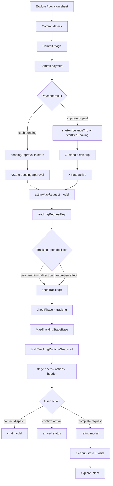

# Tracking Sheet State / UX Deep Audit - 2026-05-20

Status: Audit artifact
Scope: `/map` tracking sheet, tracking header, payment handoff, rating handoff, route/ETA, and active-request UI decisions
Purpose: map the relationship between user decisions, UI phases, state owners, derived models, and likely regressions.

## Core Diagnosis

Tracking is no longer failing from one obvious missing field. It is now a multi-owner consistency problem.

The product asks one user-facing question:

```text
Where is my active care request, and what can I safely do next?
```

The runtime currently answers that question from several partially overlapping layers:

1. Supabase row/status truth
2. TanStack active-trip query
3. Zustand active trip / pending approval store
4. XState lifecycle flags
5. Jotai route, visual phase, and rating atoms
6. map sheet phase / payload navigation state
7. tracking snapshot, view-state, hero, action, and header models

That layering is valid, but the boundaries are soft. A user can move from payment to tracking while the active request exists, but the lifecycle, route atom, hospital payload, visual status atom, and rating/modal layer may still be settling.

## State Owners

| Layer                 | Owner                                                                | Owns                                                                | Must not own                 |
| --------------------- | -------------------------------------------------------------------- | ------------------------------------------------------------------- | ---------------------------- |
| Backend               | Supabase + RPCs                                                      | canonical request row, payment status, assignment fields            | local phase or optimistic UI |
| Server cache          | TanStack active-trip query                                           | refreshed server snapshot                                           | first active trip creation   |
| Runtime store         | `stores/emergencyTripStore.js`                                       | active ambulance, active bed, pending approval, persisted ETA seeds | sheet phase                  |
| Lifecycle             | `hooks/emergency/useTripLifecycle.js`                                | active/pending/arrived/completing boolean truth                     | display copy                 |
| Sheet runtime         | `hooks/map/exploreFlow/useMapExploreFlow.js`                         | phase, payload, selected hospital, active request model             | tracking stage truth         |
| Tracking open/close   | `hooks/map/exploreFlow/useMapTracking.js`                            | open/close tracking, dismissal, auto-open                           | route/ETA/stage derivation   |
| Tracking route        | `hooks/map/tracking/useMapTrackingSync.js` + `trackingRouteInfoAtom` | route duration, distance, route coordinates scoped by request key   | active request identity      |
| Tracking runtime      | `components/map/views/tracking/useMapTrackingRuntime.js`             | snapshot inputs, triage, progress, action eligibility               | visual persistence           |
| Tracking snapshot     | `mapTracking.snapshot.js` + `mapTracking.stage.js`                   | canonical tracking stage                                            | sheet phase                  |
| Tracking view state   | `mapTracking.derived.js`                                             | hospital, labels, ETA text, responder text                          | action safety                |
| Tracking visual atoms | `useMapTrackingStatus.js` + `atoms/mapScreenAtoms.js`                | request-scoped visual phase/progress/title animation                | lifecycle truth              |
| Header                | `useMapTrackingHeader.js`                                            | floating active-session visibility and action requests              | tracking stage truth         |
| Modals                | `MapModalOrchestrator.jsx`                                           | one modal renderer per concern                                      | active request mutation      |

## User Flow Map



## Critical Invariants

1. **Active tracking identity must be canonical.**
   `emergency_requests.id` is the mutation/subscription key. `display_id` is UI only.

2. **Opening tracking is not the same as tracking being ready.**
   The sheet may open immediately, but the stage must honestly show `pending_approval`, `assigning`, or `dispatch_confirmed` until responder/route/ETA are ready.

3. **Sheet payload is navigation context, not active request truth.**
   It can help choose a first hospital shell, but it must not override the active request's canonical hospital once a request exists.

4. **Lifecycle false should close or suppress active tracking chrome.**
   A lingering `trackingRequestKey` during completion/rating cleanup is not enough to keep tracking visible.

5. **One tracking stage should drive title, hero, CTA safety, header tone, and visual atoms.**
   Multiple stage engines can disagree under async updates.

6. **Rating is a modal flow over completed tracking, not a second tracking lifecycle.**
   Completing a trip can clear active trip state while rating remains visible; tracking must not re-open from stale store identity.

## Regression Candidates

### P1 - Tracking lifecycle gate is documented but not fully enforced

Evidence:

- `useMapTracking.js` says auto-open is gated by both `trackingRequestKey` and `hasActiveTrip`.
- The close path only checks `!trackingRequestKey`.
- Header visibility also checks `trackingRequestKey`, not `hasActiveTrip`.

Risk:

- If XState becomes idle/completed/rating-pending while Zustand still has a request key, the tracking sheet/header can remain visible or reopen during cleanup.
- This explains "state problem" symptoms around reload, contact dispatch modal open/close, rating, and post-completion settling.

Fix direction:

- Define one derived boolean: `isTrackingSessionActive = Boolean(trackingRequestKey) && hasActiveTrip`.
- Use it in tracking sheet close logic and tracking header visibility.
- Keep a separate `canOptimisticallyOpenFromCommit` flag for the payment handoff instead of letting any request key behave as active.

### P1 - Payment finish directly opens tracking and bypasses the claimed backstop

Evidence:

- `useMapCommitFlow.finishCommitPayment()` clears commit flow and calls `openTracking()` directly.
- The comment says `useMapTracking` auto-open validates `hasActiveTrip`, but direct `openTracking()` does not validate it.

Risk:

- The no-reload fix is useful, but the contract is now false.
- Tracking can open from a stale `sheetPayload` or fallback hospital before `activeMapRequest` is stable.

Fix direction:

- Replace direct open with a tracking-open intent, or make `openTracking()` accept `{ source: "commit" }` and validate against current active request readiness.
- If commit source needs optimism, open a request-scoped `assigning/pending` shell tied to the canonical request id, not a generic hospital fallback.

### P1 - Active request model is contaminated by navigation payload

Evidence:

- `buildActiveMapRequestModel()` resolves hospital as `preferredHospital || payload?.hospital || findHospitalById(...) || fallbackHospital || nearestHospital`.
- `useMapDerivedData()` passes `preferredHospital: sheetPayload?.hospital`.
- `mapTracking.derived.js` also prefers `activeMapRequest?.hospital || hospital || payload?.hospital` before DB lookup.

Risk:

- Active tracking UI can show a stale or wrong provider if the sheet payload was from an earlier selection or bootstrapped bad row.
- This matches the observed provider mismatch style: tracking logic can be correct while UI labels still come from the wrong hospital source.

Fix direction:

- In active tracking, resolve hospital by active request `hospitalId` from `allHospitals` first.
- Use `sheetPayload?.hospital` only while there is no active request, or as a last fallback when IDs match.

### P2 - One request has four stage interpreters

Current interpreters:

- `mapTracking.stage.js`: canonical snapshot stage
- `mapTracking.derived.js`: `sheetTitle` from `resolvedStatus` and computed status
- `mapActiveSessionPresentation.js`: floating header status/tone
- `useMapTrackingStatus.js`: visual atom phase from snapshot, with legacy fallback

Risk:

- Header can say `Tracking delayed`, sheet can say `En route`, CTA can unlock `Confirm arrival`, and visual atom can still be `approaching`.
- That produces the "almost right but not perfect" feeling: every component is locally reasonable, but the whole surface contradicts itself.

Fix direction:

- Make `trackingSnapshot.trackingStage` the single source for:
  - top-slot title/subtitle
  - hero title/meta
  - header status label/tone
  - CTA eligibility tone
  - visual atom phase
- Keep `resolvedStatus` as backend fact, not display stage.

### P2 - Accepted + ETA but no responder reads too active

Evidence:

- `resolveTrackingStage()` returns `dispatch_confirmed` when status is active and `hasMovementSignal` is true, even with no responder.

Risk:

- A request can look dispatched just because ETA/route exists, while no ambulance identity is assigned.
- This is especially sensitive in demo cash approval where route fallback can appear before responder fields hydrate.

Fix direction:

- Split "route seeded" from "dispatch confirmed":
  - no responder + active status + ETA/route = `assigning` or `preparing_dispatch`
  - responder + no movement = `dispatch_confirmed`
  - responder + movement = `en_route`

### P2 - Request label can fall back to UUID

Evidence:

- `mapTracking.derived.js` builds `requestLabel` from `activeMapRequest?.displayId || pendingApproval?.displayId || activeAmbulanceTrip?.requestId...`
- It does not prefer `activeAmbulanceTrip?.displayId` before `activeAmbulanceTrip?.requestId`.

Risk:

- After canonical identity cleanup, the UI can display UUIDs in the details card when a display id exists.

Fix direction:

- Prefer explicit `displayId` fields for all runtime records before canonical request ids.

### P2 - Tracking header can survive active lifecycle cleanup

Evidence:

- `useMapTrackingHeader()` uses `Boolean(trackingRequestKey)` and phase ownership.
- It does not receive or check `hasActiveTrip`.

Risk:

- The floating header can keep showing a live tracking affordance while rating or cleanup has moved the lifecycle out of active tracking.

Fix direction:

- Thread `hasActiveTrip` or `isTrackingSessionActive` into the header hook.

### P3 - Visual atoms are request-scoped, but reset is passive

Evidence:

- `useMapTrackingStatus()` scopes visual state by request key and resets if no current key exists.
- `resetStatus()` exists but is not the primary owner of phase cleanup.

Risk:

- A one-render stale phase can still appear during request changes or modal remounts if the current key is absent for a frame.

Fix direction:

- Keep current request-scoping, but pair it with lifecycle close/suppress logic so visual state is not asked to hide stale tracking alone.

## Relationship Map: UI Copy And Action Safety

| User-visible surface   | Current source                                                      | Desired source                                          |
| ---------------------- | ------------------------------------------------------------------- | ------------------------------------------------------- |
| Sheet title            | `buildTrackingHeaderModel()` with fallback from `sheetTitleDisplay` | `trackingSnapshot.trackingStage`                        |
| Hero title             | `buildTrackingHeroModel()`                                          | `trackingSnapshot.trackingStage`                        |
| ETA                    | trip ETA, live route atom fallback                                  | same, scoped by canonical request id                    |
| Details request id     | `requestLabel`                                                      | display id only, UUID never unless no display id exists |
| Contact Dispatch       | active trip `id` / `requestId` fallback                             | canonical UUID only                                     |
| Confirm Arrival CTA    | action eligibility + computed ETA arrival                           | canonical stage/action model                            |
| Floating header status | active map request + telemetry                                      | canonical tracking stage + telemetry overlay            |
| Rating modal           | tracking rating atom or recovered rating atom                       | one effective modal state, tracking priority            |

## Recommended Next Runtime Pass

1. Add `isTrackingSessionActive` in `useMapExploreFlow`.
2. Use it in `useMapTracking` close logic and `useMapTrackingHeader` visibility.
3. Change tracking hospital resolution so active request `hospitalId` wins over `sheetPayload`.
4. Normalize `requestLabel` display id priority.
5. Move header status/tone to consume `trackingSnapshot.trackingStage`.
6. Decide whether no-responder + ETA should be `assigning` or a new `preparing_dispatch` stage.
7. Add a narrow pure-model test matrix for:
   - pending approval
   - accepted without responder/no ETA
   - accepted without responder/ETA
   - responder/no ETA
   - responder/ETA
   - stale/lost telemetry with route
   - stale/lost telemetry without route
   - arrived
   - completed/rating cleanup

## Full System Audit Frame

This review should proceed as one umbrella audit with three lanes. Each lane gets
its own subsection, but the source-of-truth table must remain shared so fixes do
not optimize one layer while regressing another.

### 1. Backend Solidity

Question: can the database and server-side functions represent every active
emergency state without ambiguity?

Audit targets:

- `emergency_requests` identity, status, `display_id`, hospital, assignment,
  payment, and triage fields
- `payments` status and approval handoff fields
- `visits` lifecycle fields used by tracking and rating
- ambulance assignment fields and demo `current_call`
- RPCs/functions: create emergency, approve cash, auto-assign ambulance,
  tracking/chat mutations
- RLS and role boundaries for patient, hospital/org admin, and demo automation

Required proof:

- every tracking-visible state has a backend row shape
- no frontend-only state is required to recover the active request after reload
- canonical UUID and display id are never overloaded server-side
- pending approval, accepted, in progress, arrived, completed, cancelled, and
  payment-declined have legal transitions

### 2. API Solidity

Question: do service adapters, query hydration, realtime, and store merges carry
the backend truth without changing meaning?

Audit targets:

- `services/emergencyRequestsService.js`
- `services/paymentService.js`
- `hooks/emergency/useRequestFlow.js`
- `hooks/emergency/useEmergencyActions.js`
- `hooks/emergency/useActiveTripQuery.js`
- `hooks/emergency/useEmergencyRealtime.js`
- `utils/emergencyRealtimeProjection.js`
- `stores/emergencyTripStore.js`

Required proof:

- request UUID, display id, hospital id, payment id, and visit id keep stable
  meanings across create, approve, query, realtime, reload, and completion
- optimistic trip shape and hydrated trip shape compare as the same request
- route/ETA/responder fields are preserved when query rows are partial
- realtime is treated as a patch stream, not first active-trip creation
- every mutation path that requires UUID receives UUID, not display id

### 3. UI Perfection

Question: does every visible surface tell the same story for the same request?

Audit targets:

- tracking sheet phase and floating tracking header
- top-slot title/subtitle
- hero title/subtitle/right meta/state label
- ETA, arrival, distance, progress, and map route
- mid actions and bottom action
- Contact Dispatch modal entry/exit
- rating modal entry/exit
- visit detail resume/rating paths

Required proof:

- header, hero, details, CTA, and modal state agree for every tracking stage
- broad states such as `arrived` are refined by action context when the user has
  already completed the previous action
- no route, modal, or sheet transition leaves a blank or contradictory tracking
  surface
- copy is stage-aware and action-aware, not only status-string-aware

## Source Of Truth Table

| Meaning              | Source of truth                       | Display source                   | Never use for                     |
| -------------------- | ------------------------------------- | -------------------------------- | --------------------------------- |
| Request mutation key | `emergency_requests.id` UUID          | hidden except debug              | human-facing label                |
| Human request label  | `emergency_requests.display_id`       | `displayId`, `requestLabel`      | RPC filters/mutations             |
| Active lifecycle     | XState flags from store/server status | stage copy and CTA gates         | provider/hospital selection       |
| Active request data  | Zustand trip + TanStack hydration     | tracking runtime snapshot        | sheet navigation history          |
| Hospital destination | active request `hospitalId` lookup    | hospital name/address cards      | fallback if active request exists |
| ETA/progress         | trip ETA + scoped route atom          | hero/meta/header metrics         | request identity                  |
| Tracking stage       | `buildTrackingRuntimeSnapshot()`      | header/hero/actions/visual atoms | backend persistence               |
| Action safety        | `buildTrackingActionEligibility()`    | CTA availability/copy            | backend status labels alone       |
| Rating state         | tracking rating atoms + visits truth  | modal                            | active tracking lifecycle         |

## Edge Case Coverage Tracker

| Case                                        | Backend lane                            | API lane                                      | UI lane                                  | Status                 |
| ------------------------------------------- | --------------------------------------- | --------------------------------------------- | ---------------------------------------- | ---------------------- |
| Cash pending approval                       | request/payment pending rows            | pending approval store + query                | `pending_approval`, no dispatch actions  | partial                |
| Cash auto-approved with responder           | approved request + ambulance assignment | hydrated approval result starts trip          | en route or dispatch confirmed           | verified manually      |
| Cash auto-approved before responder hydrate | accepted request, assignment delayed    | same request preserved through query/realtime | assigning/preparing copy, no fake driver | open                   |
| Card payment processing                     | payment intent + settlement             | settlement waits on UUID                      | payment sheet committed state            | needs review           |
| Wallet/immediate payment                    | active request row                      | direct completion payload                     | immediate tracking shell                 | needs review           |
| Reload during pending                       | persisted/query request                 | hydration gate + alias match                  | pending approval restored                | needs review           |
| Reload during active trip                   | active request + route fields           | ETA/startedAt/route preserve                  | ETA and route persist                    | partially verified     |
| Contact Dispatch open/close                 | chat room UUID contract                 | room creation uses canonical id               | modal does not disturb tracking          | partially verified     |
| ETA elapsed before confirm                  | accepted/in_progress request            | computed arrival eligibility                  | hero says confirm, CTA confirm           | fixed by current slice |
| User confirmed arrival                      | arrived request/lifecycle               | action model exposes complete                 | hero says complete, CTA complete         | fixed by current slice |
| Complete request/rating                     | visit/request completed                 | defer cleanup + rating atom                   | single rating modal, no tracking reopen  | partially verified     |
| Cancel active request                       | cancelled status                        | store clears active trip                      | tracking chrome closes                   | needs review           |
| Lost/stale telemetry with route             | telemetry health                        | route fallback preserved                      | warning overlay, actions still available | needs review           |
| Lost/stale telemetry without route          | telemetry health                        | no movement signal                            | delayed/lost state, no fake ETA          | needs review           |
| Bed-only booking                            | bed status/lifecycle                    | active bed booking store                      | bed reserved/ready/complete              | needs review           |
| Ambulance + bed companion                   | both active records                     | priority and companion labels                 | no hidden companion state                | needs review           |
| Visit detail resume                         | visit lifecycle                         | active request key guard                      | resume only when active request exists   | needs review           |

## Audit Method

For each tracker row:

1. capture the backend row shape and legal transition
2. capture the API/service payload shape after each boundary
3. capture the local store shape before and after hydration/realtime
4. capture the tracking snapshot stage
5. capture rendered header, hero, details, mid actions, bottom action, modal
6. mark contradictions as UI sync, state sync, API sync, or backend contract

Do not apply broad sync changes until the contradiction is assigned to one of
those four buckets.

## Regression To Watch

Do not fix this by delaying the tracking sheet until everything is perfect. That would make payment feel dead.

The desired behavior is:

```text
payment succeeds
  -> sheet opens immediately
  -> active request identity is canonical
  -> UI shows pending/assigning honestly if responder is not ready
  -> ETA appears as soon as trip ETA or scoped route ETA exists
  -> header and sheet agree
  -> lifecycle false removes tracking chrome even if rating/modal remains
```
