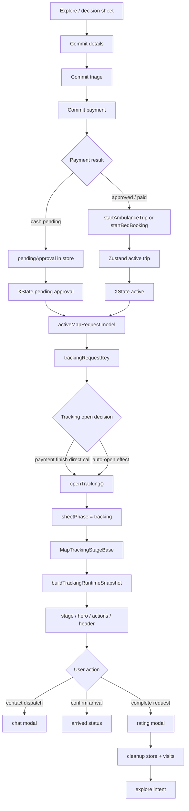
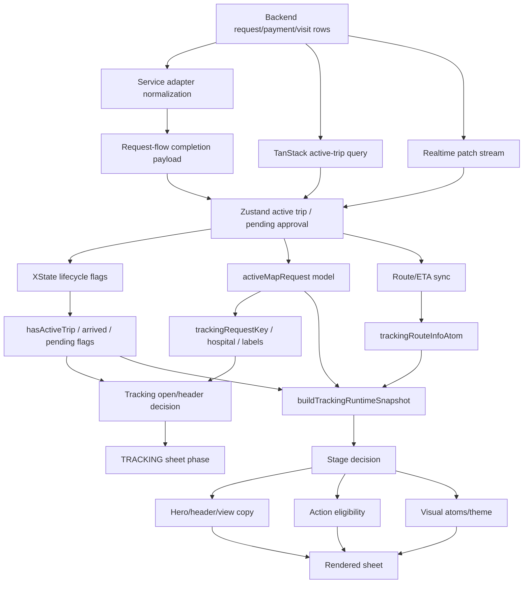

# Tracking Sheet State / UX Deep Audit - 2026-05-20

Status: Audit artifact
Scope: `/map` tracking sheet, tracking header, payment handoff, rating handoff, route/ETA, and active-request UI decisions
Purpose: map the relationship between user decisions, UI phases, state owners, derived models, and likely regressions.

## Core Diagnosis

Tracking is no longer failing from one obvious missing field. It is now a multi-owner consistency problem.

The product asks one user-facing question:

```text
Where is my active care request, and what can I safely do next?
```

The runtime currently answers that question from several partially overlapping layers:

1. Supabase row/status truth
2. TanStack active-trip query
3. Zustand active trip / pending approval store
4. XState lifecycle flags
5. Jotai route, visual phase, and rating atoms
6. map sheet phase / payload navigation state
7. tracking snapshot, view-state, hero, action, and header models

That layering is valid, but the boundaries are soft. A user can move from payment to tracking while the active request exists, but the lifecycle, route atom, hospital payload, visual status atom, and rating/modal layer may still be settling.

## State Owners

| Layer                 | Owner                                                                | Owns                                                                | Must not own                 |
| --------------------- | -------------------------------------------------------------------- | ------------------------------------------------------------------- | ---------------------------- |
| Backend               | Supabase + RPCs                                                      | canonical request row, payment status, assignment fields            | local phase or optimistic UI |
| Server cache          | TanStack active-trip query                                           | refreshed server snapshot                                           | first active trip creation   |
| Runtime store         | `stores/emergencyTripStore.js`                                       | active ambulance, active bed, pending approval, persisted ETA seeds | sheet phase                  |
| Lifecycle             | `hooks/emergency/useTripLifecycle.js`                                | active/pending/arrived/completing boolean truth                     | display copy                 |
| Sheet runtime         | `hooks/map/exploreFlow/useMapExploreFlow.js`                         | phase, payload, selected hospital, active request model             | tracking stage truth         |
| Tracking open/close   | `hooks/map/exploreFlow/useMapTracking.js`                            | open/close tracking, dismissal, auto-open                           | route/ETA/stage derivation   |
| Tracking route        | `hooks/map/tracking/useMapTrackingSync.js` + `trackingRouteInfoAtom` | route duration, distance, route coordinates scoped by request key   | active request identity      |
| Tracking runtime      | `components/map/views/tracking/useMapTrackingRuntime.js`             | snapshot inputs, triage, progress, action eligibility               | visual persistence           |
| Tracking snapshot     | `mapTracking.snapshot.js` + `mapTracking.stage.js`                   | canonical tracking stage                                            | sheet phase                  |
| Tracking view state   | `mapTracking.derived.js`                                             | hospital, labels, ETA text, responder text                          | action safety                |
| Tracking visual atoms | `useMapTrackingStatus.js` + `atoms/mapScreenAtoms.js`                | request-scoped visual phase/progress/title animation                | lifecycle truth              |
| Header                | `useMapTrackingHeader.js`                                            | floating active-session visibility and action requests              | tracking stage truth         |
| Modals                | `MapModalOrchestrator.jsx`                                           | one modal renderer per concern                                      | active request mutation      |

## User Flow Map



## Critical Invariants

1. **Active tracking identity must be canonical.**
   `emergency_requests.id` is the mutation/subscription key. `display_id` is UI only.

2. **Opening tracking is not the same as tracking being ready.**
   The sheet may open immediately, but the stage must honestly show `pending_approval`, `assigning`, or `dispatch_confirmed` until responder/route/ETA are ready.

3. **Sheet payload is navigation context, not active request truth.**
   It can help choose a first hospital shell, but it must not override the active request's canonical hospital once a request exists.

4. **Lifecycle false should close or suppress active tracking chrome.**
   A lingering `trackingRequestKey` during completion/rating cleanup is not enough to keep tracking visible.

5. **One tracking stage should drive title, hero, CTA safety, header tone, and visual atoms.**
   Multiple stage engines can disagree under async updates.

6. **Rating is a modal flow over completed tracking, not a second tracking lifecycle.**
   Completing a trip can clear active trip state while rating remains visible; tracking must not re-open from stale store identity.

## Regression Candidates

### P1 - Tracking lifecycle gate is documented but not fully enforced

Evidence:

- `useMapTracking.js` says auto-open is gated by both `trackingRequestKey` and `hasActiveTrip`.
- The close path only checks `!trackingRequestKey`.
- Header visibility also checks `trackingRequestKey`, not `hasActiveTrip`.

Risk:

- If XState becomes idle/completed/rating-pending while Zustand still has a request key, the tracking sheet/header can remain visible or reopen during cleanup.
- This explains "state problem" symptoms around reload, contact dispatch modal open/close, rating, and post-completion settling.

Fix direction:

- Define one derived boolean: `isTrackingSessionActive = Boolean(trackingRequestKey) && hasActiveTrip`.
- Use it in tracking sheet close logic and tracking header visibility.
- Keep a separate `canOptimisticallyOpenFromCommit` flag for the payment handoff instead of letting any request key behave as active.

### P1 - Payment finish directly opens tracking and bypasses the claimed backstop

Evidence:

- `useMapCommitFlow.finishCommitPayment()` clears commit flow and calls `openTracking()` directly.
- The comment says `useMapTracking` auto-open validates `hasActiveTrip`, but direct `openTracking()` does not validate it.

Risk:

- The no-reload fix is useful, but the contract is now false.
- Tracking can open from a stale `sheetPayload` or fallback hospital before `activeMapRequest` is stable.

Fix direction:

- Replace direct open with a tracking-open intent, or make `openTracking()` accept `{ source: "commit" }` and validate against current active request readiness.
- If commit source needs optimism, open a request-scoped `assigning/pending` shell tied to the canonical request id, not a generic hospital fallback.

### P1 - Active request model is contaminated by navigation payload

Evidence:

- `buildActiveMapRequestModel()` resolves hospital as `preferredHospital || payload?.hospital || findHospitalById(...) || fallbackHospital || nearestHospital`.
- `useMapDerivedData()` passes `preferredHospital: sheetPayload?.hospital`.
- `mapTracking.derived.js` also prefers `activeMapRequest?.hospital || hospital || payload?.hospital` before DB lookup.

Risk:

- Active tracking UI can show a stale or wrong provider if the sheet payload was from an earlier selection or bootstrapped bad row.
- This matches the observed provider mismatch style: tracking logic can be correct while UI labels still come from the wrong hospital source.

Fix direction:

- In active tracking, resolve hospital by active request `hospitalId` from `allHospitals` first.
- Use `sheetPayload?.hospital` only while there is no active request, or as a last fallback when IDs match.

### P2 - One request has four stage interpreters

Current interpreters:

- `mapTracking.stage.js`: canonical snapshot stage
- `mapTracking.derived.js`: `sheetTitle` from `resolvedStatus` and computed status
- `mapActiveSessionPresentation.js`: floating header status/tone
- `useMapTrackingStatus.js`: visual atom phase from snapshot, with legacy fallback

Risk:

- Header can say `Tracking delayed`, sheet can say `En route`, CTA can unlock `Confirm arrival`, and visual atom can still be `approaching`.
- That produces the "almost right but not perfect" feeling: every component is locally reasonable, but the whole surface contradicts itself.

Fix direction:

- Make `trackingSnapshot.trackingStage` the single source for:
  - top-slot title/subtitle
  - hero title/meta
  - header status label/tone
  - CTA eligibility tone
  - visual atom phase
- Keep `resolvedStatus` as backend fact, not display stage.

### P2 - Accepted + ETA but no responder reads too active

Evidence:

- `resolveTrackingStage()` returns `dispatch_confirmed` when status is active and `hasMovementSignal` is true, even with no responder.

Risk:

- A request can look dispatched just because ETA/route exists, while no ambulance identity is assigned.
- This is especially sensitive in demo cash approval where route fallback can appear before responder fields hydrate.

Fix direction:

- Split "route seeded" from "dispatch confirmed":
  - no responder + active status + ETA/route = `assigning` or `preparing_dispatch`
  - responder + no movement = `dispatch_confirmed`
  - responder + movement = `en_route`

### P2 - Request label can fall back to UUID

Evidence:

- `mapTracking.derived.js` builds `requestLabel` from `activeMapRequest?.displayId || pendingApproval?.displayId || activeAmbulanceTrip?.requestId...`
- It does not prefer `activeAmbulanceTrip?.displayId` before `activeAmbulanceTrip?.requestId`.

Risk:

- After canonical identity cleanup, the UI can display UUIDs in the details card when a display id exists.

Fix direction:

- Prefer explicit `displayId` fields for all runtime records before canonical request ids.

### P2 - Tracking header can survive active lifecycle cleanup

Evidence:

- `useMapTrackingHeader()` uses `Boolean(trackingRequestKey)` and phase ownership.
- It does not receive or check `hasActiveTrip`.

Risk:

- The floating header can keep showing a live tracking affordance while rating or cleanup has moved the lifecycle out of active tracking.

Fix direction:

- Thread `hasActiveTrip` or `isTrackingSessionActive` into the header hook.

### P3 - Visual atoms are request-scoped, but reset is passive

Evidence:

- `useMapTrackingStatus()` scopes visual state by request key and resets if no current key exists.
- `resetStatus()` exists but is not the primary owner of phase cleanup.

Risk:

- A one-render stale phase can still appear during request changes or modal remounts if the current key is absent for a frame.

Fix direction:

- Keep current request-scoping, but pair it with lifecycle close/suppress logic so visual state is not asked to hide stale tracking alone.

## Relationship Map: UI Copy And Action Safety

| User-visible surface   | Current source                                                      | Desired source                                          |
| ---------------------- | ------------------------------------------------------------------- | ------------------------------------------------------- |
| Sheet title            | `buildTrackingHeaderModel()` with fallback from `sheetTitleDisplay` | `trackingSnapshot.trackingStage`                        |
| Hero title             | `buildTrackingHeroModel()`                                          | `trackingSnapshot.trackingStage`                        |
| ETA                    | trip ETA, live route atom fallback                                  | same, scoped by canonical request id                    |
| Details request id     | `requestLabel`                                                      | display id only, UUID never unless no display id exists |
| Contact Dispatch       | active trip `id` / `requestId` fallback                             | canonical UUID only                                     |
| Confirm Arrival CTA    | action eligibility + computed ETA arrival                           | canonical stage/action model                            |
| Floating header status | active map request + telemetry                                      | canonical tracking stage + telemetry overlay            |
| Rating modal           | tracking rating atom or recovered rating atom                       | one effective modal state, tracking priority            |

## Recommended Next Runtime Pass

1. Add `isTrackingSessionActive` in `useMapExploreFlow`.
2. Use it in `useMapTracking` close logic and `useMapTrackingHeader` visibility.
3. Change tracking hospital resolution so active request `hospitalId` wins over `sheetPayload`.
4. Normalize `requestLabel` display id priority.
5. Move header status/tone to consume `trackingSnapshot.trackingStage`.
6. Decide whether no-responder + ETA should be `assigning` or a new `preparing_dispatch` stage.
7. Add a narrow pure-model test matrix for:
   - pending approval
   - accepted without responder/no ETA
   - accepted without responder/ETA
   - responder/no ETA
   - responder/ETA
   - stale/lost telemetry with route
   - stale/lost telemetry without route
   - arrived
   - completed/rating cleanup

## Full System Audit Frame

This review should proceed as one umbrella audit with three lanes. Each lane gets
its own subsection, but the source-of-truth table must remain shared so fixes do
not optimize one layer while regressing another.

### 1. Backend Solidity

Question: can the database and server-side functions represent every active
emergency state without ambiguity?

Audit targets:

- `emergency_requests` identity, status, `display_id`, hospital, assignment,
  payment, and triage fields
- `payments` status and approval handoff fields
- `visits` lifecycle fields used by tracking and rating
- ambulance assignment fields and demo `current_call`
- RPCs/functions: create emergency, approve cash, auto-assign ambulance,
  tracking/chat mutations
- RLS and role boundaries for patient, hospital/org admin, and demo automation

Required proof:

- every tracking-visible state has a backend row shape
- no frontend-only state is required to recover the active request after reload
- canonical UUID and display id are never overloaded server-side
- pending approval, accepted, in progress, arrived, completed, cancelled, and
  payment-declined have legal transitions

### 2. API Solidity

Question: do service adapters, query hydration, realtime, and store merges carry
the backend truth without changing meaning?

Audit targets:

- `services/emergencyRequestsService.js`
- `services/paymentService.js`
- `hooks/emergency/useRequestFlow.js`
- `hooks/emergency/useEmergencyActions.js`
- `hooks/emergency/useActiveTripQuery.js`
- `hooks/emergency/useEmergencyRealtime.js`
- `utils/emergencyRealtimeProjection.js`
- `stores/emergencyTripStore.js`

Required proof:

- request UUID, display id, hospital id, payment id, and visit id keep stable
  meanings across create, approve, query, realtime, reload, and completion
- optimistic trip shape and hydrated trip shape compare as the same request
- route/ETA/responder fields are preserved when query rows are partial
- realtime is treated as a patch stream, not first active-trip creation
- every mutation path that requires UUID receives UUID, not display id

### 3. UI Perfection

Question: does every visible surface tell the same story for the same request?

Audit targets:

- tracking sheet phase and floating tracking header
- top-slot title/subtitle
- hero title/subtitle/right meta/state label
- ETA, arrival, distance, progress, and map route
- mid actions and bottom action
- Contact Dispatch modal entry/exit
- rating modal entry/exit
- visit detail resume/rating paths

Required proof:

- header, hero, details, CTA, and modal state agree for every tracking stage
- broad states such as `arrived` are refined by action context when the user has
  already completed the previous action
- no route, modal, or sheet transition leaves a blank or contradictory tracking
  surface
- copy is stage-aware and action-aware, not only status-string-aware

## Source Of Truth Table

| Meaning              | Source of truth                       | Display source                   | Never use for                     |
| -------------------- | ------------------------------------- | -------------------------------- | --------------------------------- |
| Request mutation key | `emergency_requests.id` UUID          | hidden except debug              | human-facing label                |
| Human request label  | `emergency_requests.display_id`       | `displayId`, `requestLabel`      | RPC filters/mutations             |
| Active lifecycle     | XState flags from store/server status | stage copy and CTA gates         | provider/hospital selection       |
| Active request data  | Zustand trip + TanStack hydration     | tracking runtime snapshot        | sheet navigation history          |
| Hospital destination | active request `hospitalId` lookup    | hospital name/address cards      | fallback if active request exists |
| ETA/progress         | trip ETA + scoped route atom          | hero/meta/header metrics         | request identity                  |
| Tracking stage       | `buildTrackingRuntimeSnapshot()`      | header/hero/actions/visual atoms | backend persistence               |
| Action safety        | `buildTrackingActionEligibility()`    | CTA availability/copy            | backend status labels alone       |
| Rating state         | tracking rating atoms + visits truth  | modal                            | active tracking lifecycle         |

## Code Coverage Ledger

This ledger is the promise boundary for "covered every line." A file is marked
covered only after reading it end-to-end and connecting its decisions to this
audit. "Mapped" means the current behavior is represented in a section below.
"Read" means reviewed but not yet fully cross-linked to every downstream
consumer.

| Tier                        | Files                                                                                                                                                                                         | Coverage state              |
| --------------------------- | --------------------------------------------------------------------------------------------------------------------------------------------------------------------------------------------- | --------------------------- |
| Tracking stage/render       | `MapTrackingStageBase.jsx`, `MapTrackingOrchestrator.jsx`, `parts/MapTrackingParts.jsx`                                                                                                       | mapped                      |
| Tracking pure models        | `mapTracking.stage.js`, `snapshot.js`, `actions.js`, `model.js`, `hero.js`, `derived.js`, `timeline.js`                                                                                       | mapped                      |
| Tracking style/theme/share  | `mapTracking.presentation.js`, `theme.js`, `styles.js`, `share.js`                                                                                                                            | mapped                      |
| Tracking controller/runtime | `useMapTrackingRuntime.js`, `useMapTrackingController.js`                                                                                                                                     | mapped                      |
| Tracking open/header/status | `useMapTracking.js`, `useMapTrackingHeader.js`, `useMapTrackingStatus.js`, `useMapTrackingTimer.js`                                                                                           | mapped                      |
| Route sync/map focus        | `useMapTrackingSync.js`, `useMapFocusedState.js`, `MapScreen.jsx` tracking route wiring                                                                                                       | mapped                      |
| Active request/header       | `mapActiveRequestModel.js`, `mapActiveSessionPresentation.js`, `useMapDerivedData.js`, `MapSheetOrchestrator.jsx` tracking case                                                               | mapped                      |
| Trip store/query/lifecycle  | `emergencyTripStore.js`, `useActiveTripQuery.js`, `useTripLifecycle.js`, `useTripProgress.js`, `tripLifecycleMachine.js`                                                                      | mapped                      |
| Trip actions/handlers       | `useEmergencyActions.js`, `useEmergencyHandlers.js`, `useEmergencyRealtime.js`, `useEmergencyServerSync.js`, `emergencyRealtimeProjection.js`                                                 | mapped                      |
| Payment/request handoff     | `useRequestFlow.js`, `useMapCommitFlow.js`, `useMapCommitPaymentController.js`, `mapCommitPayment.transaction.js`, `usePaymentScreenModel.js`, `emergencyRequestsService.js`, payment helpers | mapped, edge review ongoing |
| Rating recovery             | `useTrackingRatingFlow.js`, `mapTracking.rating.js`, rating atoms, `MapModalOrchestrator.jsx`                                                                                                 | mapped                      |
| Contact dispatch            | chat atoms, chat hooks, `EmergencyContactDispatchModal.jsx`, `MapModalOrchestrator.jsx`, `emergencyChatService.js`, emergency chat RPCs                                                       | mapped, edge review ongoing |
| Backend/API contract        | emergency request RPCs, status guards, dispatch/ETA helpers, chat RPCs, realtime projection helpers, runtime tests                                                                            | partial read                |

## Connected Decision Map

Every active tracking render is the result of these decisions in order. A bug is
only understood when we know which node produced the wrong output or which
consumer interpreted a valid output incorrectly.



### Decision Nodes

| Node                | Owner                                                     | Inputs                                                    | Output                                                            | Downstream consumers                                | Failure shape                                         |
| ------------------- | --------------------------------------------------------- | --------------------------------------------------------- | ----------------------------------------------------------------- | --------------------------------------------------- | ----------------------------------------------------- |
| Request creation    | `create_emergency_v4` / `emergencyRequestsService.create` | hospital, service, payment method, user                   | canonical request UUID, display id, payment state                 | payment sheet, pending approval, completion payload | UUID/display id meaning drifts                        |
| Cash approval       | `demo-approve-cash-payment`, `approve_cash_payment`       | request UUID, payment id, org admin/demo auth             | approved request, payment complete, optional ambulance assignment | request completion, store, tracking                 | approval returns stale pre-assignment row             |
| Card settlement     | `paymentService.waitForEmergencyPaymentSettlement`        | request UUID, payment intent                              | settled active request or decline/timeout                         | request completion                                  | UI exits payment before server row is active          |
| Completion payload  | `mapCommitPayment.helpers.js` + `useRequestFlow`          | initiated request + approval/settlement result            | normalized request for `handleRequestComplete`                    | start trip/booking                                  | missing `id`, display id, responder, ETA              |
| Active trip start   | `useEmergencyActions.startAmbulanceTrip` / bed equivalent | completion payload                                        | Zustand active trip or bed booking                                | lifecycle, active map request, route sync           | optimistic shape differs from hydrated shape          |
| Pending approval    | `setPendingApproval`                                      | cash pending payload                                      | pending approval store record                                     | lifecycle, active request, tracking stage           | pending treated as active dispatch                    |
| Store hydration     | `emergencyTripStore.initFromStorage`                      | persisted active trip/pending                             | restored store                                                    | lifecycle, route, tracking open                     | query overwrites before hydration settles             |
| Query hydration     | `useActiveTripQuery`                                      | server request list, previous store                       | active/pending snapshots                                          | store merge                                         | partial server row drops richer runtime fields        |
| Realtime patch      | `useEmergencyRealtime` + projection helper                | request/ambulance events                                  | patch over existing store trip                                    | active request, ETA, responder                      | expected to create state when none exists             |
| Lifecycle flags     | `useTripLifecycle`                                        | store record status                                       | `hasActiveTrip`, `isArrived`, `isPendingApproval`                 | tracking open, actions, snapshot                    | store identity lingers after lifecycle false          |
| Active map request  | `buildActiveMapRequestModel`                              | active trip/bed/pending, hospitals, sheet payload         | request kind, hospital, ETA labels, action flags                  | tracking key, header, route sync, tracking runtime  | sheet payload overrides active request truth          |
| Tracking open       | `useMapTracking` / `useMapCommitFlow`                     | tracking key, lifecycle, sheet phase, commit source       | tracking sheet phase/payload                                      | sheet orchestrator, map route active flag           | direct open bypasses lifecycle/readiness contract     |
| Tracking header     | `useMapTrackingHeader`                                    | request key, phase, modal state, active request           | active-session header                                             | global header                                       | header survives cleanup because key is truthy         |
| Route sync          | `useMapTrackingSync` + map route callback                 | active request key, trip route, map route                 | scoped route atom, ETA patch                                      | progress, hero, map polyline                        | request-key mismatch hides live ETA                   |
| Runtime snapshot    | `buildTrackingRuntimeSnapshot`                            | kind, status, route, ETA, responder, lifecycle, telemetry | `trackingStage`, readiness, visual phase                          | hero, actions, visual atoms                         | broad stage misses action substate                    |
| View state          | `mapTracking.derived.js`                                  | active request, trip, route, hospital, current location   | display labels and sheet title                                    | hero, route card, details                           | labels disagree with snapshot/action state            |
| Action eligibility  | `mapTracking.actions.js`                                  | snapshot, active request flags, lifecycle flags           | primary/mid/bottom actions                                        | CTA group and footer                                | CTA says complete while hero says confirm             |
| Visual atoms        | `useMapTrackingStatus`                                    | snapshot, request key, progress                           | status phase, progress, animation flags                           | title color, CTA theme, arrival toast               | persisted visual phase leaks between requests         |
| Modal orchestration | `MapModalOrchestrator`, rating/chat atoms                 | rating/chat state, active request id                      | visible modal                                                     | tracking behind modal, recovery                     | modal cleanup changes tracking without lifecycle sync |

## Backend State Machine Contract

Backend status must be treated as the durable contract, not as final UI copy.
The UI stage may refine it with assignment, route, ETA, telemetry, and action
state.

| Backend status/payment                 | Legal tracking meaning                          | Required fields                                                | Next legal backend transition                              | UI must show                                                     |
| -------------------------------------- | ----------------------------------------------- | -------------------------------------------------------------- | ---------------------------------------------------------- | ---------------------------------------------------------------- |
| `pending_approval` + payment `pending` | cash/card approval or settlement not finished   | request UUID, display id, hospital id, payment id              | `accepted`, `in_progress`, `payment_declined`, `cancelled` | awaiting approval/confirming, no dispatch-complete actions       |
| `payment_declined`                     | payment failed/declined                         | request UUID, payment status                                   | retry/new payment or terminal                              | payment failure, no tracking shell unless explicitly recoverable |
| `accepted`                             | active request accepted, may still be assigning | request UUID, hospital id, service type                        | `in_progress`, `arrived`, `cancelled`, `completed`         | assigning/preparing/dispatch confirmed depending responder/ETA   |
| `in_progress`                          | active request underway                         | request UUID, hospital id, ETA/route or responder if available | `arrived`, `cancelled`, `completed`                        | en route/approaching/lost/delayed                                |
| `arrived`                              | arrival confirmed or server-arrived             | request UUID, hospital id                                      | `completed`, `cancelled`                                   | complete request, not confirm arrival                            |
| `completed`                            | request finished                                | request UUID, visit id                                         | terminal/rating visit updates                              | rating or complete, no live tracking chrome                      |
| `cancelled`                            | request ended                                   | request UUID, reason if present                                | terminal                                                   | return to explore/visit detail, no live tracking chrome          |

## API And Store Shape Contract

These shapes must compare as the same request at every boundary:

| Boundary               | Canonical UUID field                               | Display field                             | Store active key | Risk                                                    |
| ---------------------- | -------------------------------------------------- | ----------------------------------------- | ---------------- | ------------------------------------------------------- |
| RPC result             | `request_id`                                       | `display_id`                              | not yet          | raw snake_case                                          |
| service adapter        | `id`                                               | `requestId`/`displayId` depending adapter | not yet          | `requestId` can mean display id                         |
| initiated request      | `requestId` currently UUID                         | `displayId`                               | pending payload  | overloaded `requestId`                                  |
| completion payload     | `id` or `requestId` UUID expected                  | `displayId`                               | start trip input | missing `id` breaks alias matching                      |
| active trip optimistic | `id`, `requestId` must be canonical or alias-aware | `displayId`                               | Zustand          | query hydration can look like a different trip          |
| query row              | `id`                                               | `displayId` / row `display_id`            | Zustand merge    | partial server row can overwrite richer optimistic data |
| realtime row           | `id`, `request_id`, `current_call`                 | `display_id`                              | store patch      | patch ignored if no existing trip                       |
| chat room              | request UUID only                                  | display id forbidden                      | modal id         | display id causes room creation failure                 |

Rule for future cleanup: either make `activeAmbulanceTrip.requestId` always the
canonical UUID and `displayId` always the label, or keep the adapter shape but
require all same-request helpers to compare `id`, `requestId`, `displayId`,
`display_id`, nested `request.id`, and nested `request.display_id`.

## Tracking Stage To Render Matrix

This is the UI perfection checklist. Every row must be verified against the
actual rendered sheet, not only the model output.

| Tracking stage         | Required condition                         | Header title                              | Hero title/subtitle               | Mid actions                               | Bottom action                      | Contradiction to catch                               |
| ---------------------- | ------------------------------------------ | ----------------------------------------- | --------------------------------- | ----------------------------------------- | ---------------------------------- | ---------------------------------------------------- |
| `idle`                 | no active request                          | hidden or `Tracking` only if safely empty | no active request                 | none                                      | none                               | blank tracking shell opens from stale payload        |
| `pending_approval`     | pending approval store or backend status   | `Confirming`                              | `Awaiting approval` + service     | triage if useful, cancel                  | cancel pending                     | contact dispatch/reserve bed shown too early         |
| `assigning`            | active request, no responder/movement      | `Assigning`                               | assigning/finding driver          | info, cancel, maybe share disabled/hidden | cancel request                     | ETA/route makes it look dispatched without responder |
| `dispatch_confirmed`   | responder exists, little/no route movement | `Dispatch Confirmed`                      | driver/dispatch confirmed         | info, contact dispatch, share ETA         | cancel request                     | no responder but copy implies responder assigned     |
| `en_route`             | responder + movement/ETA                   | `En Route`                                | responder or ambulance en route   | info, contact dispatch, share ETA         | cancel request                     | telemetry warning replaces ETA when ETA valid        |
| `approaching`          | progress threshold before arrival action   | `Approaching`                             | almost there                      | info, contact dispatch, share ETA         | cancel request                     | confirm arrival appears before eligibility           |
| `arrived` pre-confirm  | ETA elapsed or can mark arrived            | `Arrived`                                 | driver arrived / confirm arrival  | confirm arrival emphasized                | cancel or confirm depending layout | hero does not match confirm CTA                      |
| `arrived` post-confirm | lifecycle/status arrived, can complete     | `Arrived`                                 | driver arrived / complete request | info/contact/share, no confirm arrival    | complete request                   | hero says confirm after user confirmed               |
| `completed`            | backend/store completed or rating flow     | `Complete` or no tracking header          | visit complete                    | none or rating context                    | rating/none                        | tracking reopens behind rating                       |
| `delayed`              | stale telemetry and no movement signal     | `Tracking Delayed`                        | waiting for fresh update          | contact dispatch/cancel available         | cancel request                     | blocks all actions like terminal state               |
| `lost`                 | lost telemetry and no movement signal      | `Tracking Lost`                           | signal interrupted                | contact dispatch/cancel available         | cancel request                     | fake ETA/progress continues without signal           |
| bed `en_route`         | bed booking active with ETA                | `Bed Reserved`                            | bed service + hospital            | info, request transport, share            | cancel booking                     | ambulance-specific copy leaks in                     |
| bed ready              | bed arrived/ready/check-in available       | `Bed Ready`                               | bed ready                         | check in/complete path                    | complete stay/check in             | bed status and CTA disagree                          |
| companion active       | ambulance and bed both active              | primary active + companion label          | service + companion state         | no duplicate add companion CTA            | current primary action             | companion hidden or duplicated                       |

## Field-Level Source Map

| Field/signal                           | Produced by                                             | Consumed by                                    | Sync rule                                                              |
| -------------------------------------- | ------------------------------------------------------- | ---------------------------------------------- | ---------------------------------------------------------------------- |
| `hospitalId`                           | backend request row / completion payload                | active map request, hospital label, map focus  | active request wins over sheet payload                                 |
| `hospitalName/address`                 | hospital lookup by `hospitalId`                         | route card, hero subtitle fallback             | lookup first, payload fallback only if id matches or no active request |
| `etaSeconds`                           | approval/settlement result, query, route atom patch     | progress, arrival clock, hero right meta       | preserve for same request when query is partial                        |
| `startedAt`                            | trip start, query fallback, route sync                  | progress and arrival eligibility               | never reset for same request unless explicitly restarted               |
| `route`                                | map route callback, stored trip route                   | map polyline, ETA fallback, movement signal    | scoped by canonical request key                                        |
| `assignedAmbulance` / responder fields | approval, assignment RPC, query, realtime ambulance row | hero title, dispatch state, contact confidence | route alone should not pretend responder exists                        |
| `ambulanceTelemetryHealth`             | emergency realtime/location health                      | delayed/lost stage, header tone, hero warning  | telemetry exception overlays active state unless no movement signal    |
| `isArrived`                            | XState/backend status                                   | snapshot, action eligibility, progress         | distinguishes complete request from confirm arrival                    |
| `canMarkArrived`                       | action eligibility                                      | primary/mid action, hero subtitle              | pre-confirm arrived only                                               |
| `canCompleteAmbulance`                 | action eligibility                                      | bottom action, hero subtitle                   | post-confirm arrived only                                              |
| `ratingState`                          | controller/rating flow atoms + visits                   | modal orchestrator                             | not a live tracking stage                                              |

## Implementation Evidence Map

This section records what the current code actually does. It is the anti-hallucination layer: if a future claim is not connected to one of these functions or a new checked source, it should be treated as a hypothesis.

### Backend / API Evidence

| Contract                                                   | Current implementation evidence                                                                                                                                                                                                                                                 | Interpretation                                                                                                                                  |
| ---------------------------------------------------------- | ------------------------------------------------------------------------------------------------------------------------------------------------------------------------------------------------------------------------------------------------------------------------------- | ----------------------------------------------------------------------------------------------------------------------------------------------- | -------------- | ---------------------------------------------------------------------------------------------------------------------------------- | --------------------------------------------------------------------------------------------------------------------------------- |
| Backend has a finite request status language               | `EmergencyRequestStatus` in `services/emergencyRequestsService.js` defines `pending_approval`, `in_progress`, `accepted`, `arrived`, `completed`, `cancelled`, and `payment_declined`.                                                                                          | UI stages should refine these statuses, not invent durable backend states.                                                                      |
| Active backend requests include waiting and arrived states | `ACTIVE_EMERGENCY_REQUEST_STATUSES` includes `pending_approval`, `in_progress`, `accepted`, and `arrived`.                                                                                                                                                                      | `arrived` is still active for completion; `completed/cancelled/payment_declined` are terminal for live tracking.                                |
| Canonical status aliases exist in SQL                      | `canonicalize_emergency_status()` maps legacy or UI-like labels such as `pending`, `dispatched`, `assigned`, `responding`, `en_route`, `resolved`, `canceled`, and `declined` into canonical request statuses.                                                                  | Backend accepts some historical vocabulary, but the UI should still emit canonical statuses to avoid ambiguous reads.                           |
| Backend transition graph is explicit                       | `is_valid_emergency_status_transition()` allows `pending_approval -> in_progress/accepted/cancelled/payment_declined`, `in_progress -> accepted/arrived/completed/cancelled/payment_declined`, `accepted -> arrived/completed/cancelled`, and `arrived -> completed/cancelled`. | This is the hard lifecycle graph the tracking UI must not contradict.                                                                           |
| Direct status writes are blocked                           | `enforce_emergency_status_write_path()` rejects status updates unless the RPC path sets `ivisit.allow_emergency_status_write`.                                                                                                                                                  | Tracking actions must go through canonical RPC/service helpers, not direct table updates.                                                       |
| Status changes are logged                                  | `log_emergency_status_transition()` writes `emergency_status_transitions` with source, reason, actor role, metadata, and request snapshot.                                                                                                                                      | Backend can explain lifecycle changes after the fact; audit tooling should compare UI state against this log.                                   |
| Create RPC returns canonical and display ids separately    | `emergencyRequestsService.create()` maps RPC `request_id` to `id` and `display_id` to the display-facing fields.                                                                                                                                                                | The payment handoff has enough data to avoid display-id-as-mutation-key regressions.                                                            |
| List/query adapter still exposes overloaded `requestId`    | `mapEmergencyRequestRow()` maps `id: r.id`, but also maps `requestId: r.display_id` and `displayId: r.display_id`.                                                                                                                                                              | Alias-aware comparison remains necessary until service row shapes are cleaned up.                                                               |
| Status mutation expects canonical identity                 | `setStatus()` resolves incoming ids and only writes legal active/terminal request statuses.                                                                                                                                                                                     | UI actions must pass canonical UUID or an alias resolvable to UUID; display id should not be the normal action key.                             |
| Cash approval promotes active backend tracking             | `approve_cash_payment()` verifies a pending payment/request pair, requires request status `pending_approval`, completes payment, moves the emergency request to `in_progress`, activates the visit, and hydrates responder fields from assigned ambulance data when present.    | This is the backend handoff that should make the UI leave payment/waiting and enter active tracking without reload.                             |
| Ambulance assignment promotes dispatch state               | `assign_ambulance_to_emergency()` rejects terminal requests, requires a legal transition to `accepted`, claims the ambulance, releases any previous ambulance, and writes responder fields.                                                                                     | Tracking can treat `accepted` with responder/ambulance data as dispatch-confirmed, but must tolerate data arriving in pieces.                   |
| Auto assignment can mutate after create/approval           | `auto_assign_driver()` runs on emergency insert/update for ambulance requests in `in_progress` or `accepted`, claims an available ambulance, and updates the request to `accepted`.                                                                                             | The UI can see `in_progress` briefly before `accepted`; no-copy/no-header states during this gap are regressions.                               |
| Demo cash approval has an extra auto-assign fallback       | `supabase/functions/demo-approve-cash-payment/index.ts` calls `approve_cash_payment`, hydrates the approved request, and calls `auto_assign_ambulance` if an ambulance request still has no `ambulance_id`.                                                                     | Demo/staging can converge to tracking even when the trigger path did not assign before hydration; this is a second backend path to account for. |
| Resource sync owns terminal cleanup                        | `update_resource_availability()` releases ambulance and bed capacity when requests move to `completed`, `cancelled`, or `payment_declined`.                                                                                                                                     | Store cleanup should mirror backend cleanup, but rating deferral can intentionally keep a terminal trip locally.                                |
| ETA helper is not the primary frontend ETA source          | `calculate_ambulance_eta()` reads ambulance location and writes ambulance `eta`, while the current tracking UI also derives route ETA through `useMapTrackingSync()`.                                                                                                           | Backend ETA and map-route ETA are parallel sources; if both are present, the UI needs a clear precedence rule.                                  |
| Chat tables are request-scoped                             | `emergency_chat_rooms.emergency_request_id` is unique, participants are unique by room/user, and messages have a unique room/sender/client-message index when a client id exists.                                                                                               | Contact Dispatch has a backend identity fence around the canonical request UUID and idempotent optimistic sends.                                |
| Chat room creation is scoped and idempotent                | `ensure_emergency_chat_room(p_request_id)` locks the emergency request, verifies the actor is the patient, responder, admin, or same-org staff, upserts one room per request, writes `communication_room_id`, and returns room plus participants.                               | Opening Contact Dispatch should not create duplicate rooms or mutate tracking state; failures should be room-scope/auth-scope issues.           |
| Chat message writes are room-scoped                        | `send_emergency_chat_message()` requires an authenticated participant, rejects archived rooms, de-dupes by `client_message_id`, writes the message, updates room `last_message_at`, and marks the sender read.                                                                  | Chat realtime churn should only affect chat message caches, not active trip, ETA, or route state.                                               |
| Chat archives on terminal request                          | `archive_emergency_chat_room_on_request_close()` archives the room when the request status changes to `completed` or `cancelled`.                                                                                                                                               | Completed/cancelled tracking should not keep Contact Dispatch as a live operational channel.                                                    |
| Backend hardening tests check the contract shape           | `validate_emergency_hardening_guards.js` asserts realtime publication coverage, RLS scope, transition audit write path, console RPC locks, RPC execute scope, and mutation role gates.                                                                                          | Backend solidity is testable, but the tracking audit must connect these pass/fail reports to the current UI state graph.                        |
| Runtime confidence test expects tracking scenarios         | `assert_emergency_runtime_confidence.js` requires `cardAmbulance`, `trackingContract`, `completion`, `cashAmbulance`, `bedReservation`, `tipFlow`, and `transitionAudit` scenario evidence.                                                                                     | A backend/API audit is not complete until these reports are current and tied to the user-facing state matrix.                                   |
| Transition table surface is guarded                        | `assert_emergency_status_transitions_surface_field_guard.js` enforces canonical transition columns and forbids direct mutation of `emergency_status_transitions` from app/console surfaces.                                                                                     | Audit history should be read-only evidence, never another mutable state owner.                                                                  |
| Emergency request field surface is guarded                 | `assert_emergency_requests_surface_field_guard.js` compares app/console generated database types, required FK relationships, console select columns, direct mutations, and legacy alias boundaries.                                                                             | Backend/API field drift is testable, but this script focuses the console/app schema surface, not the rendered tracking sheet.                   |
| Chat RLS matrix exists                                     | `run_emergency_chat_rls_matrix.js` creates patient, driver, same-org dispatcher, and outside-org actors, exercises room ensure, sends, selects, and read marking, then writes `emergency_chat_rls_matrix_report.json`.                                                          | Contact Dispatch has a dedicated backend access test; the UI audit still needs a live open/close run to prove ETA/header stability.             |
| Payment edge-function contract exists                      | `assert_edge_function_payment_contract.js` checks payment/webhook functions use shared Stripe/service-role helpers and CORS options helpers.                                                                                                                                    | This protects payment-function hygiene, but does not prove emergency settlement-to-tracking UI timing.                                          |
| Referenced tracking-state model test is absent             | `rg --files                                                                                                                                                                                                                                                                     | rg "assert_tracking_state_models                                                                                                                | tracking_state | TRACKING_STATE"`finds the prior tightening doc but no`supabase/tests/scripts/assert_tracking_state_models.js` in the current tree. | The IDE tab/reference may be stale or moved; do not count that script as current coverage until its path is restored or replaced. |
| Active query can retrieve all live request lanes           | `getActive()` queries `ACTIVE_EMERGENCY_REQUEST_STATUSES`.                                                                                                                                                                                                                      | Reload/hydration can recover pending, accepted, in-progress, and arrived requests.                                                              |

### API / Service Adapter Evidence

| Contract                                             | Current implementation evidence                                                                                                                                                                                                                                   | Interpretation                                                                                                                                                    |
| ---------------------------------------------------- | ----------------------------------------------------------------------------------------------------------------------------------------------------------------------------------------------------------------------------------------------------------------- | ----------------------------------------------------------------------------------------------------------------------------------------------------------------- |
| App service mirrors backend status aliases           | `emergencyRequestsService.js` defines active request statuses and maps historical labels like `pending`, `dispatched`, `assigned`, `responding`, `en_route`, and `resolved`.                                                                                      | Frontend/API vocabulary is mostly aligned with SQL canonicalization, while canonical `payment_declined` passes through unchanged.                                 |
| Request creation preflights the one-active guard     | Before `create_emergency_v4`, `emergencyRequestsService.create()` queries active rows for the same user/service type and throws `ACTIVE_EMERGENCY_REQUEST_EXISTS` if one exists.                                                                                  | The UI should surface this as resume/continue, not a generic failure, because backend also enforces active uniqueness.                                            |
| Request creation returns canonical and display ids   | The service maps RPC `request_id` to `id` and RPC `display_id` to `requestId`, making `requestId` display-facing on the create result.                                                                                                                            | Downstream code must carry `id` as canonical UUID and `displayId/requestId` as user copy; this is where identity regressions start.                               |
| Patient status updates use backend RPC               | `emergencyRequestsService.update()` resolves display ids to owned UUIDs, then calls `patient_update_emergency_request` for status, location, or triage changes.                                                                                                   | Patient-side confirm arrival and location updates stay on the RPC-only write path when this service is used.                                                      |
| Service `setStatus()` narrows allowed patient writes | `setStatus()` only forwards `cancelled`, `completed`, `accepted`, or `arrived`; everything else collapses to `in_progress`.                                                                                                                                       | This protects broad callers but can hide an invalid UI request by turning it into `in_progress`; action code should pass explicit intended statuses.              |
| Approval modal has truth-sync recovery               | `EmergencyRequestModal.jsx` subscribes to emergency request and payment rows, polls truth on interval, and truth-syncs when realtime channels recover or resubscribe.                                                                                             | Payment-to-tracking handoff is designed to survive missed realtime, but it can proceed with partial responder data by design.                                     |
| Approval can proceed before assignment               | For ambulance cash approvals, the modal accepts payment completion or active request status even without responder assignment and shows a dispatch-started toast.                                                                                                 | Tracking must render a clean `in_progress` or assigning state while responder fields hydrate, instead of showing blank header/ETA.                                |
| Payment service has direct and demo paths            | `paymentService.approveCashPayment()` calls `approve_cash_payment`; `requestDemoCashAutoApproval()` invokes the demo edge function, which still delegates to the real RPC.                                                                                        | Staging/demo and console approval paths converge through backend truth but have different hydration timing.                                                       |
| Commit payment has a local transaction state machine | `mapCommitPayment.transaction.js` defines `idle`, `waiting_approval`, `processing_payment`, `finalizing_dispatch`, `dispatched`, `failed`, and `payment_declined`; `waiting_approval` is intentionally non-dismissible.                                           | The payment sheet is already modeled as committed work once the server request exists; repeated submit/dismiss bugs should be audited against this state machine. |
| Commit payment waits before tracking handoff         | `useMapCommitPaymentController.handleSubmit()` calls `handleRequestComplete()` and then awaits `invalidateActiveTrip()` before setting `dispatched` and calling `onConfirm()` on cash approval, recovered approval, card settlement, and direct completion paths. | The current no-reload handoff is intentionally proactive and query-aware; weakening the await/invalidation sequence can recreate the ETA hydration bug.           |
| Approval recovery is explicit                        | If demo auto-approval errors, the controller polls `waitForEmergencyPaymentSettlement()` and still builds a completion payload, completes request flow, invalidates active trip, clears pending approval, and dismisses.                                          | A transient edge-function or realtime miss should not force reload if backend truth has settled.                                                                  |
| Card settlement has decline and timeout branches     | Card flow creates/confirm a PaymentIntent, waits on emergency settlement, handles `PAYMENT_DECLINED`, and only completes request flow after settlement success.                                                                                                   | Card flow is structurally safer than old fire-and-forget navigation, but still needs rendered-state verification for finalizing/timeout copy.                     |
| Legacy payment screen learned the same lesson        | `usePaymentScreenModel.handlePayment()` awaits `invalidateActiveTrip()` before `router.push('/(auth)/map')` from the `Track Now` alert.                                                                                                                           | Payment routes outside the map commit sheet must keep the same "refresh before map mount" invariant.                                                              |
| Realtime subscriptions are alias-aware but uneven    | `subscribeToEmergencyUpdates()` filters by UUID `id` or `display_id`; `subscribeToAmbulanceLocation()` resolves display id to UUID before subscribing to `ambulances.current_call`.                                                                               | Emergency row updates can follow either key, but ambulance location updates need canonical UUID resolution to avoid signal loss.                                  |
| Realtime projection gates stale updates              | `shouldApplyTripEvent()` requires record/trip key overlap and ignores older timestamps; `mergeEmergencyRealtimeTrip()` clears terminal requests.                                                                                                                  | This protects against stale events, but a bad trip key at handoff can cause valid backend updates to be ignored.                                                  |

### Request Flow / Store Evidence

| Contract                                            | Current implementation evidence                                                                                                                                                                  | Interpretation                                                                                                                                     |
| --------------------------------------------------- | ------------------------------------------------------------------------------------------------------------------------------------------------------------------------------------------------ | -------------------------------------------------------------------------------------------------------------------------------------------------- |
| Payment completion now preserves canonical identity | `useRequestFlow.handleRequestComplete()` extracts `canonicalRequestId`, `displayRequestId`, and passes `id`, `requestId`, and `displayId` into `startAmbulanceTrip()`.                           | The previous handoff bug is not the current main issue when logs show UUID in `requestId`.                                                         |
| Request initiation still uses overloaded labels     | `emergencyRequestsService.create()` returns `id: data.request_id` and `requestId: data.display_id`; `mapEmergencyRequestRow()` maps `requestId` to `display_id` and `displayId` to `display_id`. | Store/query helpers must remain alias-aware until the service adapter stops overloading `requestId`.                                               |
| Commit finish directly opens tracking               | `useMapCommitFlow.finishCommitPayment()` clears commit state and calls `openTracking()` regardless of whether the active trip write has propagated.                                              | This keeps payment responsive, but the lifecycle/readiness guard lives in later auto-open/header logic, not in the direct call itself.             |
| Store compares same request by aliases              | `stores/emergencyTripStore.js` has `getRequestIdentityKeys()` / `sameTripIdentity()` across `id`, `requestId`, `displayId`, `display_id`, nested request ids, and booking ids.                   | Hydration and realtime should not drop runtime fields just because one boundary uses display id and another uses UUID.                             |
| Store preserves runtime data for same request       | `preserveTripTrackingRuntime()` keeps `startedAt`, `etaSeconds`, `estimatedArrival`, `etaSource`, and `route` when identities match.                                                             | ETA/route disappearing is more likely from route scoping or UI interpretation than raw store overwrite when identity matches.                      |
| Pending-to-active is an atomic store transition     | `transitionPendingToActive()` sets active ambulance trip and clears pending approval together.                                                                                                   | Cash approval should not show both pending and active for the same request after this path runs.                                                   |
| Query hydration waits for store hydration           | `useActiveTripQuery()` gates the query with `enabled: hydrated`.                                                                                                                                 | The earlier "query beats persisted store" risk is reduced in the current implementation and should not be reported as active without new evidence. |
| Query hydration also preserves runtime data         | `buildAmbulanceTripSnapshot()` compares previous and active rows by alias and preserves route/ETA/start fields for the same trip.                                                                | Partial server rows should enrich, not erase, the optimistic handoff when identities match.                                                        |
| Realtime patches are patch-only                     | `shouldApplyRealtimeEvent()` applies events only when an existing active trip matches the record identity.                                                                                       | Realtime is not a creator of missing active tracking state; the initial create/query/store path must exist first.                                  |

### Open / Header / Route Evidence

| Contract                                                           | Current implementation evidence                                                                                                                        | Interpretation                                                                                                                                                |
| ------------------------------------------------------------------ | ------------------------------------------------------------------------------------------------------------------------------------------------------ | ------------------------------------------------------------------------------------------------------------------------------------------------------------- |
| Auto-open has lifecycle awareness                                  | `useMapTracking()` auto-opens from explore only when `sheetPhase` is `EXPLORE_INTENT` and either `hasActiveTrip` or commit-source force-open is true.  | The no-reload payment handoff can be responsive without waiting for every hydrated field.                                                                     |
| Direct `openTracking()` is hospital-context driven                 | `openTracking()` resolves hospital from active request hospital first, then sheet payload hospital and id fallbacks before setting the tracking sheet. | This is still the main UI-context contamination risk: sheet payload can influence the tracking shell.                                                         |
| Close logic is not fully lifecycle-gated                           | `useMapTracking()` only auto-closes tracking when `!trackingRequestKey`; it does not also close on `!hasActiveTrip`.                                   | A lingering key can keep tracking visible during rating/completion cleanup.                                                                                   |
| Header visibility is key-gated, not lifecycle-gated                | `useMapTrackingHeader()` uses `Boolean(trackingRequestKey)`, phase ownership, snap state, and modal absence.                                           | Header can survive a lifecycle false if the request key remains truthy.                                                                                       |
| Runtime reads the route atom directly                              | `useMapTrackingRuntime()` subscribes to `trackingRouteInfoAtom` and scopes it by `requestKey` before using it as an ETA fallback.                      | The ETA no-reload fix is now implemented at the tracking runtime level, not only through props.                                                               |
| Runtime chooses atom route over stale prop route when valid        | `snapshotRouteInfo` uses scoped live atom route when it has duration or coordinates; otherwise it falls back to the prop route.                        | A missing ETA now points to request-key mismatch or no route calculation, not simply stale props.                                                             |
| Route atom preserves current request duration during recalculation | `useMapTrackingSync.mergeTrackingRouteInfo()` preserves `durationSec`, distance, and coordinates while route calculation is in progress.               | The UI should not flicker to `--` simply because a recalculation event starts.                                                                                |
| Route sync seeds from stored trip ETA/route                        | `useMapTrackingSync()` seeds `trackingRouteInfoAtom` from `activeAmbulanceTrip.etaSeconds` and `activeAmbulanceTrip.route` for the same request.       | Reloaded or hydrated trips can show ETA before the map emits a new route callback.                                                                            |
| Route sync patches the store from live route                       | `useMapTrackingSync()` calls `patchActiveAmbulanceTrip()` when route ETA/timeline or polyline differs from the active trip.                            | Live route is allowed to become persisted runtime truth, but only for ambulance tracking and matching request keys.                                           |
| Commit finish still directly opens tracking                        | `useMapCommitFlow.finishCommitPayment()` clears commit flow and calls `openTracking()` unconditionally.                                                | This is an intentional responsiveness choice, but the comment overstates the lifecycle backstop because direct open itself does not validate `hasActiveTrip`. |

### Snapshot / Render Evidence

| Contract                                                                        | Current implementation evidence                                                                                                                                         | Interpretation                                                                                                                        |
| ------------------------------------------------------------------------------- | ----------------------------------------------------------------------------------------------------------------------------------------------------------------------- | ------------------------------------------------------------------------------------------------------------------------------------- |
| Snapshot is the closest current stage source of truth                           | `buildTrackingRuntimeSnapshot()` derives `kind`, `requestId`, `status`, `hasRoute`, `hasEta`, `hasResponder`, `trackingStage`, `visualPhase`, and `isTrackingReady`.    | Every render surface should consume this directly or document why it refines it.                                                      |
| Stage resolver treats arrival before pending                                    | `resolveTrackingStage()` returns `arrived` when `isArrived` or backend status is `arrived`, before checking pending approval.                                           | Once a request is arrived, broad copy must be action-aware because `arrived` includes both pre-confirm and post-confirm UI moments.   |
| Stage resolver treats active + movement as dispatch confirmed without responder | `resolveTrackingStage()` returns `dispatch_confirmed` for active statuses with movement signal even when `hasResponder` is false.                                       | This is a real product wording risk: route/ETA can make assignment feel more certain than it is.                                      |
| Action eligibility refines arrived state                                        | `buildTrackingActionEligibility()` exposes `canMarkArrived` for active pre-arrival statuses and `canCompleteAmbulance` for arrived state/action context.                | CTA logic already knows the substate that broad stage alone cannot express.                                                           |
| Hero now consumes action context                                                | `buildTrackingHeroModel()` receives `canMarkArrived` and `canCompleteAmbulance`; arrived subtitle becomes confirm, complete, or arrival-confirmed based on those flags. | The specific hero contradiction the user found is fixed by aligning copy with action state.                                           |
| Detail rows depend on derived request label                                     | `buildTrackingDetailRows()` displays `requestLabel` from `mapTracking.derived.js`.                                                                                      | Request-id display defects should be fixed in `mapTracking.derived.js`, not in the detail row renderer.                               |
| Hero state pill is intentionally absent                                         | `MapTrackingStageBase.jsx` passes `stateLabel={null}` to `MapTrackingTopSlot`.                                                                                          | If a blank state/header appears, inspect header model/title path, not this state-pill prop.                                           |
| Visual atoms are request-scoped                                                 | `useMapTrackingStatus()` stores `trackingVisualRequestKey` as `${kind}:${requestId}` and falls back to computed phase when the atom key does not match.                 | Stale visual state is guarded, but tracking visibility must still be cleaned by lifecycle/session logic.                              |
| Visual phase now prefers snapshot phase                                         | `useMapTrackingStatus()` uses snapshot `visualPhase`, then snapshot `trackingStage`, before legacy progress/status derivation.                                          | Snapshot stage is already the strongest stage owner for sheet visuals.                                                                |
| Header session does not consume tracking snapshot                               | `buildMapActiveSessionHeaderSession()` derives status from `activeMapRequest.status`, action flags, and telemetry, not from `trackingSnapshot.trackingStage`.           | Header-stage parity remains a real open audit target.                                                                                 |
| Header labels collapse many active states to `En Route`                         | `resolveSessionStatusLabel()` returns `En Route` for ambulance when not pending, arrived/complete, or telemetry exception.                                              | The floating header can overstate dispatch/en-route confidence compared with sheet `assigning` or `dispatch_confirmed` stages.        |
| Header visibility is modal-sensitive but not lifecycle-sensitive                | `useMapTrackingHeader()` hides while expanded or while map modals are active, but its primary existence check is still `Boolean(trackingRequestKey)`.                   | Header can disappear during modals for valid UI reasons, then reappear from a stale key if lifecycle/session cleanup is not stricter. |
| Header left action always requests triage when visible                          | The header left button sends a `triage` action request whenever the tracking header is visible.                                                                         | Header can expose triage during states where the sheet action policy might later block or deprioritize it; this needs parity testing. |
| Header right action means different things by phase                             | In explore intent the right button reopens tracking; in tracking phase it closes to map.                                                                                | This is useful, but it makes tracking header behavior phase-dependent while status text is active-request-dependent.                  |

### Rating / Modal Evidence

| Contract                                         | Current implementation evidence                                                                                                                                                                                    | Interpretation                                                                                                       |
| ------------------------------------------------ | ------------------------------------------------------------------------------------------------------------------------------------------------------------------------------------------------------------------ | -------------------------------------------------------------------------------------------------------------------- |
| Rating has one renderer                          | `components/map/MapModalOrchestrator.jsx` renders a single `ServiceRatingModal`.                                                                                                                                   | Double flashes should be investigated as state changes/remounts, not as two rating components rendering together.    |
| Tracking rating wins over recovered rating       | `MapModalOrchestrator` chooses `trackingRatingState` when visible, else `recoveredRatingState`.                                                                                                                    | In-flow completion should suppress recovered rating content while the tracking rating is visible.                    |
| Rating state is persisted but hydrated hidden    | `hydrateTrackingViz()` strips `ratingState.visible: true` before writing persisted atom values.                                                                                                                    | Cold start should not blindly reopen a stale rating modal before visits/server truth is known.                       |
| Runtime validation can suppress stale rating     | `useTrackingRatingFlow()` returns `INITIAL_TRACKING_RATING_STATE` when the visible rating visit is missing or already rated in loaded visits.                                                                      | The returned state can hide the modal, but the atom is not immediately rewritten by that pure validation.            |
| Completion opens rating after backend completion | `useMapTrackingController.handleCompleteAmbulanceWithRating()` calls `onCompleteAmbulanceTrip({ deferCleanup: true })`, writes a recovery claim, clears recovered rating state, then sets tracking rating visible. | Tracking is intentionally kept long enough to preserve rating context, so lifecycle/header cleanup must be explicit. |
| Rating close only clears modal state             | `useTrackingRatingFlow.closeRating()` resets `trackingRatingStateAtom` but does not finalize the completed trip.                                                                                                   | A user closing the modal may leave cleanup dependent on prior completion/defer behavior.                             |
| Rating skip/submit finalize active trip cleanup  | `skipRating()` and `submitRating()` reset rating state, call `finalizeCompletedTracking()`, then trigger after-resolution refresh hooks.                                                                           | The clean terminal path is skip/submit; close behavior needs separate UX decision.                                   |
| Rating submit is idempotent server-side          | `resolveTrackingRatingSubmit()` uses `visitsService.updateRating()` with an idempotent rated-at guard and patches local visit cache.                                                                               | Duplicate submissions should become no-op/safe, but duplicate modal exposure still hurts UX.                         |

### Completion / Lifecycle Evidence

| Contract                                         | Current implementation evidence                                                                                                                                                                   | Interpretation                                                                                                                                                             |
| ------------------------------------------------ | ------------------------------------------------------------------------------------------------------------------------------------------------------------------------------------------------- | -------------------------------------------------------------------------------------------------------------------------------------------------------------------------- |
| Lifecycle machine excludes completed from active | `useTripLifecycle()` computes `hasActiveTrip` from pending, active, arrived, and completing states; completed and cancelled are false.                                                            | Completed/rating can intentionally have trip data in store while lifecycle says no active live trip.                                                                       |
| Completion can defer store cleanup for rating    | `useEmergencyHandlers.onCompleteAmbulanceTrip()` and bed completion set backend status complete and visit lifecycle rating-pending, then skip `stopAmbulanceTrip()` when `deferCleanup` is true.  | The terminal record remains in Zustand so rating has context. Visibility must be gated by lifecycle, not just store identity.                                              |
| Query preserves terminal store record            | `useActiveTripQuery()` preserves a store trip with terminal status when active query returns null.                                                                                                | This protects rating context but makes key-only header/sheet visibility unsafe after completion.                                                                           |
| Realtime clears terminal trip records            | `mergeEmergencyRealtimeTrip()` returns null for completed, cancelled, and payment-declined statuses; `useEmergencyRealtime()` writes that null into the active trip store when the event matches. | Realtime and query intentionally diverge: realtime can clear the trip immediately while query may preserve it for rating context. This is a rating flash/settle edge.      |
| Rating submit/skip performs final cleanup        | `useTrackingRatingFlow.finalizeCompletedTracking()` calls `stopAmbulanceTrip()` or `stopBedBooking()` after successful skip/submit.                                                               | Submit/skip is the explicit handoff from rating-pending to no live tracking state.                                                                                         |
| Rating close does not finalize cleanup           | `closeRating()` only clears `trackingRatingStateAtom`.                                                                                                                                            | Closing the modal without skip/submit can leave terminal trip data in store until some other cleanup path runs.                                                            |
| `useMapTracking` comments overstate close gating | The hook comment says lifecycle prevents key-truthy races, but the close branch only closes when `trackingRequestKey` is missing; `hasActiveTrip` only gates auto-open.                           | This is a doc/code mismatch and a real target: live tracking chrome should close when lifecycle is no longer active unless rating UI owns an intentional terminal surface. |
| Floating header is key-gated                     | `useMapTrackingHeader()` sets `trackingHeaderVisible` from `Boolean(trackingRequestKey)` plus phase/modal/snap checks.                                                                            | Header can remain eligible while XState says completed/cancelled if request key is preserved for rating.                                                                   |

### Active Request / Hospital Evidence

| Contract                                                            | Current implementation evidence                                                                                                                                                                               | Interpretation                                                                                                                              |
| ------------------------------------------------------------------- | ------------------------------------------------------------------------------------------------------------------------------------------------------------------------------------------------------------- | ------------------------------------------------------------------------------------------------------------------------------------------- |
| `activeMapRequest` is rebuilt every map render from multiple owners | `useMapDerivedData()` calls `buildActiveMapRequestModel()` with active trip, bed booking, pending approval, telemetry, hospitals, `sheetPayload`, featured hospital, nearest hospital, location, and `nowMs`. | It is a powerful aggregate, not a single source of truth.                                                                                   |
| Sheet payload is passed as preferred hospital                       | `useMapDerivedData()` passes the current `sheetPayload` hospital as `preferredHospital` when one exists.                                                                                                      | This makes active tracking vulnerable to stale sheet context unless `buildActiveMapRequestModel()` gives active request id lookup priority. |
| Hospital id and hospital object can disagree                        | `buildActiveMapRequestModel()` computes `hospitalId` from the active record first, but resolves `hospital` by taking `preferredHospital` or `payload.hospital` before looking up by that id.                  | This is a real source-of-truth inversion: active request id can be right while name/address/coords come from stale sheet state.             |
| Tracking sheet receives a separate hospital prop                    | `MapSheetOrchestrator` passes `sheetPayload.hospital`, `featuredHospital`, or `nearestHospital` as the `hospital` prop for tracking.                                                                          | Runtime derived state must treat this prop as fallback only, not active-request truth.                                                      |
| Map focus is closer but still downstream                            | `useMapFocusedState()` chooses focused hospital id from active request before commit/nearest, then resolves object from map hospitals, active request hospital, featured, sheet payload, nearest.             | If `activeMapRequest.hospital` was already polluted, map focus can inherit the wrong object even though its id priority is better.          |
| Active model computes action flags                                  | `buildActiveMapRequestModel()` exposes `canConfirmArrival` and `canCompleteAmbulance`.                                                                                                                        | Action context belongs in this model/action eligibility, not in broad backend status labels.                                                |
| Header/request key is derived from `activeMapRequest.requestId`     | `useMapExploreFlow` sets `trackingRequestKey = activeMapRequest.requestId`.                                                                                                                                   | If active model is stale or contaminated, all tracking/header open decisions inherit it.                                                    |

### Action Surface Evidence

| Contract                                 | Current implementation evidence                                                                                                                                                       | Interpretation                                                                                                                           |
| ---------------------------------------- | ------------------------------------------------------------------------------------------------------------------------------------------------------------------------------------- | ---------------------------------------------------------------------------------------------------------------------------------------- |
| Primary action is eligibility-driven     | `buildTrackingPrimaryAction()` promotes triage first, then confirm arrival, complete ambulance, bed check-in, and bed completion.                                                     | The CTA slot is the best truth for what the user can safely do next. Hero copy must follow this action context.                          |
| Confirm and complete are distinct        | `buildTrackingPrimaryAction()` creates `Confirm arrival` when `canMarkArrived` is true and `Complete trip` when `canCompleteAmbulance` is true.                                       | A broad `arrived` stage is not enough to write user-facing copy.                                                                         |
| Mid actions exclude terminal completion  | `buildTrackingMidActions()` puts confirm arrival in the mid-action row but promotes ambulance or bed completion to the bottom slot.                                                   | The UI is intentionally staging commitment actions differently by risk.                                                                  |
| Bottom action owns completion/cancel     | `buildTrackingBottomAction()` renders complete actions when the primary action is a completion action; otherwise it renders the destructive action.                                   | The bottom slot is the final-state decision lane and must agree with hero subtext.                                                       |
| Bottom action has disabled semantics     | `TrackingBottomActionButton()` disables the pressable while loading or disabled and renders loading copy/spinner.                                                                     | Final actions have functional feedback during async work.                                                                                |
| Mid action disabled semantics are weaker | `TrackingCtaButton()` renders a spinner when `action.loading` is true, but the pressable itself is not disabled and does not consume an `action.disabled` flag.                       | Confirm arrival, contact dispatch, share, triage, and companion actions can still receive repeated taps unless each handler self-guards. |
| Destructive action is policy-gated       | `buildTrackingDestructiveAction()` can cancel pending approval, active ambulance, or active bed depending on available callbacks and active request type.                             | Cancel behavior needs a separate backend, store, lifecycle, and UI close audit for each active type.                                     |
| Companion services are policy-gated      | `buildTrackingSecondaryActions()` offers `Reserve bed` during active ambulance-only tracking and `Request transport` during active bed-only tracking when companion callbacks exist.  | Companion actions are useful, but they need timing limits so they do not appear after the flow is functionally done.                     |
| Header action path is narrower           | `resolveTrackingHeaderActionHandler()` supports triage, bed companion, and cancel actions; it does not currently route the ambulance companion action from the header action surface. | Header and sheet action affordances can diverge if companion actions are added or reordered.                                             |
| Mid actions are truncated by priority    | `MapTrackingStageBase.jsx` caps collapsed mid actions to `MID_SNAP_ACTION_LIMIT` and sorts by `getMidActionPriority()`.                                                               | A valid action can be present in the model but hidden in collapsed UI; parity checks must inspect both collapsed and expanded states.    |
| Completion is bottom-promoted            | `buildTrackingMidActions()` intentionally omits `complete-ambulance` and `complete-bed` from the mid-action row because completion is promoted to `TrackingBottomActionButton`.       | Hero, top slot, and bottom action must agree after arrival/check-in; do not look only at mid actions when auditing completion copy.      |

### Action Policy Evidence

| Policy                                | Current implementation evidence                                                                                                                   | Audit question                                                                                               |
| ------------------------------------- | ------------------------------------------------------------------------------------------------------------------------------------------------- | ------------------------------------------------------------------------------------------------------------ |
| Triage may open outside terminal/idle | `buildTrackingActionSurfacePolicy()` sets `canOpenTriage` when the stage is not terminal and not idle.                                            | Confirm pending-approval triage remains available without exposing dispatch actions.                         |
| Contact dispatch excludes pending     | `canOpenContactDispatch` is false for idle, terminal, and pending stages.                                                                         | Good baseline: chat should not open before there is an active dispatch context.                              |
| Companion service excludes pending    | `canAddCompanionService` is false for idle, terminal, and pending stages.                                                                         | Need a tighter rule for `arrived` and completion-ready states if companion service would feel late or wrong. |
| Cancel excludes terminal only         | `canCancel` is false for idle and terminal, but true during pending and active stages.                                                            | Each cancel path must prove server cancel, local cleanup, lifecycle cleanup, header hide, and sheet close.   |
| Controller applies policy callbacks   | `useMapTrackingController()` only passes companion callbacks when `canAddCompanionService` is true and cancel callbacks when `canCancel` is true. | The model can only render these actions when policy allows the callbacks through.                            |

### Bed Runtime Evidence

| Contract                               | Current implementation evidence                                                                                                                                        | Interpretation                                                                                                                                             |
| -------------------------------------- | ---------------------------------------------------------------------------------------------------------------------------------------------------------------------- | ---------------------------------------------------------------------------------------------------------------------------------------------------------- |
| Bed tracking has its own timer model   | `bedBookingRuntime.js` uses `DEFAULT_BED_HOLD_SECONDS = 15 * 60` and treats `pending_approval`, `in_progress`, `accepted`, and `arrived` as active bed timer statuses. | Bed ETA/ready copy is not derived from ambulance route telemetry; it is a reservation hold/progress model.                                                 |
| Bed progress can default without ETA   | `resolveBedHoldSeconds()` returns explicit `etaSeconds`, parsed estimated wait/arrival, or the 15-minute default when a bed runtime key/status exists.                 | A bed sheet can show progress even when the backend has no literal ETA; this is expected, but UI copy should call it a hold/ready window, not a route ETA. |
| Bed check-in is arrival transition     | `selectCanCheckInBed()` and `onMarkBedOccupied()` allow check-in from `accepted` or `in_progress`, then write backend status `arrived` and visit lifecycle `OCCUPIED`. | Bed `arrived` means occupied/check-in complete, not responder arrival; hero/header copy must not borrow ambulance arrival phrasing blindly.                |
| Bed completion mirrors rating handoff  | `handleCompleteBedWithRating()` calls `onCompleteBedBooking({ deferCleanup: true })`, writes a bed rating recovery claim, clears recovered rating, and opens rating.   | Bed completion has the same terminal/rating cleanup risk as ambulance completion.                                                                          |
| Backend has admin/staff bed RPCs       | `discharge_patient()` and `cancel_bed_reservation()` require admin/org-admin/dispatcher or service role, legal transitions, and service type `bed`.                    | Patient-side bed actions currently use the generic patient update lane, while staff console lanes have stricter role/organization authority.               |
| Bed resource availability is automated | `update_resource_availability()` in automations adjusts hospital bed counts when bed requests enter active or terminal states.                                         | UI bed availability and active tracking can drift if local cancellation/completion succeeds but resource sync/reload evidence is not checked.              |

### Telemetry Evidence

| Contract                                      | Current implementation evidence                                                                                                                                      | Interpretation                                                                                                                       |
| --------------------------------------------- | -------------------------------------------------------------------------------------------------------------------------------------------------------------------- | ------------------------------------------------------------------------------------------------------------------------------------ |
| Telemetry is ambulance-only                   | `selectAmbulanceTelemetryHealth()` returns inactive when there is no active ambulance trip, no tracked status, no responder location, or no timestamp.               | Lost/delayed state should not appear on bed tracking.                                                                                |
| Stale and lost thresholds are explicit        | The selector marks telemetry `stale` after 30 seconds and `lost` after 120 seconds using `responderTelemetryAt` or `updatedAt`.                                      | A stale/lost warning is an age-of-signal overlay, not a proof that the request itself is invalid.                                    |
| Demo heartbeat keeps telemetry fresh          | `useEmergencyActions()` patches `currentResponderLocation`, heading, `responderTelemetryAt`, and `updatedAt` on an interval for active demo ambulance trips.         | In demo mode, persistent lost-signal UI suggests heartbeat source/identity mismatch, not only map rendering.                         |
| Stage resolver preserves route over telemetry | `resolveTrackingStage()` returns `lost` or `delayed` only when telemetry is stale/lost **and** there is no movement signal; with route/ETA it can still show active. | This is good for ETA resilience, but header/hero warning overlays must not erase valid ETA/distance when route data exists.          |
| Header presentation has separate warning path | `mapActiveSessionPresentation.js` and `mapActiveRequestModel.js` can return `Tracking lost` / `Tracking delayed` from telemetry state.                               | Header parity remains open because the header can emphasize telemetry warning while the sheet stage still has route-backed progress. |
| Hero warning tone is view-derived             | `mapTracking.derived.js` sets `telemetryWarningLabel` and `telemetryHeroTone` for ambulance only, excluding arrived/completed.                                       | This avoids terminal alarm copy, but it should be verified with route-present lost-signal cases so the ETA card remains useful.      |

### Route, Timeline, And Share Evidence

| Contract                                 | Current implementation evidence                                                                                                                                                             | Interpretation                                                                                                                                                     |
| ---------------------------------------- | ------------------------------------------------------------------------------------------------------------------------------------------------------------------------------------------- | ------------------------------------------------------------------------------------------------------------------------------------------------------------------ |
| Route atom is request-scoped             | `useMapTrackingSync()` writes `requestKey` into `trackingRouteInfoAtom`, and reads route data only when the atom key equals the normalized active request key.                              | A good ETA can exist but be invisible if active map request id, active trip request id, and route atom key disagree.                                               |
| Hydration fix preserves same-request ETA | The sync effect seeds route info from `activeAmbulanceTrip.etaSeconds`, otherwise preserves same-request atom `durationSec`; fallthrough reset also preserves same-request duration.        | This is the May 19 no-reload fix shape: opening tracking must not null out ETA while waiting for the map route callback to re-fire.                                |
| Stored route can seed map route          | A second sync effect seeds atom coordinates from `activeAmbulanceTrip.route` when the live scoped atom has fewer than two coordinates.                                                      | Reload or query hydration can restore line/progress without waiting for the map preview to emit a new route.                                                       |
| Timeline reconciliation is tolerance-led | `shouldReconcileTrackingTimeline()` patches store ETA/start only when route ETA is missing, start time is missing, or route/store ETA drift exceeds 15 seconds.                             | Route calculation should refine progress without constantly resetting the countdown.                                                                               |
| Calculation preserves old route info     | `mergeTrackingRouteInfo()` preserves current duration/distance/coordinates when incoming route info marks `isCalculatingRoute`.                                                             | The UI should keep the previous ETA/progress during recalculation instead of flashing `--`.                                                                        |
| Timer is shared by active header         | `useMapTracking()` calls `useMapTrackingTimer(isHeaderVisible)`, and the timer implementation uses one global interval shared by all active listeners.                                      | ETA countdown is intentionally tied to visible tracking/header chrome; modal/header visibility changes can pause ticking but should not delete ETA state.          |
| Share payload follows displayed state    | `buildTrackingSharePayload()` chooses telemetry warning first, then ETA if present, otherwise generic on-the-way copy, and includes distance/pickup/hospital/driver/vehicle when available. | Share ETA can correctly report warning state, but if telemetry warning overlays route-backed ETA too aggressively, the outbound message will mirror that priority. |
| Presentation labels are display-only     | `mapTracking.presentation.js` formats clock arrival, remaining minutes, distance, service labels, tones, and detail labels from already-derived state.                                      | Bugs in stage/action truth should not be fixed in formatters; formatters should stay pure once the right model inputs arrive.                                      |

### Store, Query, And Realtime Evidence

| Contract                                      | Current implementation evidence                                                                                                                                                    | Interpretation                                                                                                                                     |
| --------------------------------------------- | ---------------------------------------------------------------------------------------------------------------------------------------------------------------------------------- | -------------------------------------------------------------------------------------------------------------------------------------------------- |
| Query waits for persisted store hydration     | `useActiveTripQuery()` is enabled by `useStoreHydrated()` and reads prior snapshots imperatively from `useEmergencyTripStore.getState()` inside the query function.                | Server hydration should merge with the real persisted trip, not a pre-hydration null React closure.                                                |
| Query preserves runtime for same request      | `buildAmbulanceTripSnapshot()` preserves previous route, map-route ETA, start time, triage, responder identity, telemetry, and assigned ambulance fields when identity keys match. | Partial server rows must patch the trip without destroying richer local tracking runtime.                                                          |
| Store setters defend tracking runtime         | `setActiveAmbulanceTrip()`, `setActiveBedBooking()`, patches, hydration, and server hydration all route through `preserveTripTrackingRuntime()`.                                   | Started-at/ETA/route are treated as same-request invariants; every writer must preserve them unless it is truly a new request.                     |
| Store auto-persist is field-change guarded    | The Zustand subscriber writes normalized emergency state after hydration only when active trip, bed booking, pending approval, or event gates change.                              | Reload recovery depends on this persistence path; breaking it recreates the old reload-to-get-ETA behavior.                                        |
| Query sync preserves terminal data for rating | If query returns null while the store has a terminal trip/booking, the sync effect preserves the terminal store object until explicit `stopAmbulanceTrip()` / `stopBedBooking()`.  | Completion can show rating with enough trip context instead of wiping hero/details one frame too early.                                            |
| Realtime is patch-only and event-gated        | `useEmergencyRealtime()` applies emergency request and ambulance-location updates only when record keys match active trip keys and event timestamps are not stale.                 | Realtime should refine an existing active request; mismatched/stale events must not create or overwrite the current trip.                          |
| Terminal realtime clears active trip/bed      | `mergeEmergencyRealtimeTrip()` returns null for completed/cancelled/payment-declined, and bed realtime also returns null for completed/cancelled/payment-declined.                 | Terminal server truth should remove live tracking, except while explicit rating preservation intentionally keeps terminal context.                 |
| Realtime recovery delegates to query          | Realtime status recovery/resubscribe calls `syncActiveTripsFromServer()`, which is now a thin TanStack Query `refetch()` adapter.                                                  | Backend/API truth recovery is centralized through the same normalization path rather than a second manual active-trip builder.                     |
| Lifecycle waits for store hydration           | `useTripLifecycle()` does not send machine events until the Zustand store has hydrated, then maps store status to XState events.                                                   | `hasActiveTrip` should not briefly become false on boot just because persisted tracking has not loaded yet.                                        |
| Lifecycle is a boolean gate, not data owner   | XState owns `hasActiveTrip`, `isPendingApproval`, `isArrived`, etc.; Zustand owns the full active trip/bed/pending objects.                                                        | UI gates should combine lifecycle booleans with request identity from Zustand; using either one alone creates stale-key or false-idle regressions. |

### API And Backend Solidity Evidence

| Contract                                   | Current implementation evidence                                                                                                                                                       | Interpretation                                                                                                                                       |
| ------------------------------------------ | ------------------------------------------------------------------------------------------------------------------------------------------------------------------------------------- | ---------------------------------------------------------------------------------------------------------------------------------------------------- |
| Active query is intentionally non-terminal | `emergencyRequestsService.list()` fetches the current user's `pending_approval`, `in_progress`, `accepted`, and `arrived` requests ordered newest-first.                              | Completed/cancelled rows leave active tracking through query nulls; rating preservation must be explicit client runtime, not expected from `list()`. |
| Patient writes use canonical RPC           | `emergencyRequestsService.update()`, `setStatus()`, and `updateLocation()` route writes through `patient_update_emergency_request` after resolving the owned request UUID.            | Client mutations must pass canonical UUID whenever possible; display ids are only an alias layer.                                                    |
| Patient status setter normalizes inputs    | `setStatus()` allows cancelled/completed/accepted/arrived explicitly and otherwise normalizes to `in_progress`.                                                                       | A careless UI status string can become `in_progress`; action builders should only pass known status constants.                                       |
| Subscriptions tolerate aliases             | `subscribeToEmergencyUpdates()` filters by UUID `id` when valid, otherwise by `display_id`; `subscribeToAmbulanceLocation()` resolves display id to UUID before ambulance filtering.  | Realtime can recover from display-id callers, but the stronger invariant remains UUID-first throughout tracking.                                     |
| Backend blocks direct status writes        | `enforce_emergency_status_write_path()` rejects direct `status` updates unless canonical RPC context allows them.                                                                     | Backend solidity is good: state transitions should be audited through RPCs, not arbitrary table writes.                                              |
| Backend validates transition graph         | `is_valid_emergency_status_transition()` allows pending to active/cancel/decline, active to arrived/complete/cancel, accepted to arrived/complete/cancel, arrived to complete/cancel. | UI copy and CTA availability must follow this graph; arrived is a legal pre-complete state, not final completion.                                    |
| Backend logs transition context            | `log_emergency_status_transition()` writes from/to status, actor role, source, reason, metadata, request snapshot, and occurrence time.                                               | Backend history can prove whether durable status changed or only client presentation drifted.                                                        |
| Patient RPC enforces owner and legality    | `patient_update_emergency_request()` checks auth owner, rejects illegal transitions, sets transition context, stamps cancelled/completed timestamps, and returns request JSON.        | Patient-side tracking actions have backend protection; UI still needs pending/failure feedback if the RPC rejects a transition.                      |
| Staff RPCs are separate authority lanes    | `complete_trip`, `cancel_trip`, `discharge_patient`, and `cancel_bed_reservation` require admin/org-admin/dispatcher/service role and service-type/organization checks.               | Staff console outcomes can alter the same active rows; patient tracking must handle realtime/query terminal updates from those lanes.                |
| Resource side effects are backend-owned    | Emergency logic includes ambulance assignment/status functions and bed availability/resource update functions tied to canonical request transitions.                                  | UI should display resource availability as backend-derived state, not as a local optimistic counter.                                                 |

### Map Render And Focus Evidence

| Contract                                   | Current implementation evidence                                                                                                                                                 | Interpretation                                                                                                                                   |
| ------------------------------------------ | ------------------------------------------------------------------------------------------------------------------------------------------------------------------------------- | ------------------------------------------------------------------------------------------------------------------------------------------------ |
| Tracking sheet receives route as a prop    | `MapSheetOrchestrator` passes `trackingRouteInfo` into `MapTrackingOrchestrator` only in `MAP_SHEET_PHASES.TRACKING`.                                                           | Sheet ETA/distance depends on the tracking phase boundary; explore/header state can exist while the tracking sheet is not mounted.               |
| Tracking sheet receives action wiring      | The tracking case also threads telemetry, lifecycle booleans, status setters, stop handlers, hospitals, and header action requests into `MapTrackingOrchestrator`.              | The sheet should not reach into emergency context directly; regressions should be traced through these props and their upstream owners.          |
| Map focus prioritizes active request       | `useMapFocusedState()` resolves focused hospital id from history first, then `activeMapRequest.hospitalId`, then commit-payment payload, then nearest hospital.                 | A selected/history surface can intentionally override active request focus; route/marker audits must know which surface currently owns focus.    |
| Destination fallback exists for tracking   | `mapFocusedHospitalCoordinate` falls back to `activeMapRequest.raw.activeAmbulanceTrip.hospitalCoordinate` when the hospital object cannot provide coordinates.                 | `Missing coords` means route/marker bearing lacked a usable destination at that moment, not necessarily that tracking data was invalid.          |
| Ambulance marker can be hospital-seeded    | If no responder location exists, `mapServiceMarkerCoordinate` uses the focused hospital coordinate for ambulance marker preview.                                                | A marker at the hospital is assignment/preview state, not live responder telemetry; copy must not imply movement unless route/telemetry says so. |
| Marker heading prefers live telemetry      | `mapServiceMarkerHeading` uses `currentResponderHeading` first, otherwise calculates bearing from hospital to user location when coords exist.                                  | Sprite facing can be correct even when ETA/hospital text is still hydrating; marker orientation is a visual refinement, not tracking truth.      |
| Route line is rendered from map route hook | `FullScreenEmergencyMap` uses `useMapRoute()` to calculate route coordinates, emits `onRouteCalculated()`, then `RouteLayer` renders the polyline and ambulance marker.         | Map route callback is a producer for the scoped route atom; if it does not re-fire, the sheet must rely on preserved store/atom ETA.             |
| Map telemetry banner is independent        | `FullScreenEmergencyMap` shows a top telemetry banner when route hospital exists and telemetry is stale/lost, unless hidden by `hideTelemetryBanner`.                           | The map can show signal warning while the sheet still has valid ETA; parity checks must include map banner, header text, hero, and ETA card.     |
| Camera fitting follows route coordinates   | `FullScreenEmergencyMap` fits and recenters when route coordinates exist and a route hospital id is present.                                                                    | Losing coordinates can affect perceived tracking even if the sheet still has ETA; route line and text should be checked separately.              |
| Generic route atoms are separate           | `atoms/mapRouteAtoms.js` owns generic route UI preferences, not the active tracking route payload; active tracking route data is in the request-scoped `trackingRouteInfoAtom`. | Do not fix tracking ETA by changing generic route preference atoms; use the request-scoped tracking route atom and sync hook.                    |

### Contact Dispatch Evidence

| Contract                                   | Current implementation evidence                                                                                                                                                  | Interpretation                                                                                                                                                           |
| ------------------------------------------ | -------------------------------------------------------------------------------------------------------------------------------------------------------------------------------- | ------------------------------------------------------------------------------------------------------------------------------------------------------------------------ |
| Chat modal state is UI-only                | `emergencyChatModalVisibleAtom` and `activeEmergencyChatRequestIdAtom` only store modal visibility and selected request id.                                                      | Chat atoms should not own tracking truth, ETA, active trip, or lifecycle.                                                                                                |
| Controller chooses chat request id         | `handleOpenContactDispatch()` uses the active ambulance request id first, then active bed booking request id, then opens the modal.                                              | The request id must stay canonical; a display id here would create room or realtime mismatches.                                                                          |
| Close clears chat state                    | `EmergencyContactDispatchModal.handleClose()` sets modal visible false, clears active request id, clears composer text, and calls `onClose`.                                     | Closing chat should not clear tracking request key, route atom, active trip, or ETA.                                                                                     |
| Room and messages are enabled by UI        | `useEmergencyChatRoom()` and `useEmergencyChatMessages()` are enabled only when the modal is visible and the request or room id exists.                                          | Opening can have a short room-creation phase; tracking UI should remain stable through that phase.                                                                       |
| Realtime is lifecycle-gated                | `useEmergencyChatRealtime()` subscribes only when visible, room id exists, and the modal lifecycle is ready; cleanup unsubscribes on disable, dependency change, or unmount.     | A `SUBSCRIBED` then `CLOSED` log can be normal on close or remount, but it is suspicious if tracking changes too.                                                        |
| Modal mirrors prop into atom               | `EmergencyContactDispatchModal` mirrors the `visible` prop into `emergencyChatModalVisibleAtom`, then renders from the atom-backed `modalVisible`.                               | There are two visible inputs; audit should confirm they do not briefly disagree during tracking sheet rerenders.                                                         |
| Room ensure writes query cache only        | `useEmergencyChatRoom()` calls `emergencyChatService.ensureRoomForRequest()` through a mutation and stores the response under `emergencyChatQueryKeys.roomByRequest(requestId)`. | Room creation cannot directly erase ETA or trip state; any ETA loss during chat open/close points to parent tracking remount, active request key, or route atom scoping. |
| Message fetches preserve previous data     | `useEmergencyChatMessages()` is enabled by room id, uses `placeholderData: previousData`, and only invalidates the room message key.                                             | Chat loading should not blank the tracking sheet; if the sheet changes, inspect modal/sheet orchestration instead of message fetching.                                   |
| Chat realtime patches message cache only   | `useEmergencyChatRealtime()` appends, replaces optimistic echoes, updates, deletes, or invalidates `emergencyChatQueryKeys.messages(roomId)` for the room.                       | Chat subscription `CLOSED` is not an active-trip query invalidation by itself.                                                                                           |
| Chat mutations are optimistic and scoped   | `useEmergencyChatMutations()` cancels/invalidate only the room messages key, rolls back on send error, and requests demo dispatch reply through the chat service.                | Message send can affect chat list order/loading, but should not mutate tracking lifecycle, route, or hospital labels.                                                    |
| Modal orchestrator renders chat separately | `MapModalOrchestrator` renders `EmergencyContactDispatchModal` from chat atoms alongside the single rating modal renderer.                                                       | Contact Dispatch and rating can coexist at the orchestrator level; visibility rules must prevent both from feeling like active tracking surfaces after terminal states.  |

### Cancel And Cleanup Evidence

| Cancel path                              | Current implementation evidence                                                                                                                                                           | Required proof / interpretation                                                                                                                 |
| ---------------------------------------- | ----------------------------------------------------------------------------------------------------------------------------------------------------------------------------------------- | ----------------------------------------------------------------------------------------------------------------------------------------------- |
| Pending approval cancel                  | `handleCancelPendingRequest()` updates request status to cancelled, cancels the visit, updates visit lifecycle to cancelled, then clears pending approval.                                | Pending sheet closes, header hides, triage state clears or becomes irrelevant, no active trip.                                                  |
| Active ambulance cancel                  | `onCancelAmbulanceTrip()` calls `setRequestStatus(cancelled)`, `cancelVisit()`, writes visit lifecycle `CANCELLED`, then `stopAmbulanceTrip()` only when the request batch succeeds.      | Server row, active trip store, lifecycle, route atom, and header all clear for the same id.                                                     |
| Active bed cancel                        | `onCancelBedBooking()` calls the same generic patient status/update visit/cancel visit lane and then `stopBedBooking()` only on success.                                                  | Bed booking store and active map request clear without disturbing unrelated ambulance state.                                                    |
| Patient cancel/complete uses generic RPC | `emergencyRequestsService.setStatus()` routes patient status writes through `patient_update_emergency_request`; admin/staff-specific `cancel_trip`/`cancel_bed_reservation` are separate. | Patient UI actions must be checked against `patient_update_emergency_request` authority and transition rules, not only the staff RPC contracts. |
| Patient update forbids payment-declined  | `patient_update_emergency_request()` rejects `payment_declined`, checks owner identity, validates status transition, sets transition context, and stamps cancelled/completed timestamps.  | Patient confirm arrival, cancel, and complete are legal only when the backend transition graph allows them for that exact current status.       |
| Cleanup only runs on successful action   | `createBaseHandler()` runs `cleanup()` when `ok` is true or `cleanupOnFailure` is explicitly true; cancel actions do not set cleanup-on-failure.                                          | Failed cancel/complete should leave tracking visible, but the UI needs visible failure feedback beyond console errors/haptics.                  |
| Terminal suppression                     | `buildTrackingActionSurfacePolicy()` prevents cancel in terminal stages.                                                                                                                  | Completed/rating flow cannot expose cancel after backend completion.                                                                            |

### History / Resume / Rating Recovery Evidence

| Contract                                    | Current implementation evidence                                                                                                                                             | Interpretation                                                                                               |
| ------------------------------------------- | --------------------------------------------------------------------------------------------------------------------------------------------------------------------------- | ------------------------------------------------------------------------------------------------------------ |
| History item selection has id matching      | `handleSelectHistoryItem()` builds keys from `historyItem.requestId`, `historyItem.displayId`, and `historyItem.id`, then checks those against `activeHistoryRequestKeys`.  | Selecting a live history row can open tracking only when the selected item matches the active request set.   |
| Active history keys omit some canonical ids | `useMapShell()` builds `activeHistoryRequestKeys` from `activeMapRequest.requestId`, `activeMapRequest.id`, display ids, and pending display id.                            | This is better than global `hasActiveTrip`, but it should include active trip/bed canonical ids too.         |
| Resume is gated by active-trip existence    | `handleResumeHistoryRequest()` checks `hasActiveTrip`; if false it shows `This trip is no longer active.` and does not open tracking.                                       | This prevents dead resume, but it does not prove the selected history item is the active request.            |
| Resume opens current tracking               | When `hasActiveTrip` is true, `handleResumeHistoryRequest()` closes history details and calls `openTracking()`.                                                             | Resume is a global active-trip action, not a selected-visit-specific rehydration.                            |
| Recovered rating is suppressed when active  | `pendingRecoveredRatingVisit` returns null when the current surface cannot recover rating, an active map modal exists, or `activeMapRequest.hasActiveRequest` is true.      | This protects active tracking from stale recovered-rating modals.                                            |
| In-flow rating wins over recovered rating   | `useMapHistoryFlow()` reads `trackingRatingStateAtom.visible` and does not open recovered rating while in-flow tracking rating is visible.                                  | This supports the single-rating-modal invariant.                                                             |
| Route visit detail is parameter-driven      | `useMapRouteHandlers()` opens visit details from route params and cleans invalid params with navigation replace and a toast.                                                | History detail can be a separate surface from active tracking; route state should not become tracking state. |
| History rating is explicit                  | `handleRateHistoryVisit()` opens rating for the selected history visit and closes visit detail; the route handler treats that history item as already completion-committed. | History rating should never reopen live tracking or mutate active request state.                             |

## Current Confirmed Solid Areas

These should not be re-litigated as likely causes unless new logs contradict the code evidence:

1. Payment-to-tracking identity handoff now carries canonical UUID and display id separately through `handleRequestComplete()` and `startAmbulanceTrip()`.
2. Store/query hydration is alias-aware and preserves ETA/start/route for same-request records.
3. Tracking runtime reads the scoped route atom directly, so fresh route ETA can render before the store is patched.
4. The arrived hero subtitle is now action-aware and matches `Confirm arrival` vs `Complete request`.
5. The duplicate rating-modal renderer was consolidated earlier; remaining rating flashes should be audited as state/cleanup timing, not as two intentional modal components.
6. Tracking visual atoms prefer the runtime snapshot stage and are request-scoped.
7. Route sync preserves duration during recalculation and seeds from same-request stored ETA/route.
8. The May 19 no-reload payment-to-tracking hydration fix (`09d9195c`) is a protected lesson, now captured in `docs/architecture/refactoring/TRACKING_SHEET_LEARNINGS.md` section 2.24. Do not weaken its identity, hydration, or runtime-preservation rules while cleaning adjacent UI state.

## Current High-Value Audit Targets

| Target                           | Why it matters                                                                | Code to inspect first                                                              | Expected proof                                                             |
| -------------------------------- | ----------------------------------------------------------------------------- | ---------------------------------------------------------------------------------- | -------------------------------------------------------------------------- |
| Lifecycle-gated tracking session | Prevent tracking/header from surviving completion/rating cleanup.             | `useMapExploreFlow`, `useMapTracking`, `useMapTrackingHeader`, `useTripLifecycle`  | one boolean controls sheet/header visibility after commit optimism settles |
| Active hospital resolution       | Prevent stale selection/payload from overriding active request provider.      | `buildActiveMapRequestModel`, `useMapTracking.openTracking`, `mapTracking.derived` | active request `hospitalId` lookup wins whenever request exists            |
| Assignment vs movement wording   | Prevent fake dispatch confidence when only route/ETA is seeded.               | `mapTracking.stage.js`, `mapTracking.hero.js`, `mapTracking.derived.js`            | no-responder active trip has honest assigning/preparing copy               |
| Header-stage parity              | Prevent header, sheet title, and hero from saying different states.           | `useMapTrackingHeader`, `mapActiveSessionPresentation`, `buildTrackingHeaderModel` | floating header consumes same snapshot stage/tone as sheet                 |
| Terminal/rating transition       | Prevent rating modal from fighting tracking cleanup.                          | rating atoms, `MapModalOrchestrator`, completion handlers, store stop handlers     | completed request shows one modal path and no live tracking chrome         |
| Display id defense-in-depth      | Prevent UUIDs in user-facing request labels.                                  | `mapTracking.derived.js`, `mapActiveRequestModel.js`, service adapters             | display id preferred at every render label boundary                        |
| Rating close semantics           | Decide whether close means skip/defer/finish cleanup.                         | `useTrackingRatingFlow.closeRating`, `skipRating`, `submitRating`                  | closing the modal cannot leave tracking chrome or visit lifecycle confused |
| Route request-key parity         | Prevent route atom hiding a valid ETA because active key and trip key differ. | `useMapTrackingSync`, `useMapTrackingRuntime`, `activeMapRequest.requestId`        | route atom key, active map request key, and trip request key agree         |
| Contact dispatch stability       | Prevent chat modal lifecycle from perturbing tracking/header/ETA state.       | chat atoms, `EmergencyContactDispatchModal`, `useEmergencyChatRealtime`            | open/close chat leaves request key, route atom, and snapshot unchanged     |
| Companion action timing          | Prevent add-on services from appearing after arrival or completion boundary.  | `buildTrackingActionSurfacePolicy`, `buildTrackingSecondaryActions`                | companion actions only appear while still operationally meaningful         |
| Cancel parity                    | Prevent server cancellation without matching local UI/lifecycle cleanup.      | cancel handlers, request services, active trip/bed stores, header visibility       | cancel hides live chrome for the cancelled request only                    |
| History resume identity          | Prevent a historical item from resuming whichever trip is globally active.    | `useMapHistoryFlow.handleResumeHistoryRequest`, active history request keys        | selected history id must match the active request before tracking opens    |

## Edge Case Audit Checklist By Flow

### Cash Ambulance Flow

| Step                       | Backend/API check                                               | Store/lifecycle check                               | UI check                                                       |
| -------------------------- | --------------------------------------------------------------- | --------------------------------------------------- | -------------------------------------------------------------- |
| create cash request        | RPC returns UUID/display id/payment pending                     | pending approval contains UUID and display id       | payment sheet acknowledges pending/approval state immediately  |
| approval before assignment | status accepted/in_progress may lack responder                  | active trip exists but responder false              | assigning/preparing copy, no fake driver name                  |
| approval with ETA route    | ETA/route exists before responder                               | route atom scoped to request key                    | ETA may show, but dispatch copy should not overclaim responder |
| responder hydrated         | ambulance identity appears from approval/query/realtime         | same request preserves ETA and route                | hero/header can move to dispatch/en route                      |
| ETA elapsed                | active status accepted/in_progress and arrival eligibility true | lifecycle active, not arrived                       | hero says confirm arrival and CTA confirms                     |
| user confirms arrival      | backend/store status arrived                                    | `canCompleteAmbulance` true, `canMarkArrived` false | hero says complete request and CTA completes                   |
| complete request           | backend completed/visit created                                 | active lifecycle false                              | rating visible, tracking chrome suppressed                     |

### Modal Interaction Flow

| Interaction                            | State risk                                                     | Evidence to capture                                                                    |
| -------------------------------------- | -------------------------------------------------------------- | -------------------------------------------------------------------------------------- |
| Contact Dispatch opens from tracking   | chat modal may close header or route subscriptions for a frame | before/after `trackingRequestKey`, `hasActiveTrip`, `trackingHeaderVisible`, ETA label |
| Contact Dispatch closes                | tracking may remount and recompute ETA/header                  | same request key, same route atom key, same snapshot stage                             |
| Rating modal opens                     | active trip cleanup may race with header visibility            | active key, lifecycle false, rating atom true, sheet/header hidden                     |
| Rating modal closes/submits            | visits/history truth may replace active tracking truth         | no live tracking reopen; visit detail/rating state is terminal                         |
| Rating modal close without submit/skip | close clears modal without finalizing trip cleanup             | active key, lifecycle state, visit lifecycle, whether header/sheet remain visible      |

### Action Surface / Companion Flow

| Interaction                        | State risk                                                  | Evidence to capture                                                        |
| ---------------------------------- | ----------------------------------------------------------- | -------------------------------------------------------------------------- |
| active ambulance shows reserve bed | bed companion can be offered too late in the ambulance flow | stage, `canAddCompanionService`, `canCompleteAmbulance`, rendered actions  |
| active bed shows request transport | ambulance companion can appear after bed stay is complete   | bed lifecycle, stage, `canAddCompanionService`, rendered actions           |
| header action mirrors sheet action | header may expose only a subset of sheet actions            | header action key, sheet mid-actions, bottom action, action handler branch |
| completion action moves bottom     | hero may not match bottom action                            | primary action key, bottom action label, hero title/subtitle               |
| collapsed mid-action limit         | valid secondary action can be hidden until sheet expansion  | full mid-actions, visible collapsed actions, priority order                |
| companion after pre-terminal state | reserve/request action can feel late or operationally wrong | stage, completion eligibility, companion eligibility, rendered actions     |

### Contact Dispatch Flow

| Interaction                         | State risk                                                | Evidence to capture                                                              |
| ----------------------------------- | --------------------------------------------------------- | -------------------------------------------------------------------------------- |
| open dispatch from ambulance trip   | chat room uses wrong id or display id                     | active ambulance UUID, chat request id atom, room request id                     |
| open dispatch from bed booking      | bed request id may override ambulance context incorrectly | active bed UUID, active ambulance UUID, selected chat request id                 |
| realtime subscribes then closes     | modal lifecycle or prop/atom mirror may remount briefly   | visible prop, visible atom, room id, lifecycle status, realtime status           |
| close dispatch                      | tracking sheet/header/ETA could remount or clear          | tracking request key, route atom key, snapshot stage, ETA before and after close |
| send message during tracking update | chat mutation invalidation could cause unrelated refresh  | query invalidations, active request query status, route/ETA preservation         |

### Cancel Flow

| Interaction             | State risk                                      | Evidence to capture                                                           |
| ----------------------- | ----------------------------------------------- | ----------------------------------------------------------------------------- |
| cancel pending approval | request cancelled but pending UI remains        | backend status, pending approval atom, sheet phase, header visible            |
| cancel active ambulance | active trip clears but route/header survive     | backend status, active trip atom/query, lifecycle, route atom, header visible |
| cancel active bed       | bed clears but active map request still points  | backend bed status, active bed booking store, active map request kind         |
| cancel then reload      | persisted local state resurrects cancelled trip | post-reload active request query, persisted store, tracking key               |

### History Resume / Recovery Flow

| Interaction                         | State risk                                             | Evidence to capture                                                                |
| ----------------------------------- | ------------------------------------------------------ | ---------------------------------------------------------------------------------- |
| resume selected active history item | resume may only prove some trip is active              | selected history request id, active trip id, active history request keys           |
| resume inactive history item        | global active trip may open from the wrong history row | selected history request id, active trip id, toast/openTracking behavior           |
| recovered rating while active trip  | stale rating can compete with live tracking            | `activeMapRequest.hasActiveRequest`, in-flow rating visible, recovered rating atom |
| rate history visit                  | history rating may affect active tracking state        | selected visit id, active request id, tracking key, rating atom                    |

### Reload / Rehydrate Flow

| Reload point                       | Expected source of truth                       | UI must not do                                  |
| ---------------------------------- | ---------------------------------------------- | ----------------------------------------------- |
| during pending approval            | query/store pending approval                   | show dispatch/en route actions                  |
| during active accepted/in_progress | query active row + preserved persisted runtime | lose ETA if route/ETA exists for same request   |
| during arrived pre-complete        | backend/store arrived                          | tell user to confirm arrival again              |
| during completed/rating            | visits/rating state                            | reopen active tracking because stale key exists |

### Header / Sheet Parity Flow

| Runtime condition               | Sheet should say                     | Header should say                        | Evidence to capture                                                             |
| ------------------------------- | ------------------------------------ | ---------------------------------------- | ------------------------------------------------------------------------------- |
| pending approval                | awaiting approval / confirming       | awaiting approval / processing           | `trackingSnapshot.trackingStage`, `activeMapRequest.kind`, header `statusLabel` |
| active no responder no movement | assigning/finding driver             | assigning/preparing, not en route        | `hasResponder=false`, `hasEta=false`, `statusLabel`                             |
| active no responder with ETA    | assigning/preparing with ETA allowed | preparing/dispatch pending, not en route | `hasResponder=false`, `hasEta=true`, `routeSource`                              |
| responder no movement           | dispatch confirmed                   | dispatch confirmed                       | assigned responder fields and no route                                          |
| responder with movement         | en route                             | en route                                 | responder, route/ETA, progress                                                  |
| telemetry lost with route       | route remains but warning overlays   | same warning without dropping actions    | telemetry state plus `hasMovementSignal`                                        |
| arrived pre-confirm             | confirm arrival                      | arrived / confirm-oriented tone          | `canMarkArrived=true`, `canCompleteAmbulance=false`                             |
| arrived post-confirm            | complete request                     | complete-oriented arrived tone           | `canMarkArrived=false`, `canCompleteAmbulance=true`                             |
| modal owns focus                | modal surface stable                 | hidden until focus returns               | modal atom, `hasActiveMapModal`, request key, ETA before and after close        |
| completed/rating                | rating/complete, no live chrome      | hidden unless deliberately terminal      | `hasActiveTrip=false`, rating visible                                           |

## Edge Case Coverage Tracker

| Case                                        | Backend lane                               | API lane                                                            | UI lane                                          | Status                    |
| ------------------------------------------- | ------------------------------------------ | ------------------------------------------------------------------- | ------------------------------------------------ | ------------------------- |
| Cash pending approval                       | request/payment pending rows               | pending approval store + query                                      | `pending_approval`, no dispatch actions          | partial                   |
| Cash auto-approved with responder           | approved request + ambulance assignment    | hydrated approval result starts trip                                | en route or dispatch confirmed                   | verified manually         |
| Cash auto-approved before responder hydrate | accepted request, assignment delayed       | same request preserved through query/realtime                       | assigning/preparing copy, no fake driver         | open                      |
| Card payment processing                     | payment intent + settlement                | settlement waits on UUID and invalidates active trip before dismiss | payment sheet committed/finalizing state         | code-mapped, needs UI run |
| Wallet/immediate payment                    | active request row                         | direct completion payload then active-trip invalidation             | immediate tracking shell                         | code-mapped, needs UI run |
| Reload during pending                       | persisted/query request                    | hydration gate + alias match                                        | pending approval restored                        | needs review              |
| Reload during active trip                   | active request + route fields              | ETA/startedAt/route preserve                                        | ETA and route persist                            | partially verified        |
| Contact Dispatch open/close                 | unique chat room per request UUID          | room creation uses canonical id and chat cache only                 | modal should not disturb tracking                | code-mapped, needs UI run |
| Contact Dispatch realtime lifecycle         | room-scoped message subscription           | visible + room + lifecycle gates, message-key cache only            | `CLOSED` expected on close/remount, not ETA loss | code-mapped, needs UI run |
| ETA elapsed before confirm                  | accepted/in_progress request               | computed arrival eligibility                                        | hero says confirm, CTA confirm                   | fixed by current slice    |
| User confirmed arrival                      | arrived request/lifecycle                  | action model exposes complete                                       | hero says complete, CTA complete                 | fixed by current slice    |
| Complete request/rating                     | visit/request completed                    | defer cleanup + rating atom                                         | single rating modal, no tracking reopen          | partially verified        |
| Rating close without skip/submit            | visit may still be rating-pending          | rating atom cleared without finalize cleanup                        | no stranded tracking chrome                      | open                      |
| Cancel pending approval                     | patient update -> cancelled + visit cancel | pending approval cleared                                            | pending sheet and header close                   | code-mapped, needs UI run |
| Cancel active request                       | patient update -> cancelled                | store clears active trip only on success                            | tracking chrome closes                           | code-mapped, needs UI run |
| Cancel active bed                           | patient update -> cancelled                | store clears active bed only on success                             | bed tracking chrome closes                       | code-mapped, needs UI run |
| Lost/stale telemetry with route             | telemetry health                           | route fallback preserved                                            | warning overlay, actions still available         | code-mapped, needs UI run |
| Lost/stale telemetry without route          | telemetry health                           | no movement signal                                                  | delayed/lost state, no fake ETA                  | code-mapped, needs UI run |
| Bed-only booking                            | bed status/lifecycle + bed resource sync   | active bed booking store and 15-minute hold fallback                | bed reserved/ready/complete                      | code-mapped, needs UI run |
| Ambulance + bed companion                   | both active records                        | priority and companion labels                                       | no hidden companion state                        | needs review              |
| Companion action after arrival              | arrived request or completion-ready bed    | action policy suppresses late add-ons                               | no operationally stale companion CTA             | open                      |
| Visit detail resume                         | visit lifecycle                            | active request key guard                                            | resume only when active request exists           | code-mapped, needs UI run |
| Visit detail resume id mismatch             | selected history request vs active row     | selection path matches active key set; detail resume still global   | no wrong-trip resume                             | open targeted fix         |
| Recovered rating during active tracking     | terminal visit/rating claim                | recovered rating suppressed while active                            | no stale modal over active tracking              | partially verified        |
| Header/sheet parity across all stages       | same backend row/status                    | same activeMapRequest/snapshot inputs                               | header, hero, and CTA agree                      | open                      |

## Audit Method

For each tracker row:

1. capture the backend row shape and legal transition
2. capture the API/service payload shape after each boundary
3. capture the local store shape before and after hydration/realtime
4. capture the tracking snapshot stage
5. capture rendered header, hero, details, mid actions, bottom action, modal
6. mark contradictions as UI sync, state sync, API sync, or backend contract

Do not apply broad sync changes until the contradiction is assigned to one of
those four buckets.

## Regression To Watch

Do not fix this by delaying the tracking sheet until everything is perfect. That would make payment feel dead.

The desired behavior is:

```text
payment succeeds
  -> sheet opens immediately
  -> active request identity is canonical
  -> UI shows pending/assigning honestly if responder is not ready
  -> ETA appears as soon as trip ETA or scoped route ETA exists
  -> header and sheet agree
  -> lifecycle false removes tracking chrome even if rating/modal remains
```
