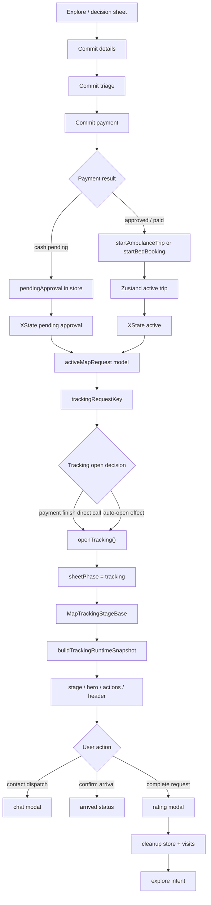

> **Reconciliation 2026-05-24:** See [docs/audit/RECONCILIATION_2026-05-24.md](../../../RECONCILIATION_2026-05-24.md) for current status of the findings below and any carryforward.

---

# Core Map And Findings

> Extracted from `../TRACKING_SHEET_FULL_SYSTEM_AUDIT_2026-05-20.md` during the lossless modularization pass.
> The verbatim pre-split artifact is preserved in `00-full-audit-preserved.md`.

## Core Diagnosis

Tracking is no longer failing from one obvious missing field. It is now a multi-owner consistency problem.

The product asks one user-facing question:

```text
Where is my active care request, and what can I safely do next?
```

The runtime currently answers that question from several partially overlapping layers:

1. Supabase row/status truth
2. TanStack active-trip query
3. Zustand active trip / pending approval store
4. XState lifecycle flags
5. Jotai route, visual phase, and rating atoms
6. map sheet phase / payload navigation state
7. tracking snapshot, view-state, hero, action, and header models

That layering is valid, but the boundaries are soft. A user can move from payment to tracking while the active request exists, but the lifecycle, route atom, hospital payload, visual status atom, and rating/modal layer may still be settling.

## State Owners

| Layer                 | Owner                                                                | Owns                                                                | Must not own                 |
| --------------------- | -------------------------------------------------------------------- | ------------------------------------------------------------------- | ---------------------------- |
| Backend               | Supabase + RPCs                                                      | canonical request row, payment status, assignment fields            | local phase or optimistic UI |
| Server cache          | TanStack active-trip query                                           | refreshed server snapshot                                           | first active trip creation   |
| Runtime store         | `stores/emergencyTripStore.js`                                       | active ambulance, active bed, pending approval, persisted ETA seeds | sheet phase                  |
| Lifecycle             | `hooks/emergency/useTripLifecycle.js`                                | active/pending/arrived/completing boolean truth                     | display copy                 |
| Sheet runtime         | `hooks/map/exploreFlow/useMapExploreFlow.js`                         | phase, payload, selected hospital, active request model             | tracking stage truth         |
| Tracking open/close   | `hooks/map/exploreFlow/useMapTracking.js`                            | open/close tracking, dismissal, auto-open                           | route/ETA/stage derivation   |
| Tracking route        | `hooks/map/tracking/useMapTrackingSync.js` + `trackingRouteInfoAtom` | route duration, distance, route coordinates scoped by request key   | active request identity      |
| Tracking runtime      | `components/map/views/tracking/useMapTrackingRuntime.js`             | snapshot inputs, triage, progress, action eligibility               | visual persistence           |
| Tracking snapshot     | `mapTracking.snapshot.js` + `mapTracking.stage.js`                   | canonical tracking stage                                            | sheet phase                  |
| Tracking view state   | `mapTracking.derived.js`                                             | hospital, labels, ETA text, responder text                          | action safety                |
| Tracking visual atoms | `useMapTrackingStatus.js` + `atoms/mapScreenAtoms.js`                | request-scoped visual phase/progress/title animation                | lifecycle truth              |
| Header                | `useMapTrackingHeader.js`                                            | floating active-session visibility and action requests              | tracking stage truth         |
| Modals                | `MapModalOrchestrator.jsx`                                           | one modal renderer per concern                                      | active request mutation      |

## User Flow Map



## Critical Invariants

1. **Active tracking identity must be canonical.**
   `emergency_requests.id` is the mutation/subscription key. `display_id` is UI only.

2. **Opening tracking is not the same as tracking being ready.**
   The sheet may open immediately, but the stage must honestly show `pending_approval`, `assigning`, or `dispatch_confirmed` until responder/route/ETA are ready.

3. **Sheet payload is navigation context, not active request truth.**
   It can help choose a first hospital shell, but it must not override the active request's canonical hospital once a request exists.

4. **Lifecycle false should close or suppress active tracking chrome.**
   A lingering `trackingRequestKey` during completion/rating cleanup is not enough to keep tracking visible.

5. **One tracking stage should drive title, hero, CTA safety, header tone, and visual atoms.**
   Multiple stage engines can disagree under async updates.

6. **Rating is a modal flow over completed tracking, not a second tracking lifecycle.**
   Completing a trip can clear active trip state while rating remains visible; tracking must not re-open from stale store identity.

## Regression Candidates

Priority labels in this section are provisional audit severity labels. They are
not final implementation order by themselves; final repair order is the
defended order in `07-fix-plan.md`.

### Audit Correction - Live chrome and tracking readiness are not one predicate

The current source contracts already reject the stronger claim that
`trackingRequestKey + hasActiveTrip` is a tracking-ready proof:

- `EMERGENCY_FLOW_LIVE_TRACKER_2026-05-19.md` says tracking-ready is stronger
  than `requestId + hasActiveTrip`.
- `MAP_SCREEN_IMPLEMENTATION_RULES_V1.md` requires request id, hospital id,
  active status, route or ETA seed, pickup/patient context when available, and
  responder identity or an explicit responder-hydrating state.
- Current `buildTrackingRuntimeSnapshot()` computes `isTrackingReady` from
  request id plus stage metadata. It does not carry or verify hospital id,
  pickup/patient context, or an explicit responder-hydrating state.

Audit consequence:

- A lifecycle-derived boolean may still be the correct **live chrome** gate for
  closing or suppressing sheet/header affordances after terminal cleanup.
- It is not the **tracking readiness** contract, and it cannot by itself prove
  that open tracking may imply healthy route, telemetry, or responder truth.
- The final audit must keep four concepts separate: active request identity,
  active lifecycle, live chrome visibility, and tracking-ready snapshot.

### P1 - Tracking lifecycle gate is documented but not fully enforced

Evidence:

- `useMapTracking.js` says auto-open is gated by both `trackingRequestKey` and `hasActiveTrip`.
- The close path only checks `!trackingRequestKey`.
- Header visibility also checks `trackingRequestKey`, not `hasActiveTrip`.

Risk:

- If XState becomes idle/completed/rating-pending while Zustand still has a request key, the tracking sheet/header can remain visible or reopen during cleanup.
- This explains "state problem" symptoms around reload, contact dispatch modal open/close, rating, and post-completion settling.

Fix direction:

- Pressure-test one derived live-chrome boolean, currently hypothesized as
  `isTrackingSessionActive = Boolean(trackingRequestKey) && hasActiveTrip`.
- Use it only where the audit proves it is the right sheet/header
  close-or-suppress gate.
- Keep a separate `canOptimisticallyOpenFromCommit` flag for the payment handoff instead of letting any request key behave as active.
- Do not treat this boolean as `isTrackingReady`; the stronger snapshot contract
  still needs hospital, status, route-or-ETA, patient/pickup context when
  available, and responder or responder-hydrating truth.

### P1 - Payment finish directly opens tracking and bypasses the claimed backstop

Evidence:

- `useMapCommitFlow.finishCommitPayment()` clears commit flow and calls `openTracking()` directly.
- The comment says `useMapTracking` auto-open validates `hasActiveTrip`, but direct `openTracking()` does not validate it.

Risk:

- The no-reload fix is useful, but the contract is now false.
- Tracking can open from a stale `sheetPayload` or fallback hospital before `activeMapRequest` is stable.

Fix direction:

- Replace direct open with a tracking-open intent, or make `openTracking()` accept `{ source: "commit" }` and validate against current active request readiness.
- If commit source needs optimism, open a request-scoped `assigning/pending` shell tied to the canonical request id, not a generic hospital fallback.

### P1 - Active request model is contaminated by navigation payload

Evidence:

- `buildActiveMapRequestModel()` resolves hospital as `preferredHospital || payload?.hospital || findHospitalById(...) || fallbackHospital || nearestHospital`.
- `useMapDerivedData()` passes `preferredHospital: sheetPayload?.hospital`.
- `mapTracking.derived.js` also prefers `activeMapRequest?.hospital || hospital || payload?.hospital` before DB lookup.

Risk:

- Active tracking UI can show a stale or wrong provider if the sheet payload was from an earlier selection or bootstrapped bad row.
- This matches the observed provider mismatch style: tracking logic can be correct while UI labels still come from the wrong hospital source.

Fix direction:

- In active tracking, resolve hospital by active request `hospitalId` from `allHospitals` first.
- Use `sheetPayload?.hospital` only while there is no active request, or as a last fallback when IDs match.

### P2 - One request has four stage interpreters

Current interpreters:

- `mapTracking.stage.js`: canonical snapshot stage
- `mapTracking.derived.js`: `sheetTitle` from `resolvedStatus` and computed status
- `mapActiveSessionPresentation.js`: floating header status/tone
- `useMapTrackingStatus.js`: visual atom phase from snapshot, with legacy fallback

Risk:

- Header can say `Tracking delayed`, sheet can say `En route`, CTA can unlock `Confirm arrival`, and visual atom can still be `approaching`.
- That produces the "almost right but not perfect" feeling: every component is locally reasonable, but the whole surface contradicts itself.

Fix direction:

- Make `trackingSnapshot.trackingStage` the single source for:
  - top-slot title/subtitle
  - hero title/meta
  - header status label/tone
  - CTA eligibility tone
  - visual atom phase
- Keep `resolvedStatus` as backend fact, not display stage.

### P2 - Accepted + ETA but no responder reads too active

Evidence:

- `resolveTrackingStage()` returns `dispatch_confirmed` when status is active and `hasMovementSignal` is true, even with no responder.

Risk:

- A request can look dispatched just because ETA/route exists, while no ambulance identity is assigned.
- This is especially sensitive in demo cash approval where route fallback can appear before responder fields hydrate.

Fix direction:

- Split "route seeded" from "dispatch confirmed":
  - no responder + active status + ETA/route = `assigning` or `preparing_dispatch`
  - responder + no movement = `dispatch_confirmed`
  - responder + movement = `en_route`

### P2 - Runtime responder truth can outrun canonical assignment proof

Evidence:

- `buildCommitPaymentCompletionPayload()` only attaches `assignedAmbulance` when
  approval/result data includes responder assignment evidence.
- `startAmbulanceTrip()` can later populate `assignedAmbulance` from
  `activeAmbulances` fallback when explicit assignment is absent.
- `buildTrackingRuntimeSnapshot()` treats assignment-like fields on the active
  trip as `hasResponder`.

Risk:

- A runtime trip can become responder-truthy before the audit has proven that
  backend assignment truth reached the handoff.
- Stage/copy audits that only inspect `hasResponder=true` can miss whether the
  UI is showing canonical dispatch confidence or optimistic local enrichment.

Fix direction:

- Keep separate audit evidence for canonical assignment truth, optimistic local
  responder/runtime shape, and explicit responder-hydrating states.
- Do not let local fallback identity silently satisfy the documented
  tracking-ready assignment requirement without an intentional product contract.

### P2 - Request label can fall back to UUID

Evidence:

- `mapTracking.derived.js` builds `requestLabel` from `activeMapRequest?.displayId || pendingApproval?.displayId || activeAmbulanceTrip?.requestId...`
- It does not prefer `activeAmbulanceTrip?.displayId` before `activeAmbulanceTrip?.requestId`.

Risk:

- After canonical identity cleanup, the UI can display UUIDs in the details card when a display id exists.

Fix direction:

- Prefer explicit `displayId` fields for all runtime records before canonical request ids.

### P2 - Tracking header can survive active lifecycle cleanup

Evidence:

- `useMapTrackingHeader()` uses `Boolean(trackingRequestKey)` and phase ownership.
- It does not receive or check `hasActiveTrip`.

Risk:

- The floating header can keep showing a live tracking affordance while rating or cleanup has moved the lifecycle out of active tracking.

Fix direction:

- Thread `hasActiveTrip` or `isTrackingSessionActive` into the header hook.

### P3 - Visual atoms are request-scoped, but reset is passive

Evidence:

- `useMapTrackingStatus()` scopes visual state by request key and resets if no current key exists.
- `resetStatus()` exists but is not the primary owner of phase cleanup.

Risk:

- A one-render stale phase can still appear during request changes or modal remounts if the current key is absent for a frame.

Fix direction:

- Keep current request-scoping, but pair it with lifecycle close/suppress logic so visual state is not asked to hide stale tracking alone.

## Relationship Map: UI Copy And Action Safety

| User-visible surface   | Current source                                                      | Desired source                                          |
| ---------------------- | ------------------------------------------------------------------- | ------------------------------------------------------- |
| Sheet title            | `buildTrackingHeaderModel()` with fallback from `sheetTitleDisplay` | `trackingSnapshot.trackingStage`                        |
| Hero title             | `buildTrackingHeroModel()`                                          | `trackingSnapshot.trackingStage`                        |
| ETA                    | trip ETA, live route atom fallback                                  | same, scoped by canonical request id                    |
| Details request id     | `requestLabel`                                                      | display id only, UUID never unless no display id exists |
| Contact Dispatch       | active trip `id` / `requestId` fallback                             | canonical UUID only                                     |
| Confirm Arrival CTA    | action eligibility + computed ETA arrival                           | canonical stage/action model                            |
| Floating header status | active map request + telemetry                                      | canonical tracking stage + telemetry overlay            |
| Rating modal           | tracking rating atom or recovered rating atom                       | one effective modal state, tracking priority            |

## Actionable Repair Route

The source audit and adversarial pass are complete for this route. The sequence
below is now a repair route, with optional rendered confirmation kept separate
from source proof.

1. Finish the audit distinction between live-chrome lifecycle gating and
   tracking-ready snapshot gating.
2. Pressure-test whether `isTrackingSessionActive` belongs in
   `useMapExploreFlow`, `useMapTracking`, and `useMapTrackingHeader`.
3. Change tracking hospital resolution so active request `hospitalId` wins over `sheetPayload`.
4. Normalize `requestLabel` display id priority.
5. Move header status/tone to consume `trackingSnapshot.trackingStage`.
6. Decide whether no-responder + ETA should be `assigning`, responder-hydrating,
   or a new `preparing_dispatch` stage.
7. Add a narrow pure-model test matrix for:
   - pending approval
   - accepted without responder/no ETA
   - accepted without responder/ETA
   - responder/no ETA
   - responder/ETA
   - stale/lost telemetry with route
   - stale/lost telemetry without route
   - arrived
   - completed/rating cleanup
