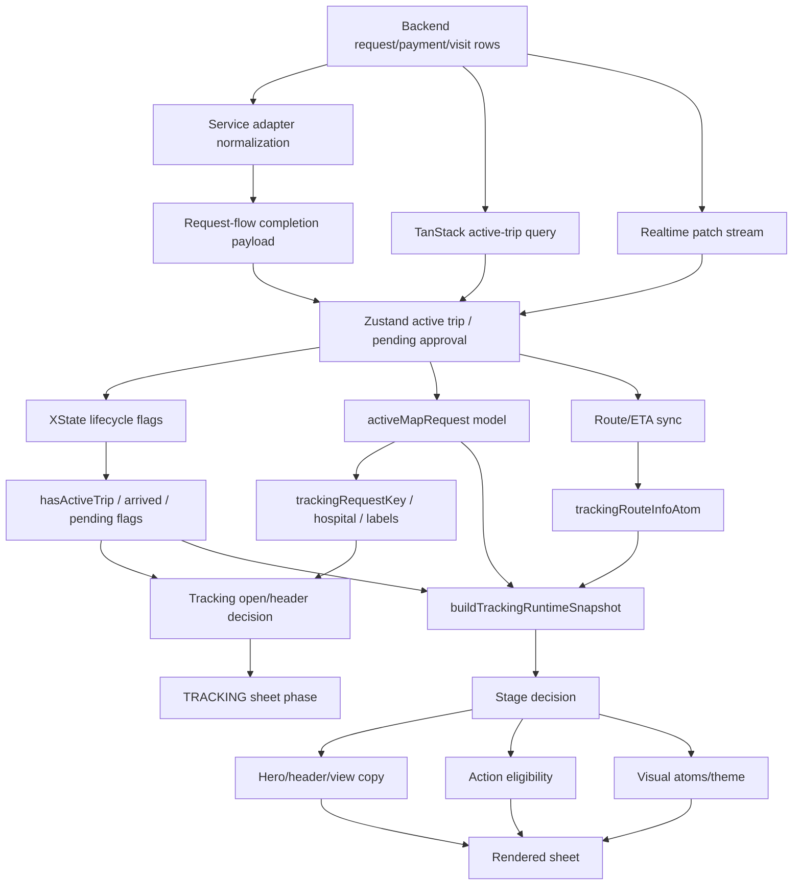

# System Contracts And Coverage

> Extracted from `../TRACKING_SHEET_FULL_SYSTEM_AUDIT_2026-05-20.md` during the lossless modularization pass.
> The verbatim pre-split artifact is preserved in `00-full-audit-preserved.md`.

## Full System Audit Frame

This review should proceed as one umbrella audit with three lanes. Each lane gets
its own subsection, but the source-of-truth table must remain shared so fixes do
not optimize one layer while regressing another.

### 1. Backend Solidity

Question: can the database and server-side functions represent every active
emergency state without ambiguity?

Audit targets:

- `emergency_requests` identity, status, `display_id`, hospital, assignment,
  payment, and triage fields
- `payments` status and approval handoff fields
- `visits` lifecycle fields used by tracking and rating
- ambulance assignment fields and demo `current_call`
- RPCs/functions: create emergency, approve cash, auto-assign ambulance,
  tracking/chat mutations
- RLS and role boundaries for patient, hospital/org admin, and demo automation

Required proof:

- every tracking-visible state has a backend row shape
- no frontend-only state is required to recover the active request after reload
- canonical UUID and display id are never overloaded server-side
- pending approval, accepted, in progress, arrived, completed, cancelled, and
  payment-declined have legal transitions

### 2. API Solidity

Question: do service adapters, query hydration, realtime, and store merges carry
the backend truth without changing meaning?

Audit targets:

- `services/emergencyRequestsService.js`
- `services/paymentService.js`
- `hooks/emergency/useRequestFlow.js`
- `hooks/emergency/useEmergencyActions.js`
- `hooks/emergency/useActiveTripQuery.js`
- `hooks/emergency/useEmergencyRealtime.js`
- `utils/emergencyRealtimeProjection.js`
- `stores/emergencyTripStore.js`

Required proof:

- request UUID, display id, hospital id, payment id, and visit id keep stable
  meanings across create, approve, query, realtime, reload, and completion
- optimistic trip shape and hydrated trip shape compare as the same request
- route/ETA/responder fields are preserved when query rows are partial
- realtime is treated as a patch stream, not first active-trip creation
- every mutation path that requires UUID receives UUID, not display id

### 3. UI Perfection

Question: does every visible surface tell the same story for the same request?

Audit targets:

- tracking sheet phase and floating tracking header
- top-slot title/subtitle
- hero title/subtitle/right meta/state label
- ETA, arrival, distance, progress, and map route
- mid actions and bottom action
- Contact Dispatch modal entry/exit
- rating modal entry/exit
- visit detail resume/rating paths

Required proof:

- header, hero, details, CTA, and modal state agree for every tracking stage
- broad states such as `arrived` are refined by action context when the user has
  already completed the previous action
- no route, modal, or sheet transition leaves a blank or contradictory tracking
  surface
- copy is stage-aware and action-aware, not only status-string-aware

## Source Of Truth Table

| Meaning              | Source of truth                       | Display source                   | Never use for                     |
| -------------------- | ------------------------------------- | -------------------------------- | --------------------------------- |
| Request mutation key | `emergency_requests.id` UUID          | hidden except debug              | human-facing label                |
| Human request label  | `emergency_requests.display_id`       | `displayId`, `requestLabel`      | RPC filters/mutations             |
| Active lifecycle     | XState flags from store/server status | stage copy and CTA gates         | provider/hospital selection       |
| Active request data  | Zustand trip + TanStack hydration     | tracking runtime snapshot        | sheet navigation history          |
| Live chrome session  | lifecycle + active request identity   | sheet/header visibility          | tracking-ready proof              |
| Hospital destination | active request `hospitalId` lookup    | hospital name/address cards      | fallback if active request exists |
| Request pickup       | completion/query `patientLocation`    | map/trip route reconciliation    | human pickup label by itself      |
| Ambient map origin   | live `activeLocation`/location model  | preview route calculation        | committed request pickup truth    |
| Pickup label         | current location display model        | route card/share/header copy     | request coordinate continuity     |
| ETA/progress         | trip ETA + scoped route atom          | hero/meta/header metrics         | request identity                  |
| Tracking stage       | `buildTrackingRuntimeSnapshot()`      | header/hero/actions/visual atoms | backend persistence               |
| Tracking readiness   | documented tracking-ready snapshot    | honest dispatch/live UI claims   | request-key/lifecycle alone       |
| Action safety        | `buildTrackingActionEligibility()`    | CTA availability/copy            | backend status labels alone       |
| Rating state         | tracking rating atoms + visits truth  | modal                            | active tracking lifecycle         |

## Code Coverage Ledger

This ledger is the promise boundary for "covered every line." A file is marked
covered only after reading it end-to-end and connecting its decisions to this
audit. "Mapped" means the current behavior is represented in a section below.
"Read" means reviewed but not yet fully cross-linked to every downstream
consumer.

| Tier                        | Files                                                                                                                                                                                         | Coverage state                   |
| --------------------------- | --------------------------------------------------------------------------------------------------------------------------------------------------------------------------------------------- | -------------------------------- |
| Tracking stage/render       | `MapTrackingStageBase.jsx`, `MapTrackingOrchestrator.jsx`, `parts/MapTrackingParts.jsx`                                                                                                       | mapped                           |
| Tracking pure models        | `mapTracking.stage.js`, `snapshot.js`, `actions.js`, `model.js`, `hero.js`, `derived.js`, `timeline.js`                                                                                       | mapped                           |
| Tracking style/theme/share  | `mapTracking.presentation.js`, `theme.js`, `styles.js`, `share.js`                                                                                                                            | mapped                           |
| Tracking controller/runtime | `useMapTrackingRuntime.js`, `useMapTrackingController.js`                                                                                                                                     | mapped                           |
| Tracking open/header/status | `useMapTracking.js`, `useMapTrackingHeader.js`, `useMapTrackingStatus.js`, `useMapTrackingTimer.js`                                                                                           | mapped                           |
| Route sync/map focus        | `useMapTrackingSync.js`, `useMapFocusedState.js`, `MapScreen.jsx` tracking route wiring                                                                                                       | mapped                           |
| Active request/header       | `mapActiveRequestModel.js`, `mapActiveSessionPresentation.js`, `useMapDerivedData.js`, `MapSheetOrchestrator.jsx` tracking case                                                               | mapped                           |
| Trip store/query/lifecycle  | `emergencyTripStore.js`, `useActiveTripQuery.js`, `useTripLifecycle.js`, `useTripProgress.js`, `tripLifecycleMachine.js`                                                                      | mapped                           |
| Trip actions/handlers       | `useEmergencyActions.js`, `useEmergencyHandlers.js`, `useEmergencyRealtime.js`, `useEmergencyServerSync.js`, `emergencyRealtimeProjection.js`                                                 | mapped                           |
| Payment/request handoff     | `useRequestFlow.js`, `useMapCommitFlow.js`, `useMapCommitPaymentController.js`, `mapCommitPayment.transaction.js`, `usePaymentScreenModel.js`, `emergencyRequestsService.js`, payment helpers | mapped                           |
| Rating recovery             | `useTrackingRatingFlow.js`, `mapTracking.rating.js`, rating atoms, `MapModalOrchestrator.jsx`                                                                                                 | mapped                           |
| History detail/resume       | `useMapHistoryFlow.js`, `useMapShell.js`, `MapVisitDetailStageBase.jsx`, `useMapVisitDetailModel.js`, `history.presentation.js`, sheet/route detail wiring                                    | mapped                           |
| Contact dispatch            | chat atoms, chat hooks, `EmergencyContactDispatchModal.jsx`, composer/message-list/quick-action leaf components, `MapModalOrchestrator.jsx`, `emergencyChatService.js`, emergency chat RPCs   | mapped, induction challenge open |
| Backend/API contract        | emergency request RPCs, status guards, dispatch/ETA helpers, chat RPCs, realtime projection helpers, runtime tests                                                                            | mapped, confidence asserts pass  |

### Remaining Coverage Before "Comprehensive"

This audit has code evidence for the main tracking spine, but it is not yet a
true every-line proof. A broad tracking search across the app still returns
thousands of references, many of which are adjacent emergency/intake/payment
surfaces rather than active tracking itself. Before marking the audit complete,
finish these passes:

| Remaining pass               | Why it is still open                                                                                                                           | Proof required                                                                                                    |
| ---------------------------- | ---------------------------------------------------------------------------------------------------------------------------------------------- | ----------------------------------------------------------------------------------------------------------------- |
| Commit flow shell            | Payment/detail/triage phases can reopen or preserve sheet payloads that later seed tracking.                                                   | Mapped; direct `openTracking()` is intentional optimism, but its comment overstates the lifecycle backstop.       |
| Active request/header parity | Header still derives from active session model, not directly from `trackingSnapshot`.                                                          | Mapped; parity gaps remain active findings, especially no-responder active states and lifecycle cleanup.          |
| Contact dispatch state proof | Chat modal should be UI-only, but visible atom mirroring and room lifecycle can remount surfaces.                                              | Prove from code that open/close/send cannot mutate request key, route atom, active trip, or lifecycle state.      |
| History/detail resume        | Selected history matching exists in row selection and collapsed detail action, but primary detail resume still has a global active-trip guard. | Mapped; primary detail CTA should reuse selected-history-to-active-request identity before opening tracking.      |
| Rating close semantics       | Shell close and Escape route through skip, but the raw close handler only clears the rating atom.                                              | Mapped; preserve shell-to-skip behavior and avoid future direct raw-close terminal dismissals.                    |
| Reload/rehydrate parity      | Trip store, visual atoms, rating atoms, and XState hydrate on different clocks.                                                                | Prove source ordering and guards across hydration, query enablement, visual atom reset, and active model rebuild. |
| Map render lifecycle proof   | Marker, polyline, camera, route, and location effects can continuously recreate rendered map objects while tracking state is valid.            | Source-proved in `04-tracking-ui-surfaces.md`; churn is presentation-side except the route-info callback bridge.  |

Implementation sequencing now lives in
[`07-fix-plan.md`](07-fix-plan.md), which orders these mapped gaps into repair
slices. Those slices are now actionable because the induction proof and fresh
adversarial validation pass have finished for the mapped tracking-map scope.

### Current Audit Boundary

The tracking spine named in this ledger is mapped for the source audit. The
strongest current findings were challenged twice in
[`08-adversarial-validation.md`](08-adversarial-validation.md), and reload,
terminal, chat, realtime, route, and render boundaries have code evidence.

Local confidence evidence is also available:

- `npm run hardening:emergency-runtime-confidence-assert` passed during this
  audit pass against the checked-in console transition and e2e flow reports.
- `npm run hardening:visits-runtime-confidence-assert` passed during this audit
  pass against the checked-in visit/emergency e2e flow report.
- The emergency confidence report covers console transition cases plus e2e
  scenarios named `cardAmbulance`, `trackingContract`, `completion`,
  `cashAmbulance`, `bedReservation`, `tipFlow`, and `transitionAudit`.

The largest current gap is no longer source discovery. Core induction is
complete for request identity, lifecycle meaning, route/ETA scope, hospital
destination, pickup truth, modal isolation, terminal cleanup, and map-render
semantics, and the fresh adversarial pass has narrowed the surviving findings.

## Connected Decision Map

Every active tracking render is the result of these decisions in order. A bug is
only understood when we know which node produced the wrong output or which
consumer interpreted a valid output incorrectly.

### Decision Nodes

| Node                | Owner                                                     | Inputs                                                                                                                 | Output                                                            | Downstream consumers                                | Failure shape                                                        |
| ------------------- | --------------------------------------------------------- | ---------------------------------------------------------------------------------------------------------------------- | ----------------------------------------------------------------- | --------------------------------------------------- | -------------------------------------------------------------------- |
| Request creation    | `create_emergency_v4` / `emergencyRequestsService.create` | hospital, service, payment method, user                                                                                | canonical request UUID, display id, payment state                 | payment sheet, pending approval, completion payload | UUID/display id meaning drifts                                       |
| Cash approval       | `demo-approve-cash-payment`, `approve_cash_payment`       | request UUID, payment id, org admin/demo auth                                                                          | approved request, payment complete, optional ambulance assignment | request completion, store, tracking                 | approval returns stale pre-assignment row                            |
| Card settlement     | `paymentService.waitForEmergencyPaymentSettlement`        | request UUID, payment intent                                                                                           | settled active request or decline/timeout                         | request completion                                  | UI exits payment before server row is active                         |
| Completion payload  | `mapCommitPayment.helpers.js` + `useRequestFlow`          | initiated request + approval/settlement result                                                                         | normalized request for `handleRequestComplete`                    | start trip/booking                                  | missing `id`, display id, responder, ETA                             |
| Active trip start   | `useEmergencyActions.startAmbulanceTrip` / bed equivalent | completion payload                                                                                                     | Zustand active trip or bed booking                                | lifecycle, active map request, route sync           | optimistic shape differs from hydrated shape                         |
| Pending approval    | `setPendingApproval`                                      | cash pending payload                                                                                                   | pending approval store record                                     | lifecycle, active request, tracking stage           | pending treated as active dispatch                                   |
| Store hydration     | `emergencyTripStore.initFromStorage`                      | persisted active trip/pending                                                                                          | restored store                                                    | lifecycle, route, tracking open                     | query overwrites before hydration settles                            |
| Query hydration     | `useActiveTripQuery`                                      | server request list, previous store                                                                                    | active/pending snapshots                                          | store merge                                         | partial server row drops richer runtime fields                       |
| Realtime patch      | `useEmergencyRealtime` + projection helper                | request/ambulance events                                                                                               | patch over existing store trip                                    | active request, ETA, responder                      | expected to create state when none exists                            |
| Lifecycle flags     | `useTripLifecycle`                                        | store record status                                                                                                    | `hasActiveTrip`, `isArrived`, `isPendingApproval`                 | tracking open, actions, snapshot                    | store identity lingers after lifecycle false                         |
| Active map request  | `buildActiveMapRequestModel`                              | active trip/bed/pending, hospitals, sheet payload                                                                      | request kind, hospital, ETA labels, action flags                  | tracking key, header, route sync, tracking runtime  | sheet payload overrides active request truth                         |
| Tracking open       | `useMapTracking` / `useMapCommitFlow`                     | tracking key, lifecycle, sheet phase, commit source                                                                    | tracking sheet phase/payload                                      | sheet orchestrator, map route active flag           | direct open bypasses lifecycle/readiness contract                    |
| Tracking header     | `useMapTrackingHeader`                                    | request key, phase, modal state, active request                                                                        | active-session header                                             | global header                                       | header survives cleanup because key is truthy                        |
| Route sync          | `useMapTrackingSync` + map route callback                 | active request key, trip route, map route                                                                              | scoped route atom, ETA patch                                      | progress, hero, map polyline                        | request-key mismatch hides live ETA                                  |
| Runtime snapshot    | `buildTrackingRuntimeSnapshot`                            | kind, status, route, ETA, responder, lifecycle, telemetry                                                              | `trackingStage`, readiness, visual phase                          | hero, actions, visual atoms                         | broad stage misses action substate and readiness proof is still thin |
| Readiness contract  | live tracker + map implementation rules                   | request id, hospital id, active status, route/ETA seed, pickup/patient context, responder or responder-hydrating truth | tracking-ready proof                                              | honest live dispatch claims                         | current snapshot readiness is thinner than the documented contract   |
| View state          | `mapTracking.derived.js`                                  | active request, trip, route, hospital, current location                                                                | display labels and sheet title                                    | hero, route card, details                           | labels disagree with snapshot/action state                           |
| Action eligibility  | `mapTracking.actions.js`                                  | snapshot, active request flags, lifecycle flags                                                                        | primary/mid/bottom actions                                        | CTA group and footer                                | CTA says complete while hero says confirm                            |
| Visual atoms        | `useMapTrackingStatus`                                    | snapshot, request key, progress                                                                                        | status phase, progress, animation flags                           | title color, CTA theme, arrival toast               | persisted visual phase leaks between requests                        |
| Modal orchestration | `MapModalOrchestrator`, rating/chat atoms                 | rating/chat state, active request id                                                                                   | visible modal                                                     | tracking behind modal, recovery                     | modal cleanup changes tracking without lifecycle sync                |

## Backend State Machine Contract

Backend status must be treated as the durable contract, not as final UI copy.
The UI stage may refine it with assignment, route, ETA, telemetry, and action
state.

| Backend status/payment                 | Legal tracking meaning                          | Required fields                                                | Next legal backend transition                              | UI must show                                                     |
| -------------------------------------- | ----------------------------------------------- | -------------------------------------------------------------- | ---------------------------------------------------------- | ---------------------------------------------------------------- |
| `pending_approval` + payment `pending` | cash/card approval or settlement not finished   | request UUID, display id, hospital id, payment id              | `accepted`, `in_progress`, `payment_declined`, `cancelled` | awaiting approval/confirming, no dispatch-complete actions       |
| `payment_declined`                     | payment failed/declined                         | request UUID, payment status                                   | retry/new payment or terminal                              | payment failure, no tracking shell unless explicitly recoverable |
| `accepted`                             | active request accepted, may still be assigning | request UUID, hospital id, service type                        | `in_progress`, `arrived`, `cancelled`, `completed`         | assigning/preparing/dispatch confirmed depending responder/ETA   |
| `in_progress`                          | active request underway                         | request UUID, hospital id, ETA/route or responder if available | `arrived`, `cancelled`, `completed`                        | en route/approaching/lost/delayed                                |
| `arrived`                              | arrival confirmed or server-arrived             | request UUID, hospital id                                      | `completed`, `cancelled`                                   | complete request, not confirm arrival                            |
| `completed`                            | request finished                                | request UUID, visit id                                         | terminal/rating visit updates                              | rating or complete, no live tracking chrome                      |
| `cancelled`                            | request ended                                   | request UUID, reason if present                                | terminal                                                   | return to explore/visit detail, no live tracking chrome          |

## API And Store Shape Contract

These shapes must compare as the same request at every boundary:

| Boundary               | Canonical UUID field                               | Display field                             | Store active key | Risk                                                    |
| ---------------------- | -------------------------------------------------- | ----------------------------------------- | ---------------- | ------------------------------------------------------- |
| RPC result             | `request_id`                                       | `display_id`                              | not yet          | raw snake_case                                          |
| service adapter        | `id`                                               | `requestId`/`displayId` depending adapter | not yet          | `requestId` can mean display id                         |
| initiated request      | `requestId` currently UUID                         | `displayId`                               | pending payload  | overloaded `requestId`                                  |
| completion payload     | `id` or `requestId` UUID expected                  | `displayId`                               | start trip input | missing `id` breaks alias matching                      |
| active trip optimistic | `id`, `requestId` must be canonical or alias-aware | `displayId`                               | Zustand          | query hydration can look like a different trip          |
| query row              | `id`                                               | `displayId` / row `display_id`            | Zustand merge    | partial server row can overwrite richer optimistic data |
| realtime row           | `id`, `request_id`, `current_call`                 | `display_id`                              | store patch      | patch ignored if no existing trip                       |
| chat room              | request UUID only                                  | display id forbidden                      | modal id         | display id causes room creation failure                 |

Rule for future cleanup: either make `activeAmbulanceTrip.requestId` always the
canonical UUID and `displayId` always the label, or keep the adapter shape but
require all same-request helpers to compare `id`, `requestId`, `displayId`,
`display_id`, nested `request.id`, and nested `request.display_id`.

## Tracking Stage To Render Matrix

This is the UI perfection checklist. Every row must be verified against the
actual rendered sheet, not only the model output.

| Tracking stage         | Required condition                         | Header title                              | Hero title/subtitle               | Mid actions                               | Bottom action                      | Contradiction to catch                               |
| ---------------------- | ------------------------------------------ | ----------------------------------------- | --------------------------------- | ----------------------------------------- | ---------------------------------- | ---------------------------------------------------- |
| `idle`                 | no active request                          | hidden or `Tracking` only if safely empty | no active request                 | none                                      | none                               | blank tracking shell opens from stale payload        |
| `pending_approval`     | pending approval store or backend status   | `Confirming`                              | `Awaiting approval` + service     | triage if useful, cancel                  | cancel pending                     | contact dispatch/reserve bed shown too early         |
| `assigning`            | active request, no responder/movement      | `Assigning`                               | assigning/finding driver          | info, cancel, maybe share disabled/hidden | cancel request                     | ETA/route makes it look dispatched without responder |
| `dispatch_confirmed`   | responder exists, little/no route movement | `Dispatch Confirmed`                      | driver/dispatch confirmed         | info, contact dispatch, share ETA         | cancel request                     | no responder but copy implies responder assigned     |
| `en_route`             | responder + movement/ETA                   | `En Route`                                | responder or ambulance en route   | info, contact dispatch, share ETA         | cancel request                     | telemetry warning replaces ETA when ETA valid        |
| `approaching`          | progress threshold before arrival action   | `Approaching`                             | almost there                      | info, contact dispatch, share ETA         | cancel request                     | confirm arrival appears before eligibility           |
| `arrived` pre-confirm  | ETA elapsed or can mark arrived            | `Arrived`                                 | driver arrived / confirm arrival  | confirm arrival emphasized                | cancel or confirm depending layout | hero does not match confirm CTA                      |
| `arrived` post-confirm | lifecycle/status arrived, can complete     | `Arrived`                                 | driver arrived / complete request | info/contact/share, no confirm arrival    | complete request                   | hero says confirm after user confirmed               |
| `completed`            | backend/store completed or rating flow     | `Complete` or no tracking header          | visit complete                    | none or rating context                    | rating/none                        | tracking reopens behind rating                       |
| `delayed`              | stale telemetry and no movement signal     | `Tracking Delayed`                        | waiting for fresh update          | contact dispatch/cancel available         | cancel request                     | blocks all actions like terminal state               |
| `lost`                 | lost telemetry and no movement signal      | `Tracking Lost`                           | signal interrupted                | contact dispatch/cancel available         | cancel request                     | fake ETA/progress continues without signal           |
| bed `en_route`         | bed booking active with ETA                | `Bed Reserved`                            | bed service + hospital            | info, request transport, share            | cancel booking                     | ambulance-specific copy leaks in                     |
| bed ready              | bed arrived/ready/check-in available       | `Bed Ready`                               | bed ready                         | check in/complete path                    | complete stay/check in             | bed status and CTA disagree                          |
| companion active       | ambulance and bed both active              | primary active + companion label          | service + companion state         | no duplicate add companion CTA            | current primary action             | companion hidden or duplicated                       |

## Field-Level Source Map

| Field/signal                           | Produced by                                              | Consumed by                                            | Sync rule                                                                                    |
| -------------------------------------- | -------------------------------------------------------- | ------------------------------------------------------ | -------------------------------------------------------------------------------------------- |
| `hospitalId`                           | backend request row / completion payload                 | active map request, hospital label, map focus          | active request wins over sheet payload                                                       |
| `hospitalName/address`                 | hospital lookup by `hospitalId`                          | route card, hero subtitle fallback                     | lookup first, payload fallback only if id matches or no active request                       |
| `etaSeconds`                           | approval/settlement result, query, route atom patch      | progress, arrival clock, hero right meta               | preserve for same request when query is partial                                              |
| `startedAt`                            | trip start, query fallback, route sync                   | progress and arrival eligibility                       | never reset for same request unless explicitly restarted                                     |
| `route`                                | map route callback, stored trip route                    | map polyline, ETA fallback, movement signal            | scoped by canonical request key                                                              |
| `patientLocation`                      | commit request handoff, query hydration, trip store      | responder demo route fallback and request pickup proof | preserve as committed pickup coordinate; do not replace with ambient location without intent |
| pickup display label                   | `currentLocationDetails` passed into tracking view state | route card, share payload, active session display      | label is ambient shell display truth unless a committed pickup label is added                |
| `assignedAmbulance` / responder fields | approval, assignment RPC, query, realtime ambulance row  | hero title, dispatch state, contact confidence         | route alone should not pretend responder exists                                              |
| `ambulanceTelemetryHealth`             | emergency realtime/location health                       | delayed/lost stage, header tone, hero warning          | telemetry exception overlays active state unless no movement signal                          |
| `isArrived`                            | XState/backend status                                    | snapshot, action eligibility, progress                 | distinguishes complete request from confirm arrival                                          |
| `canMarkArrived`                       | action eligibility                                       | primary/mid action, hero subtitle                      | pre-confirm arrived only                                                                     |
| `canCompleteAmbulance`                 | action eligibility                                       | bottom action, hero subtitle                           | post-confirm arrived only                                                                    |
| `ratingState`                          | controller/rating flow atoms + visits                    | modal orchestrator                                     | not a live tracking stage                                                                    |

## Tracking Readiness Evidence Classes

The readiness audit now uses these evidence classes so one truth source is not
silently promoted into another:

| Evidence class                   | Example signals                                                                   | May prove                                                      | Must not prove alone                                            |
| -------------------------------- | --------------------------------------------------------------------------------- | -------------------------------------------------------------- | --------------------------------------------------------------- |
| Canonical backend                | request UUID, hospital id, backend status, ambulance assignment row fields        | durable request identity, legal lifecycle, assignment mutation | map route existence, currently rendered sheet stage             |
| Approval / settlement handoff    | hydrated approval result, settlement row, completion payload                      | what payment handed tracking before query recovery             | every field that query or map callback may add later            |
| Optimistic runtime               | `startAmbulanceTrip()` trip object, persisted route/ETA, local ambulance fallback | immediate sheet continuity and current runtime presentation    | canonical responder assignment without producer-path proof      |
| Query / realtime reconciliation  | active-trip query snapshot, emergency request patch, ambulance location patch     | server correction and same-request preservation                | first creation of a missing active trip by realtime alone       |
| Tracking snapshot / presentation | stage, `hasRoute`, `hasEta`, `hasResponder`, hero/header/action models            | rendered meaning from current runtime facts                    | readiness fields the snapshot does not carry or verify directly |
