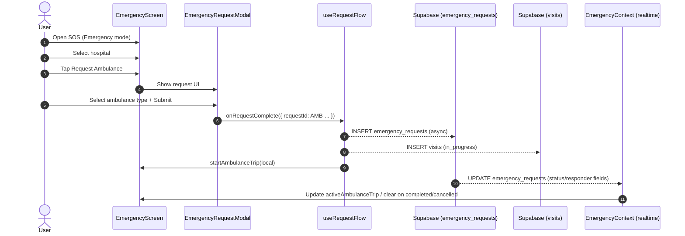
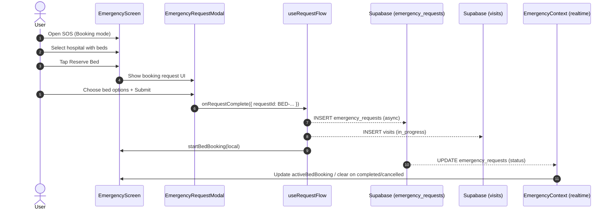

# Ambulance + Bed Booking User Flow (SOS)

> **Last Updated:** 2026-01-11  
> **Owner:** Emergency (SOS) feature  
> **Scope:** Mobile app SOS screen end-to-end flow for requesting an ambulance or reserving a bed.

This document audits the actual, current user flow implemented in the codebase for:
- **Ambulance request** (Emergency mode)
- **Bed reservation** (Booking mode)

It focuses on what the app does today: which screens the user touches, what state changes happen, and what is written to Supabase (including realtime updates).

---

## Entry Points & Navigation

### Primary Entry: SOS Tab
- Route: `/(user)/(tabs)/index.js` (SOS tab)
- Screen: `screens/EmergencyScreen.jsx`

### Secondary Entry: Deep-linking to SOS with a Mode
Some parts of the app can jump into SOS and choose a mode:
- Helper: `utils/navigationHelpers.js` → `navigateToSOS({ mode })`
- Example usage: `screens/SearchScreen.jsx` can open SOS in `"booking"` mode for bed reservation.

---

## Key Concepts & Domain Objects

### Modes
`EmergencyContext` exposes two modes:
- `EmergencyMode.EMERGENCY` (`"emergency"`) → ambulance request
- `EmergencyMode.BOOKING` (`"booking"`) → bed reservation

The mode changes:
- Header title + subtitle (Ambulance Call / Reserve Bed)
- Filtering logic for hospitals (service type vs available beds + specialty)
- Request modal UI (ambulance type vs bed options)

### Tables (Supabase)
Two different database concerns are written during a request:

1) `public.emergency_requests`
- Represents the live request for an ambulance or a bed.
- Intended to be updated by dispatch/backoffice systems (status changes, responder info, etc.).

2) `public.visits`
- Represents the user-facing “Visit” history row shown in the Visits UX.
- Created when a request is submitted, and updated to `cancelled`/`completed`.

### Statuses
Emergency request status values used by the app:
- `in_progress`
- `accepted`
- `arrived`
- `completed`
- `cancelled`

Visits are created as `in_progress` and later moved to `cancelled` or `completed`.

---

## Screen-Level User Experience (Shared)

Both ambulance and bed flows live in the same screen:
- `screens/EmergencyScreen.jsx`

Core shared behavior:
- Map + bottom sheet layout
- Hospital selection/focus state
- A “request flow” overlay inside the bottom sheet
- Tab bar and FAB are hidden when:
  - `selectedHospital` is set, OR
  - there is an active trip/booking for the current mode

---

## Data Sources (What Populates the Screen)

### Hospitals
Hospitals come from Supabase through:
- `hooks/emergency/useHospitals`
- normalized into `EmergencyContext` state (`hospitals`)

In-session behavior:
- If user location is present, the context may “localize” hospitals for demo purposes by adjusting their coordinates and computing a derived `eta`.

### User Location
The context attempts a silent location fetch:
- `expo-location` → last known position first, then fresh position if permission is already granted

The map component is still responsible for explicit permission UX; the context does not display alerts for failures.

---

## Ambulance Request (Emergency Mode) — Start to Finish

### 1) User enters SOS in Emergency mode
User sees:
- Header: “Ambulance Call”
- Hospital markers/list (optionally filterable by service type)

Filtering:
- `serviceType` filter (e.g., premium/standard) limits hospitals shown.

### 2) User selects a hospital to request from
User action:
- Tap a hospital in map or list.

App state:
- `selectedHospitalId` is set in `EmergencyContext`.
- Bottom sheet shifts into a focused hospital state.

### 3) User starts the request flow (“Request Ambulance”)
User action:
- Tap the “call/request” action for a hospital.

App state (EmergencyScreen local state):
- `requestHospitalId` is set
- `isRequestFlowOpen = true`
- Bottom sheet expands to show the request modal

### 4) User chooses ambulance type and submits
UI:
- `components/emergency/EmergencyRequestModal.jsx`

Current implementation note:
- Dispatch is currently **mocked** in the UI with a `setTimeout`.
- The UI generates a request id like `AMB-123456`.

### 5) App persists request + creates visit + starts “active trip”
Callback chain:
- `EmergencyRequestModal` → `onRequestComplete(next)`
- `EmergencyScreen` → `useRequestFlow().handleRequestComplete(next)`

What gets written:
1) Insert into `public.emergency_requests` (async, errors logged but do not block UI)
2) Insert into `public.visits` with:
   - `type = AMBULANCE_RIDE`
   - `status = in_progress`
3) Local state becomes active:
   - `EmergencyContext.startAmbulanceTrip(...)`
   - If a map route exists, `route: currentRoute.coordinates` is saved into the trip state

### 6) Realtime updates modify the active trip
Subscription:
- `EmergencyContext` listens for `UPDATE` events on `public.emergency_requests` filtered to the current user.

On incoming updates:
- `activeAmbulanceTrip.status` is updated
- If responder fields exist in the payload, the assigned ambulance details are merged in
- If status becomes `completed` or `cancelled`, the local trip is cleared

### 7) User cancels or completes the trip
User action:
- Tap cancel/complete inside the bottom sheet tracking UI.

App actions:
- Update emergency request status (`cancelled` or `completed`)
- Update visit status (`cancelled` or `completed`)
- Clear local active trip (`stopAmbulanceTrip`)

---

## Bed Reservation (Booking Mode) — Start to Finish

### 1) User enters booking mode
User action:
- Tap the FAB toggle inside SOS, OR navigate directly with `navigateToSOS({ mode: "booking" })`.

User sees:
- Header: “Reserve Bed”

### 2) Hospitals are filtered by availability + (optional) specialty
Filtering behavior:
- Only hospitals with `availableBeds > 0` appear.
- If `selectedSpecialty` is set, only hospitals including that specialty appear.

### 3) User starts the request flow (“Reserve Bed”)
Same interaction pattern as ambulance:
- Select hospital → open request flow → bottom sheet expands

### 4) User selects bed options and submits
UI:
- `EmergencyRequestModal` switches to booking UI

Current implementation note:
- Reservation response is currently **mocked** in the UI with a `setTimeout`.
- The UI generates a request id like `BED-123456` and a bed number like `B-42`.

### 5) App persists request + creates visit + starts “active booking”
Callback chain is the same as ambulance, but the writes differ slightly:

1) Insert into `public.emergency_requests` with `service_type = "bed"` and bed fields
2) Insert into `public.visits` with:
   - `type = BED_BOOKING`
   - `status = in_progress`
   - `room_number = bedNumber` (mapped from `roomNumber`)
3) Local state becomes active:
   - `EmergencyContext.startBedBooking(...)`

### 6) Realtime updates modify the active booking
Same subscription as ambulance:
- On `completed` or `cancelled`, `activeBedBooking` is cleared.

### 7) User cancels or completes the booking
User action:
- Tap cancel/complete in tracking UI.

App actions:
- Update emergency request status
- Update visit status
- Clear local booking (`stopBedBooking`)
- Also creates an in-app notification for bed cancel/complete

---

## Sequence Diagrams

### Ambulance Request

### Bed Reservation

---

## Implementation Notes / Known Gaps

- **Dispatch is mocked in the UI**: the “dispatched” response is currently generated client-side in `EmergencyRequestModal.jsx` using a timer; there is no real dispatch assignment step wired yet.
- **Request insert failures do not block the UI**: `useRequestFlow` logs request insert failures but still starts the local trip/booking and writes the visit.
- **Responder fields depend on DB schema**: `EmergencyContext` merges responder fields from realtime updates; ensure the database schema includes the responder columns if you expect them to populate.

---

## Code References (Primary)

- Screen: `screens/EmergencyScreen.jsx`
- Request UI: `components/emergency/EmergencyRequestModal.jsx`
- Request orchestration: `hooks/emergency/useRequestFlow.js`
- Cancel/complete handlers: `hooks/emergency/useEmergencyHandlers.js`
- Domain state + realtime subscription: `contexts/EmergencyContext.jsx`
- Emergency request service: `services/emergencyRequestsService.js`
- Visits service: `services/visitsService.js`

