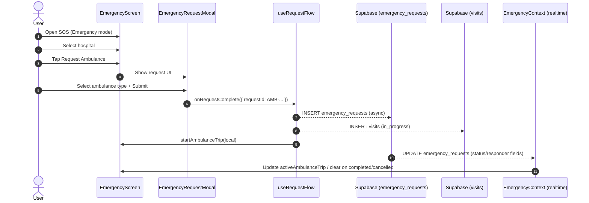
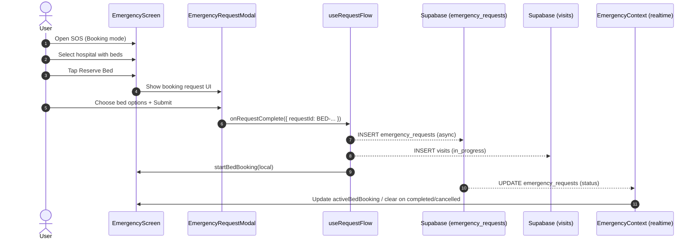

# Ambulance + Bed Booking User Flow (SOS)

> **Last Updated:** 2026-01-11  
> **Owner:** Emergency (SOS) feature  
> **Scope:** Mobile app SOS screen end-to-end flow for requesting an ambulance or reserving a bed.

This document audits the actual, current user flow implemented in the codebase for:
- **Ambulance request** (Emergency mode)
- **Bed reservation** (Booking mode)

It focuses on what the app does today: which screens the user touches, what state changes happen, and what is written to Supabase (including realtime updates).

---

## Entry Points & Navigation

### Primary Entry: SOS Tab
- Route: `/(user)/(tabs)/index.js` (SOS tab)
- Screen: `screens/EmergencyScreen.jsx`

### Secondary Entry: Deep-linking to SOS with a Mode
Some parts of the app can jump into SOS and choose a mode:
- Helper: `utils/navigationHelpers.js` → `navigateToSOS({ mode })`
- Example usage: `screens/SearchScreen.jsx` can open SOS in `"booking"` mode for bed reservation.

---

## Key Concepts & Domain Objects

### Modes
`EmergencyContext` exposes two modes:
- `EmergencyMode.EMERGENCY` (`"emergency"`) → ambulance request
- `EmergencyMode.BOOKING` (`"booking"`) → bed reservation

The mode changes:
- Header title + subtitle (Ambulance Call / Reserve Bed)
- Filtering logic for hospitals (service type vs available beds + specialty)
- Request modal UI (ambulance type vs bed options)

### Tables (Supabase)
Two different database concerns are written during a request:

1) `public.emergency_requests`
- Represents the live request for an ambulance or a bed.
- Intended to be updated by dispatch/backoffice systems (status changes, responder info, etc.).

2) `public.visits`
- Represents the user-facing “Visit” history row shown in the Visits UX.
- Created when a request is submitted, and updated to `cancelled`/`completed`.

### Statuses
Emergency request status values used by the app:
- `in_progress`
- `accepted`
- `arrived`
- `completed`
- `cancelled`

Visits are created as `in_progress` and later moved to `cancelled` or `completed`.

### Emergency Visit Lifecycle States (Visits Model)
Emergency visits also track a finer-grained lifecycle in `public.visits.lifecycle_state` (used for closed-loop state consistency across UI and data):

- `initiated`
- `confirmed`
- `monitoring`
- `arrived` (ambulance)
- `occupied` (bed)
- `completed`
- `post_completion`
- `rating_pending`
- `rated`
- `cleared`
- `cancelled`

The server keeps `public.visits` aligned with `public.emergency_requests` via a trigger that upserts the matching visit row on emergency request insert/update.

### Concurrency Rules (Production Requirement)
The system enforces:
- Max **1 active bed booking** per user (status in `in_progress|accepted|arrived`)
- Max **1 active ambulance request** per user (status in `in_progress|accepted|arrived`)
- Bed + ambulance can run in parallel (one of each)

---

## Screen-Level User Experience (Shared)

Both ambulance and bed flows live in the same screen:
- `screens/EmergencyScreen.jsx`

Core shared behavior:
- Map + bottom sheet layout
- Hospital selection/focus state
- A “request flow” overlay inside the bottom sheet
- Tab bar is hidden when `selectedHospital` is set OR any emergency visit is active.
- The mode-toggle FAB is hidden only when:
  - `selectedHospital` is set, OR
  - the sheet is collapsed (index 0), OR
  - the request flow is currently open

---

## Data Sources (What Populates the Screen)

### Hospitals
Hospitals come from Supabase through:
- `hooks/emergency/useHospitals`
- normalized into `EmergencyContext` state (`hospitals`)

In-session behavior:
- If user location is present, the context may “localize” hospitals for demo purposes by adjusting their coordinates and computing a derived `eta`.

### User Location
The context attempts a silent location fetch:
- `expo-location` → last known position first, then fresh position if permission is already granted

The map component is still responsible for explicit permission UX; the context does not display alerts for failures.

---

## Map “As-Is” Architecture (What’s Mounted, Who Owns What)

### Map Mounting
- Single `MapView` lives in: `components/map/FullScreenEmergencyMap.jsx`
- It is mounted by: `components/emergency/EmergencyMapContainer.jsx`
- Which is mounted by: `screens/EmergencyScreen.jsx`

### Two Location Systems Exist (By Design Today)
- `EmergencyContext` does a silent location read once on mount (only if permission already granted): `contexts/EmergencyContext.jsx`
- The map requests permission and manages its own location updates: `components/map/FullScreenEmergencyMap.jsx` + `hooks/emergency/useMapLocation`

---

## Critical Nuances (Things That Break If We Refactor Wrong)

### 1) Map is tightly coupled to the bottom sheet (padding + control visibility)
- `bottomPadding` is computed in `EmergencyScreen` and passed down; then used as `mapPadding.bottom` in the MapView: `screens/EmergencyScreen.jsx`, `components/map/FullScreenEmergencyMap.jsx`
- Map controls (recenter/expand) are hidden when the sheet snap index is above ~50%:
  - `shouldShowControls = showControls && sheetSnapIndex <= 1` in `components/map/FullScreenEmergencyMap.jsx`

If we split sheets or create separate map/sheet pairs, we must preserve:
- accurate `sheetSnapIndex` for the visible sheet
- correct `bottomPadding` per sheet phase, otherwise route fitting will hide content behind the sheet

### 2) Route calculation is “availability gated”
The map only shows a route if the selected/active hospital has capacity:
- booking: `availableBeds > 0`
- emergency: `ambulances > 0`

So: switching mode / active visit type must not accidentally flip these gates and clear the route.

### 3) Route fitting avoids snap-index feedback loops
When the route updates, it:
- calls `onRouteCalculated(...)` only if route info changed (stored in `mapRef.current.lastRouteInfo`)
- fits coordinates using a padding ref (so snap changes don’t constantly re-fit)
- calls `scheduleCenterInVisibleArea(...)` to shift the route upward for the sheet

If we re-architect, we must keep:
- “call parent only when changed” behavior (prevents render loops)
- “padding ref” approach (prevents repeated camera jumps on sheet drag)

### 4) Ambulance marker can be driven by two sources
- “Fake animation” along polyline (`animateAmbulance = true`) via `hooks/emergency/useAmbulanceAnimation.js`
- “Realtime responder tracking” via DB updates (`responderLocation` / `responderHeading`) overrides the marker coordinate

If we accidentally mount two map layers at once, both could try to render/animate responder markers and you’ll see flicker or doubled markers.

### 5) Simulation is a singleton and tied into lifecycle cleanup
- Simulation writes responder updates + changes `emergency_requests.status` to accepted/arrived: `services/simulationService.js`
- On realtime update, when request becomes completed/cancelled, the context stops simulation and clears active trip: `contexts/EmergencyContext.jsx`
- Nuance: `startSimulation()` uses a 5s `setTimeout` that is not cleared; it is safe because it checks `activeSimulationId`, but mount/unmount churn must not spawn multiple simulations with different requestIds.

### 6) Responder location parsing depends on WKT format
- DB stores `responder_location` as `POINT(lon lat)` and the app parses it with a regex: `contexts/EmergencyContext.jsx`

If we change DB payload shape (e.g., GeoJSON), map tracking breaks unless we update parsing everywhere.

### 7) FullScreenEmergencyMap exposes imperative methods used by selection/search flows
- `animateToHospital()` and `fitToAllHospitals()` via ref: `components/map/FullScreenEmergencyMap.jsx`
- These are used by selection/search hooks (camera moves are part of UX): `hooks/emergency/useHospitalSelection.js`, `hooks/emergency/useSearchFiltering.js`

So: if we split into “idle map vs active map” we must keep the same ref surface (or refactor all callers).

---

## Safety Conclusion (To Avoid Breaking Anything)

- Keeping one `MapView` mounted is the safest path.
- The low-risk refactor is to introduce a single `MapState` switch and mount exactly one layer tree at a time (`IdleLayers` / `AmbulanceLayers` / `BedLayers`), while preserving:
  - route gating rules
  - `mapPadding` + `sheetSnapIndex` contract
  - route-fit dedupe logic
  - responder-location parsing
  - imperative ref methods

Next: define a “MapState + Layers” design that is 100% compatible with the current prop/ref contracts (so we can implement without breaking selection, routing, simulation, or sheet behavior).

---

## Target Map Architecture: MapState + Layered Rendering

### MapState (single source of truth for what the map is “doing”)

Instead of multiple maps, we keep **one** `MapView` and introduce a derived `mapState`:

```ts
type MapState =
  | "idle"              // browsing hospitals, no active trip or booking
  | "ambulance_active"  // active ambulance trip in progress
  | "bed_active";       // active bed booking in progress
```

`mapState` is derived from existing context state:
- `ambulance_active` if `activeAmbulanceTrip` exists.
- `bed_active` if `activeBedBooking` exists.
- otherwise `idle`.

It does **not** care about:
- `mode` alone (you can be in booking mode but still “idle” if nothing is active).
- sheet snap index (that’s pure UI).

### Layered Rendering (inside the same MapView)

`FullScreenEmergencyMap` remains the only place that mounts `MapView`. Internally it renders exactly one layer tree at a time:

- `IdleLayers` (when `mapState === "idle"`):
  - User location + pulse marker.
  - All available hospitals (filtered upstream).
  - Optional “focus” ring for `selectedHospital`.
  - No active trip route/ambulance.

- `AmbulanceLayers` (when `mapState === "ambulance_active"`):
  - Everything needed to track an ambulance:
    - Route polyline (subject to ambulance availability gate).
    - Responder marker:
      - Either animated along route (`animateAmbulance = true`), or
      - Realtime `responderLocation` / `responderHeading` from DB.
    - Hospital pin (destination).

- `BedLayers` (when `mapState === "bed_active"`):
  - Future-proof for bed-specific visuals:
    - Route polyline when relevant.
    - Hospital pin for the reserved facility.
    - Optional “bed reserved” marker or badge.

The outer component:
- Owns the `MapView`, camera, route fitting, padding, and imperative ref.
- Chooses the correct `*Layers` component based on `mapState`.

### Contracts That Stay the Same

We preserve the existing external contracts:

- **Props from EmergencyScreen:**
  - `bottomPadding` (derived from `sheetSnapIndex` and selection state).
  - `sheetSnapIndex` (for control visibility).
  - `selectedHospitalId`, `routeHospitalId`, `mode`.
  - Trip props: `animateAmbulance`, `ambulanceTripEtaSeconds`, `responderLocation`, `responderHeading`.

- **Imperative ref surface:**
  - `animateToHospital(hospital, options)`
  - `fitToAllHospitals(hospitals, options)`
  - Any existing methods used by:
    - `useHospitalSelection`
    - `useSearchFiltering`

- **Callback behavior:**
  - `onRouteCalculated(routeInfo)` continues to:
    - Fire only when route info changes.
    - Respect the current `mapPaddingRef` and route dedupe logic.

### How MapState Connects to the Rest of the Flow

`mapState` is computed in `EmergencyScreen` (or `EmergencyMapContainer`) using:

- `activeAmbulanceTrip` / `activeBedBooking` from `EmergencyContext`.
- Optional future states (e.g., `simulation_only`) can map to `ambulance_active`.

The map itself stays mostly unaware of the higher-level semantics; it just receives:

- `mapState`
- `selectedHospitalId`
- `routeHospitalId`
- trip-related props

and chooses the correct layer tree.

This keeps the refactor **low risk**:

- One `MapView`.
- Existing props and refs intact.
- Logic for route fitting, padding, and simulation unchanged; we only reorganize rendering into explicit `Idle/Ambulance/Bed` layers.

---

## Ambulance Request (Emergency Mode) — Start to Finish

### 1) User enters SOS in Emergency mode
User sees:
- Header: “Ambulance Call”
- Hospital markers/list (optionally filterable by service type)

Filtering:
- `serviceType` filter (e.g., premium/standard) limits hospitals shown.

### 2) User selects a hospital to request from
User action:
- Tap a hospital in map or list.

App state:
- `selectedHospitalId` is set in `EmergencyContext`.
- Bottom sheet shifts into a focused hospital state.

### 3) User starts the request flow (“Request Ambulance”)
User action:
- Tap the “call/request” action for a hospital.

App state (EmergencyScreen local state):
- `requestHospitalId` is set
- `isRequestFlowOpen = true`
- Bottom sheet expands to show the request modal

### 4) User chooses ambulance type and submits (Request Initiated)
UI:
- `components/emergency/EmergencyRequestModal.jsx`

What happens at initiation:
- The UI generates a request id like `AMB-123456`
- App inserts `public.emergency_requests` (`status = in_progress`)
- App inserts `public.visits` (`status = in_progress`, `lifecycle_state = initiated`)

### 5) Reservation/Dispatch Confirmed (Request Confirmed)
Callback chain:
- `EmergencyRequestModal` → `onRequestComplete(next)`
- `EmergencyScreen` → `useRequestFlow().handleRequestComplete(next)`

What changes at confirmation:
1) `public.emergency_requests` is updated (`status = accepted`, and any request metadata like `estimated_arrival`)
2) `public.visits.lifecycle_state` advances (`confirmed` → `monitoring`)
3) Local state becomes active:
   - `EmergencyContext.startAmbulanceTrip(...)` (initially `status = accepted`)
   - If a map route exists, `route: currentRoute.coordinates` is saved into the trip state

### 6) Realtime updates modify the active trip
Subscription:
- `EmergencyContext` listens for `UPDATE` events on `public.emergency_requests` filtered to the current user.

On incoming updates:
- `activeAmbulanceTrip.status` is updated
- If responder fields exist in the payload, the assigned ambulance details are merged in
- If status becomes `completed` or `cancelled`, the local trip is cleared

### 7) User cancels or completes the trip
User action:
- Tap cancel/complete inside the bottom sheet tracking UI.

App actions:
- Update emergency request status (`cancelled` or `completed`)
- Update visit status (`cancelled` or `completed`)
- Clear local active trip (`stopAmbulanceTrip`)

### Arrival Gate (Mark Arrived → Complete)
To maintain a closed-loop lifecycle:
- When the ETA reaches “Arrived”, the UI requires **Mark Arrived** first
- Mark Arrived sets:
  - `public.emergency_requests.status = arrived`
  - `public.visits.lifecycle_state = arrived`
- Only after that does **Complete** become available

---

## Bed Reservation (Booking Mode) — Start to Finish

### 1) User enters booking mode
User action:
- Tap the FAB toggle inside SOS, OR navigate directly with `navigateToSOS({ mode: "booking" })`.

User sees:
- Header: “Reserve Bed”

### 2) Hospitals are filtered by availability + (optional) specialty
Filtering behavior:
- Only hospitals with `availableBeds > 0` appear.
- If `selectedSpecialty` is set, only hospitals including that specialty appear.

### 3) User starts the request flow (“Reserve Bed”)
Same interaction pattern as ambulance:
- Select hospital → open request flow → bottom sheet expands

### 4) User selects bed options and submits (Request Initiated)
UI:
- `EmergencyRequestModal` switches to booking UI

Current implementation note:
- Reservation response is currently **mocked** in the UI with a `setTimeout`.
- The UI generates a request id like `BED-123456` and a bed number like `B-42`.

What happens at initiation:
- App inserts `public.emergency_requests` (`status = in_progress`)
- App inserts `public.visits` (`status = in_progress`, `lifecycle_state = initiated`)

### 5) App persists request + creates visit + starts “active booking”
Callback chain is the same as ambulance, but the writes differ slightly:

1) `public.emergency_requests` is updated (`status = accepted`, bed metadata, ETA/wait)
2) `public.visits.lifecycle_state` advances (`confirmed` → `monitoring`)
3) Local state becomes active:
   - `EmergencyContext.startBedBooking(...)` (initially `status = accepted`)

### 6) Realtime updates modify the active booking
Same subscription as ambulance:
- On `completed` or `cancelled`, `activeBedBooking` is cleared.

### 7) User cancels or completes the booking
User action:
- Tap cancel/complete in tracking UI.

App actions:
- Update emergency request status
- Update visit status
- Clear local booking (`stopBedBooking`)
- Also creates an in-app notification for bed cancel/complete

### Occupancy Gate (Mark Occupied → Complete)
To maintain a closed-loop lifecycle:
- When the reservation becomes “Ready”, the UI requires **Mark Occupied** first
- Mark Occupied sets:
  - `public.emergency_requests.status = arrived` (shared arrival status)
  - `public.visits.lifecycle_state = occupied` (bed-specific)
- Only after that does **Complete** become available

---

## Sequence Diagrams

### Ambulance Request



### Bed Reservation



---

## Implementation Notes / Known Gaps

- **Dispatch is mocked in the UI**: the “dispatched” response is currently generated client-side in `EmergencyRequestModal.jsx` using a timer; there is no real dispatch assignment step wired yet.
- **Request insert failures do not block the UI**: `useRequestFlow` logs request insert failures but still starts the local trip/booking and writes the visit.
- **Responder fields depend on DB schema**: `EmergencyContext` merges responder fields from realtime updates; ensure the database schema includes the responder columns if you expect them to populate.

---

## Code References (Primary)

- Screen: `screens/EmergencyScreen.jsx`
- Request UI: `components/emergency/EmergencyRequestModal.jsx`
- Request orchestration: `hooks/emergency/useRequestFlow.js`
- Cancel/complete handlers: `hooks/emergency/useEmergencyHandlers.js`
- Domain state + realtime subscription: `contexts/EmergencyContext.jsx`
- Emergency request service: `services/emergencyRequestsService.js`
- Visits service: `services/visitsService.js`
